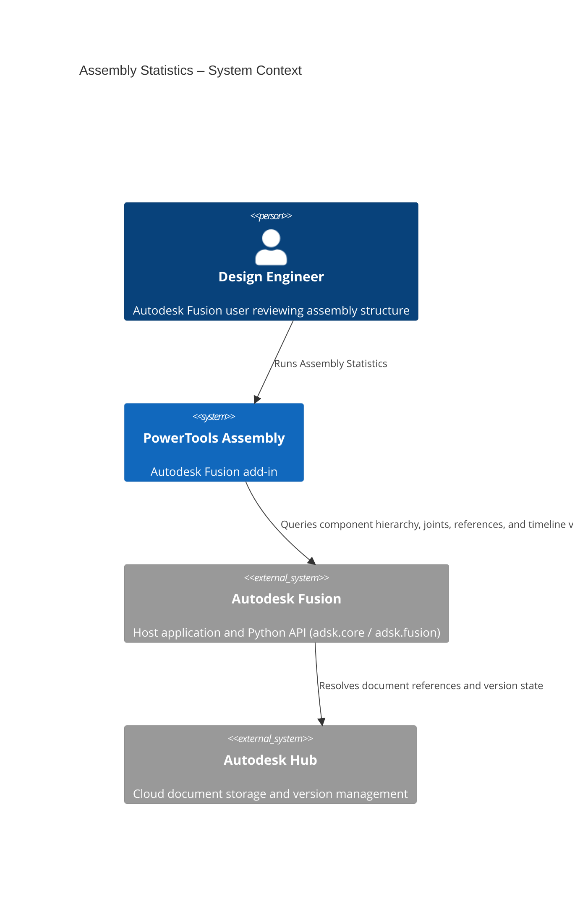
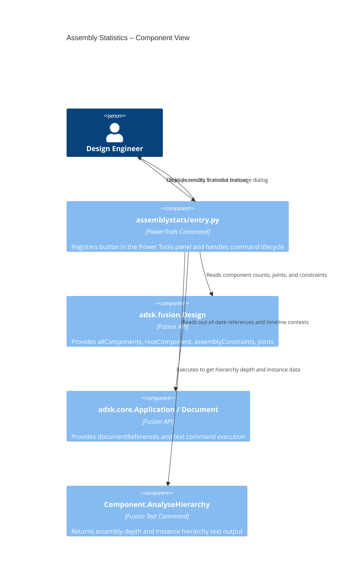
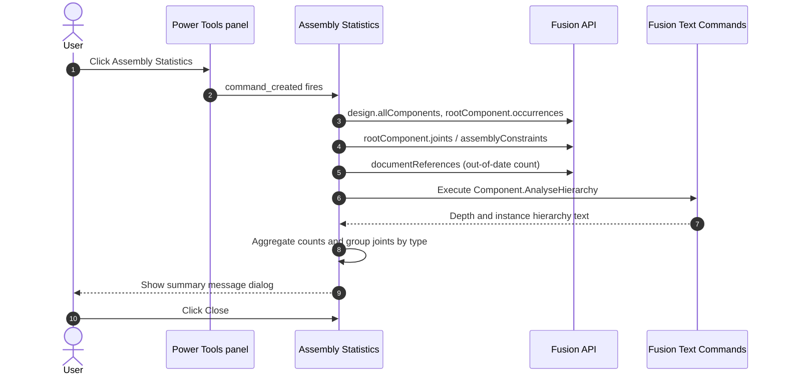

# Assembly Statistics — Architecture
[← Assembly Statistics guide](../Assembly%20Statistics.md)

## Architecture

The following diagram shows how the Assembly Statistics command interacts with Autodesk Fusion and its data model.

### User flow

