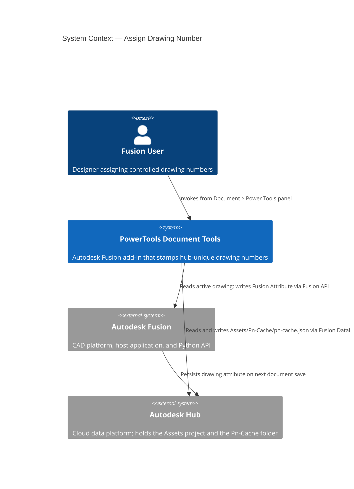
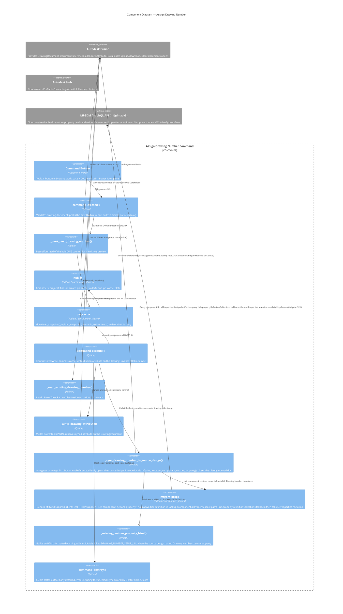
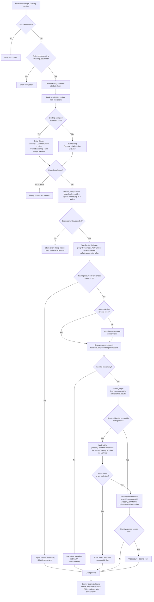

# Assign Drawing Number — Architecture

[← Assign Drawing Number guide](../Assign%20Drawing%20Number.md)

## Architecture

### Command ID

`PTND-assignDrawingNumber`

### System context

The following diagram shows the relationship between the user, the Assign Drawing Number command, Autodesk Fusion, and the Autodesk Hub.

### Component diagram

The following diagram shows how the internal components interact during a command invocation.

### Execution flow

The following diagram shows the step-by-step flow when the user runs the command.

### Storage

The assigned drawing number is written to two locations on successful Assign:

**On the drawing document itself** (canonical local record):

| Location | Value |
|---|---|
| `DrawingDocument.attributes` | — |
| &nbsp;&nbsp;group | `PowerTools.PartNumber` |
| &nbsp;&nbsp;name | `assigned` |
| &nbsp;&nbsp;value | formatted number, e.g., `DWG-000042` |

**On the source design's root component** (titleblock hook):

| Location | Value |
|---|---|
| MFGDM GraphQL — `Component.customProperties` on the root `mfgdmModelId` | — |
| &nbsp;&nbsp;propertyDefinition.name | `Drawing Number` (configurable via `DRAWING_NUMBER_PROPERTY_NAME`) |
| &nbsp;&nbsp;value | same formatted number, e.g., `DWG-000042` |

Both writes persist independently: the drawing-side attribute survives even if the titleblock sync fails, so the drawing is still correctly numbered locally.

### MFGDM GraphQL titleblock sync

The custom-property write goes through the MFGDM v3 GraphQL endpoint. Key facts the implementation depends on:

- Custom properties are **not** exposed through `Component.propertyGroups` on the Fusion Desktop Python API — that surface only covers the built-in `General` group (Part Name, Part Number, Description).
- `setProperties` is callable from the Fusion Desktop API despite Autodesk's own documentation suggesting it is blocked. The mutation succeeds when the target component's `isWritableByUser` is `True` and the property's `definition.isReadOnly` is `False` — both true for a user's own hub-configured Custom Properties collection.
- `SetPropertiesInput.targetId` must be the **`Component.id`** (time-specific, obtained via `model(modelId).component.id`). Using the timeless `mfgdmModelId` returns `"The targetId is not a valid Component or Drawing ID."`
- `SetPropertiesInput.propertyInputs` is a list of `{ propertyDefinitionId, value }`. The implementation never hard-codes a definition id — it's resolved dynamically via a two-tier lookup (below).

#### Two-tier property-definition lookup

The helper `set_component_custom_property()` resolves the property definition id through two queries in sequence:

1. **Fast path — `Component.allProperties`.** Reads the component's current property snapshot. This surfaces the definition id quickly when the property already has a value on this component, or when it is a base property (Part Name, Part Number, Description, etc.).

2. **Fallback — `Hub.propertyDefinitionCollections`.** When the fast path misses, the helper walks the hub's property-definition collections looking for a non-archived definition whose `name` matches. This is required because MFGDM's `Component.allProperties` and `Component.customProperties` only include properties that have a value set on the specific component — a defined-but-unset custom property (typical on the first-ever write to a new design) is filtered out and would otherwise look "missing." Walking the hub's collections surfaces the definition regardless of whether it has ever been assigned a value.

Only when **both** lookups fail does the helper raise `PropertyNotFoundError`, which triggers the setup-guide error dialog in the drawing command.

The plumbing lives in `commands/partnumber_shared/mfgdm_props.py`:

| Symbol | Role |
|---|---|
| `MFGDM_URL` | `"mfgdm://v3"` — Fusion-internal URL scheme that transparently attaches user auth |
| `MfgdmPropsError` | Base exception for HTTP, GraphQL, or auth failures |
| `PropertyNotFoundError` | Raised when the named property is not defined anywhere in the hub's property-definition collections. Callers treat this distinctly to trigger the setup-guide error dialog |
| `_find_definition_in_hub(hub_id, name)` | Private helper — walks `Hub.propertyDefinitionCollections.results[].definitions.results[]` and returns the first non-archived match |
| `set_component_custom_property(model_id, property_name, value)` | Public one-shot helper: fetches componentId, runs the two-tier definition lookup, runs the `setProperties` mutation, returns the echoed value |

The drawing command's `_sync_drawing_number_to_source_design()` orchestrates the workflow above (navigate `documentReferences[0]` → silently open source design if needed → call `set_component_custom_property` → close source design if we opened it).

### Shared infrastructure

This command shares the hub cache infrastructure with [Assign Part Numbers](../Assign%20Part%20Numbers.md). See that document for:

- The **Pn-Cache JSON** shape and location.
- The **concurrency** model (optimistic retry + upload verification).
- Details of the `partnumber_shared.hub_fs`, `partnumber_shared.pn_cache`, and `partnumber_shared.schemes` modules.

The `partnumber_shared.mfgdm_props` module introduced for this command is also available for reuse by any future command that needs to read or write custom properties via MFGDM GraphQL.
