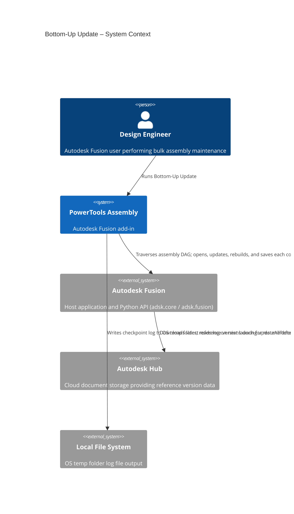
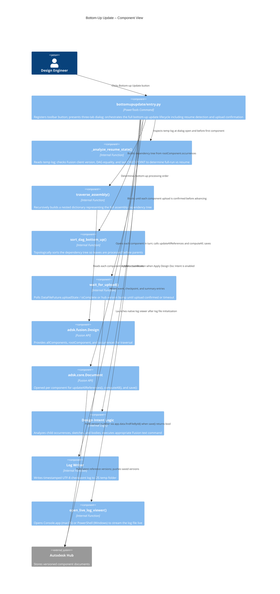
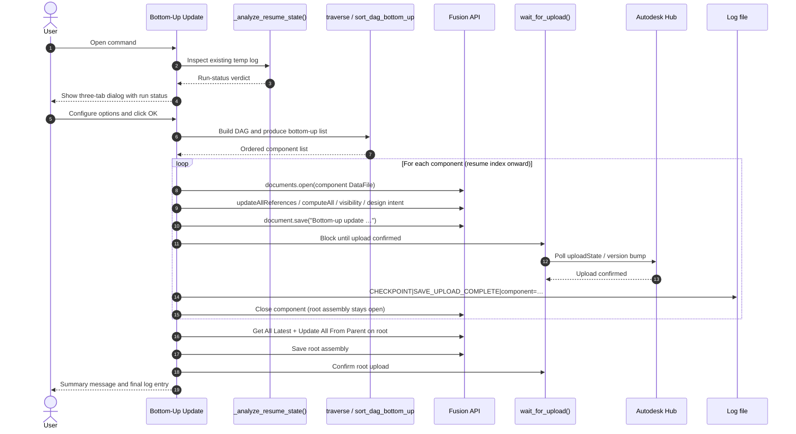

# Bottom-Up Update — Architecture
[← Bottom-Up Update guide](../Bottom-Up%20Update.md)

## Architecture

The following diagrams show how the Bottom-Up Update command fits into the Autodesk Fusion ecosystem and how its internal components interact.





### User flow



### Topological sort

The command must process components in an order where every component's dependencies are saved before the component that uses them. It achieves this through a two-phase algorithm.

**Phase 1 — Build the dependency tree (`traverse_assembly`)**

Starting from the root component, the function walks `component.occurrences` recursively. Each component is stored as a node in a nested dictionary keyed by component name:

```
{
  "Bracket": {
    "component": <adsk.fusion.Component>,
    "children": {
      "Bushing": { "component": ..., "children": {} },
      "Pin":     { "component": ..., "children": {} }
    }
  },
  "Frame": { ... }
}
```

The result is a directed acyclic graph (DAG) where each node points to its child nodes. Components that appear in multiple sub-assemblies are represented once under the first parent that encounters them; duplicate traversal of the same component name is skipped.

**Phase 2 — Post-order traversal (`sort_dag_bottom_up`)**

The sort walks the DAG using a depth-first, post-order traversal. For any given node it recurses into all children before appending the node itself to the output list. This guarantees that a component only appears in the list *after* all of its dependencies have already been appended.

```
traverse_dag("Bracket")
  → traverse_dag("Bushing")  → append "Bushing"
  → traverse_dag("Pin")      → append "Pin"
  → append "Bracket"
```

The final list is the bottom-up processing order. The command iterates it in sequence, opening, updating, and saving each document before moving to the next. The root assembly is excluded from the list and is saved separately at the end after all components have been processed.

**Why post-order matters**

If a parent component is saved before its children are up to date, Autodesk Fusion resolves the parent's references against the old version of each child. The post-order traversal eliminates this problem: by the time any parent document is opened and saved, every document it depends on has already been updated and saved to the Hub.
