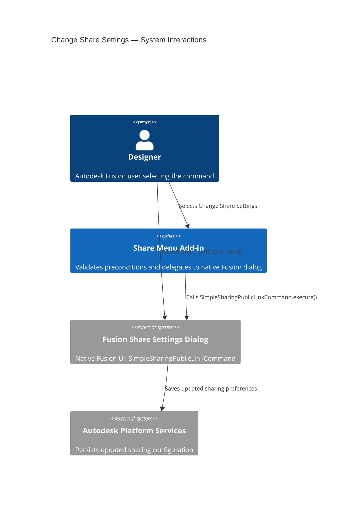
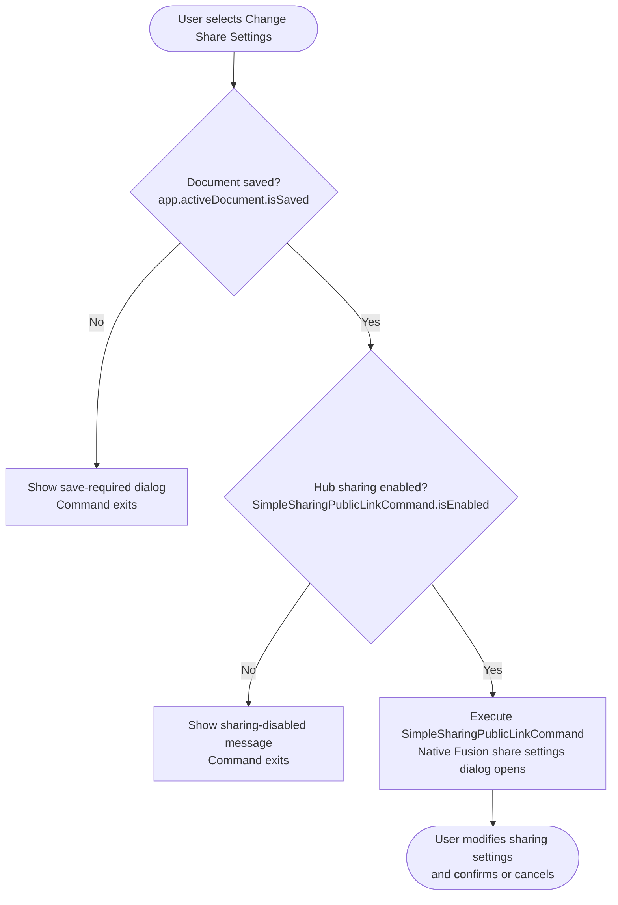

# Change Share Settings — Architecture

[← Change Share Settings guide](../Change%20Share%20Settings.md)

## Architecture — command flow

The following diagram shows what the add-in does when you select **Change Share Settings**.

### Detailed command flow

---

## Key API surface

| API element | Purpose |
|---|---|
| `ui.commandDefinitions.itemById("SimpleSharingPublicLinkCommand")` | Retrieves the native Fusion share command and checks whether sharing is enabled |
| `controlDefinition.isEnabled` | Reflects the Hub administrator's sharing policy |
| `futil.isSaved()` | Guards against operating on unsaved documents (checks `app.activeDocument.isSaved`; shows a "Please Save" prompt if not) |
| `commandDefinitions.itemById("SimpleSharingPublicLinkCommand").execute()` | Opens the native Fusion share settings dialog |
