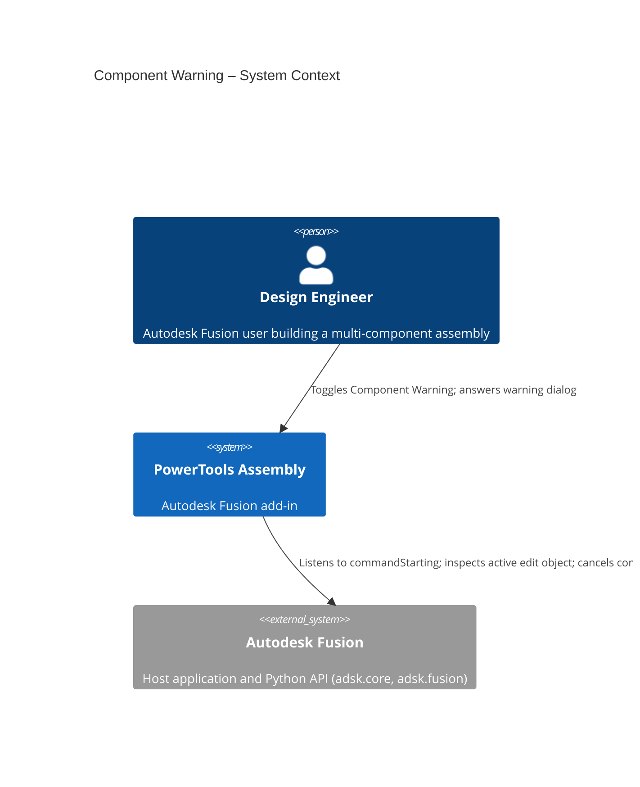
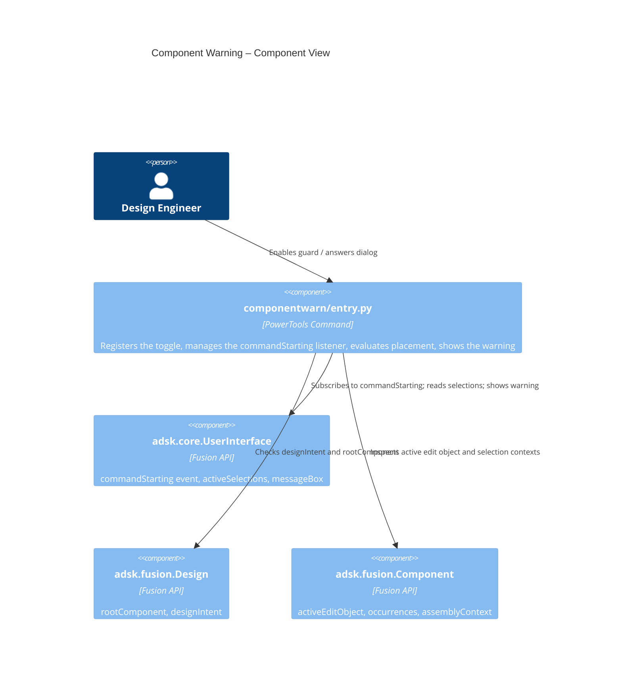

# Component Warning — Architecture
[← Component Warning guide](../Component%20Warning.md)

## How it works

While enabled and while the Solid workspace is active, the command listens to the Fusion `commandStarting` event. When a watched feature-creation command begins, the guard inspects the active edit target:

- If the active edit target is the **root component**, the feature would be created outside of any component.
- If **only-leaf checking** is enabled and the target component still has child occurrences, the feature would be created in a **non-leaf component**.
- If any current selection belongs to a **different component** than the one being edited, the feature would reference another component.

When any of these is true, the warning dialog is shown before the command runs. Choosing **Cancel** sets the starting command to canceled so it never executes.

The set of watched commands and the only-leaf option are defined at the top of `commands/componentwarn/entry.py`.

## Architecture

The following diagrams show how the Component Warning command interacts with Autodesk Fusion.





### User flow

```mermaid
sequenceDiagram
  autonumber
  actor User
  participant Menu as QAT › PowerTools Settings
  participant Cmd as Component Warning
  participant API as Fusion API

  User->>Menu: Click "Enable Component Warning"
  Menu->>Cmd: command_execute fires
  Cmd->>Cmd: _enabled = True; label → "Disable Component Warning"
  Cmd->>API: Attach commandStarting listener
  User->>API: Start a feature command (e.g. Extrude)
  API->>Cmd: command_starting fires
  Cmd->>API: Read designIntent, activeEditObject, selections
  alt Feature lands in wrong place
    Cmd->>User: Show warning (Yes / No / Cancel)
    User-->>Cmd: Choice
    alt Cancel
      Cmd->>API: args.isCanceled = true
    else No
      Cmd->>Cmd: Silence active document
    else Yes
      Cmd->>Cmd: Start hold-off timer
    end
  else Placement is fine
    Cmd-->>API: Do nothing (command proceeds)
  end
```
