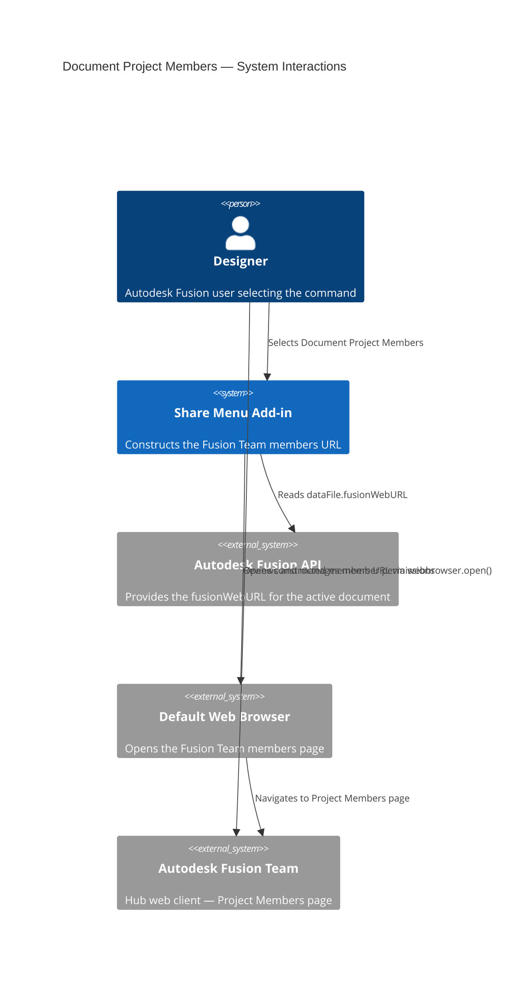
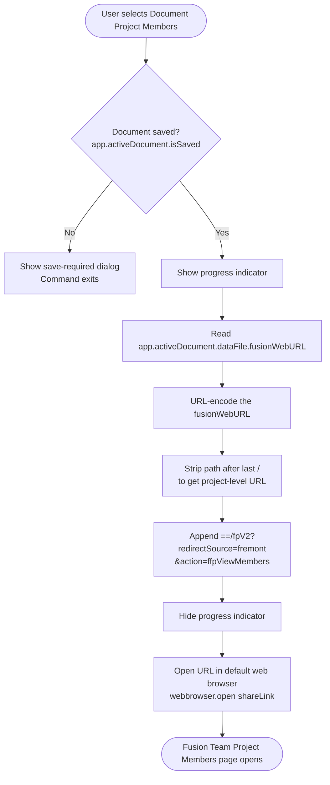

# Document Project Members — Architecture

[← Document Project Members guide](../Document%20Project%20Members.md)

## Architecture — command flow

The following diagram shows what the add-in does when you select **Document Project Members**.

### Detailed command flow

---

## URL construction

The add-in derives the members URL from `dataFile.fusionWebURL`, which points to the active document's page on Fusion Team. The construction process:

1. Reads the document's `fusionWebURL` (for example, `https://autodesk.com/team/hubs/.../projects/.../data/.../files/...`).
2. Trims the path to the project level by removing everything after the last `/`.
3. Appends the query string `==/fpV2?redirectSource=fremont&action=ffpViewMembers` to redirect to the Members page.

This pattern is identical to [Invite to Project](invite-to-project.md), but uses the `ffpViewMembers` action instead of `ffpInviteMembers`.

---

## Key API surface

| API element | Purpose |
|---|---|
| `futil.isSaved()` | Guards against operating on unsaved documents (checks `app.activeDocument.isSaved`; shows a "Please Save" prompt if not) |
| `app.activeDocument.dataFile.fusionWebURL` | Base URL used to construct the members page URL |
| `urllib.parse.quote` / `urllib.parse.unquote` | URL encoding and decoding during path manipulation |
| `webbrowser.open(url)` | Opens the constructed URL in the system default browser |
