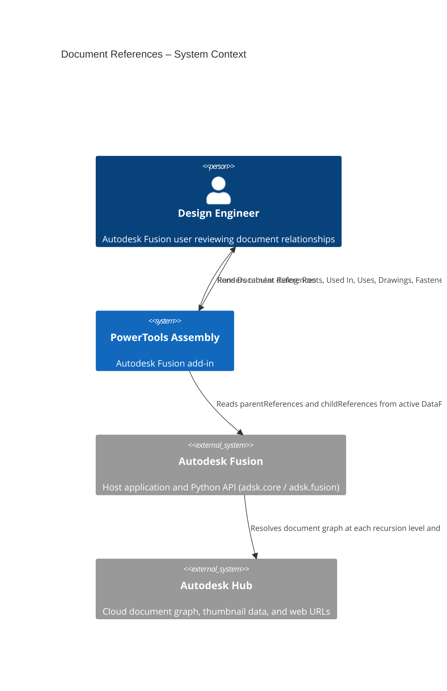
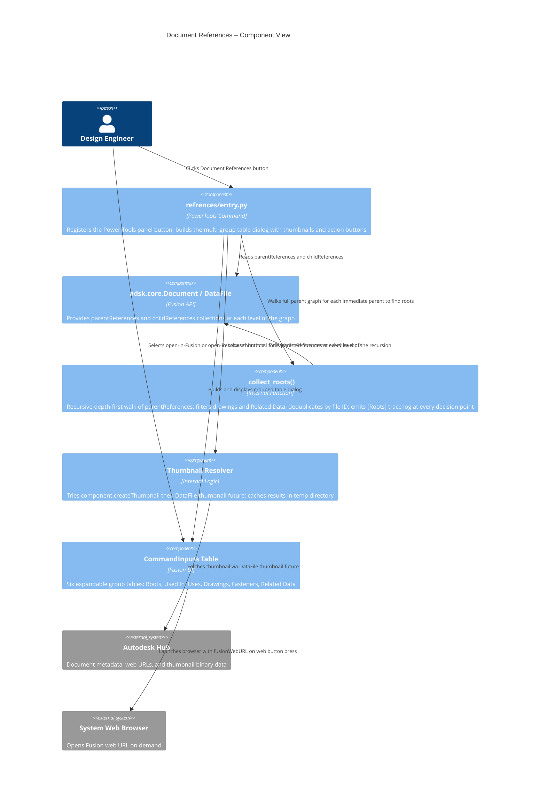
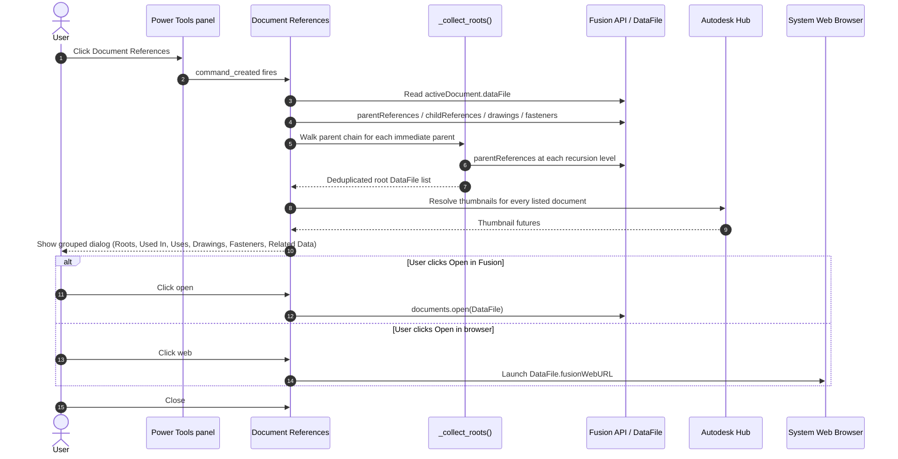

# Document References — Architecture
[← Document References guide](../Document%20References.md)

## Roots — recursive parent walk

The Roots section is computed by a depth-first recursive walk of the parent graph:

1. Starting from each immediate parent of the active document, the command calls `parentReferences` on that file.
2. For each parent it encounters it checks:
   - **Skip if already visited** — prevents infinite loops in cyclic or diamond-shaped reference graphs.
   - **Skip drawings** — files with extension `.f2d` are excluded from the walk and are not treated as roots.
   - **Skip Related Data** — files whose name contains the ` ‹+› ` marker are excluded.
3. If a file has **no remaining real parents** after filtering, it is a root and is added to the list (once — duplicates are suppressed by file ID).
4. The active document itself is always excluded from the Roots list even if it has no parents.

### Diagnostics

The root walk emits detailed trace entries to the Fusion **Text Commands** panel (`View → Text Commands`). Each line is prefixed with `[Roots]` and indented by recursion depth:

```
[Roots] Visiting: 'Sub-Assembly A'  id=urn:adsk...
[Roots]   'Sub-Assembly A' raw parents (2): ['Top Assembly', 'Drawing v1']
[Roots]   SKIP parent (drawing): 'Drawing v1'
[Roots]   KEEP parent: 'Top Assembly'
[Roots]   'Sub-Assembly A' has 1 real parent(s) — recursing
[Roots]     Visiting: 'Top Assembly'  id=urn:adsk...
[Roots]     'Top Assembly' raw parents (0): []
[Roots]     ROOT FOUND: 'Top Assembly'
```

Use these traces to verify that drawings and Related Data documents are being excluded correctly and that the active document is not appearing as a root.

## Architecture

The following diagrams show how the Document References command fits into the Autodesk Fusion ecosystem and how its internal components interact.





### User flow


