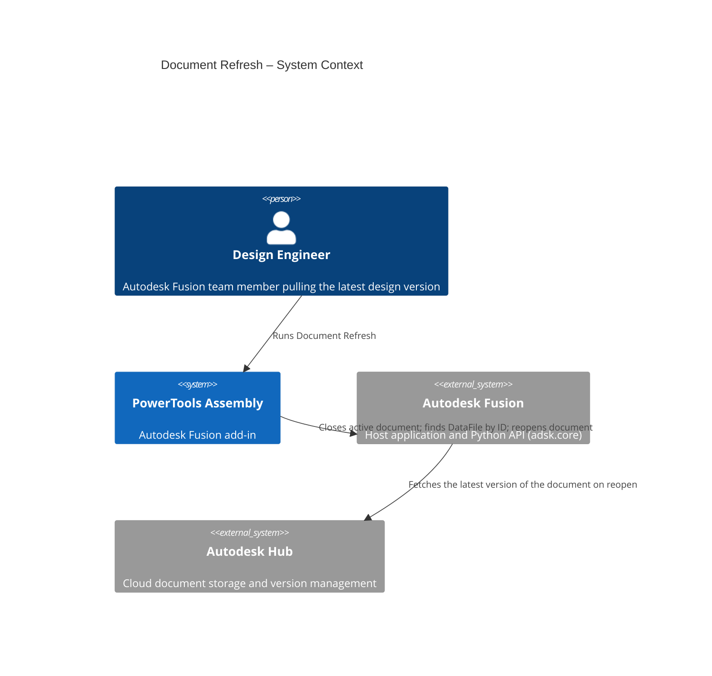
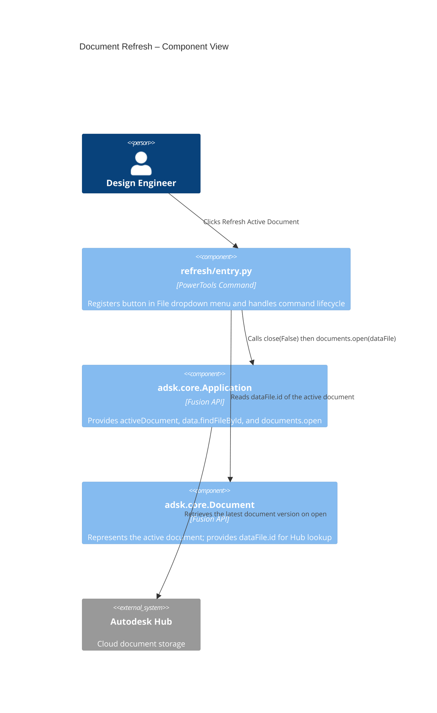
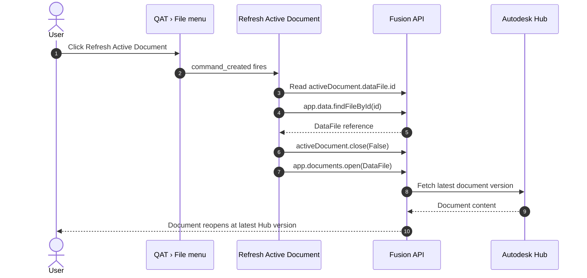

# Document Refresh — Architecture
[← Document Refresh guide](../Document%20Refresh.md)

## Architecture

The following diagram shows how the Document Refresh command interacts with Autodesk Fusion and the Autodesk Hub.

### User flow

