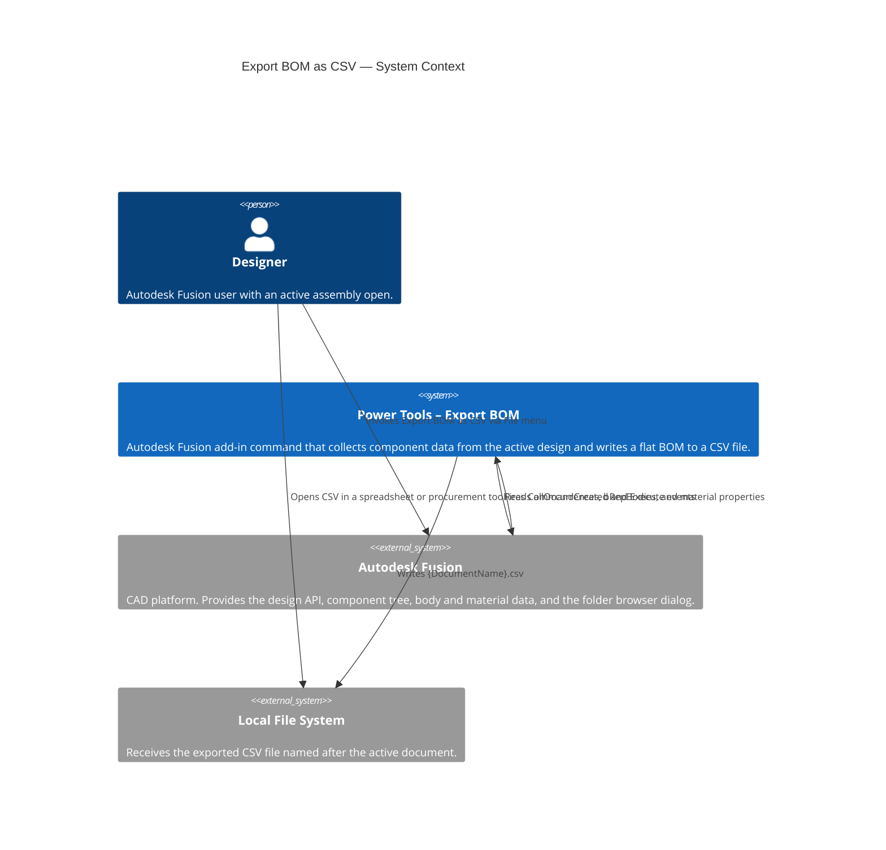

# Export BOM as CSV — Architecture

[← Export BOM as CSV guide](../Export%20BOM.md)

## Architecture

### System context

The following C4 context diagram shows how the **Export BOM as CSV** command interacts with Autodesk Fusion and the local file system.



### Command processing flow

The following diagram shows the internal processing steps that run when the command executes.

```mermaid
flowchart TD
    A([User selects Export BOM as CSV]) --> B[CommandExecute event fires]
    B --> C{Active product\nis a Fusion Design?}
    C -- No --> D[Show error:\nA Design Must be Active]
    C -- Yes --> E[Get rootComponent.allOccurrences]
    E --> F[Iterate all occurrences\nBuild unique component list]
    F --> G{Component already\nin BOM list?}
    G -- Yes --> H[Increment instance count]
    G -- No --> I[Resolve display name\nStrip version suffix if xref]
    I --> J[Read material from\nfirst solid bRepBody]
    J --> K[Append new row to BOM list]
    H --> L{More occurrences?}
    K --> L
    L -- Yes --> F
    L -- No --> M[Generate CSV string\nHeader + leaf component rows]
    M --> N[Show folder picker dialog]
    N --> O{User confirmed\ndestination folder?}
    O -- No --> P([Exit — no file written])
    O -- Yes --> Q[Write {DocumentName}.csv]
    Q --> R[Show confirmation message\nwith full file path]
    R --> P
```
