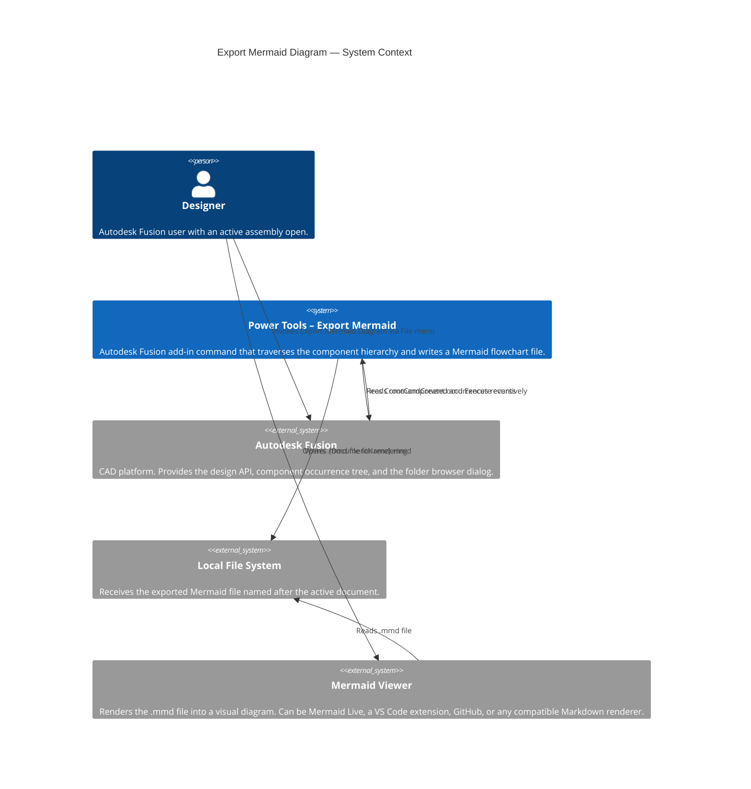

# Export Mermaid Diagram — Architecture

[← Export Mermaid Diagram guide](../Export%20Mermaid.md)

## Architecture

### System context

The following C4 context diagram shows how the **Export Mermaid Diagram** command interacts with Autodesk Fusion and external rendering tools.



### Command processing flow

The following diagram shows the internal processing steps that run when the command executes.

```mermaid
flowchart TD
    A([User selects Export Mermaid Diagram]) --> B[CommandExecute event fires]
    B --> C{Active product\nis a Fusion Design?}
    C -- No --> D[Show error:\nA Design Must be Active]
    C -- Yes --> E[Get rootComponent and document name]
    E --> F[Write Mermaid front matter\ntheme init block]
    F --> G[Write graph LR declaration]
    G --> H[traverseAssembly:\nIterate rootComponent.occurrences]
    H --> I[Sanitize parent and child names\nReplace or remove special characters]
    I --> J[Write relationship string:\nParent--&#62;Child]
    J --> K{Child has\nchild occurrences?}
    K -- Yes --> L[Recurse into\nchild occurrences]
    L --> I
    K -- No --> M{More occurrences\nat this level?}
    M -- Yes --> I
    M -- No --> N[Show folder picker dialog]
    N --> O{User confirmed\ndestination folder?}
    O -- No --> P([Exit — no file written])
    O -- Yes --> Q[Write {DocumentName}.mmd]
    Q --> R[Show confirmation message\nwith full file path]
    R --> P
```
