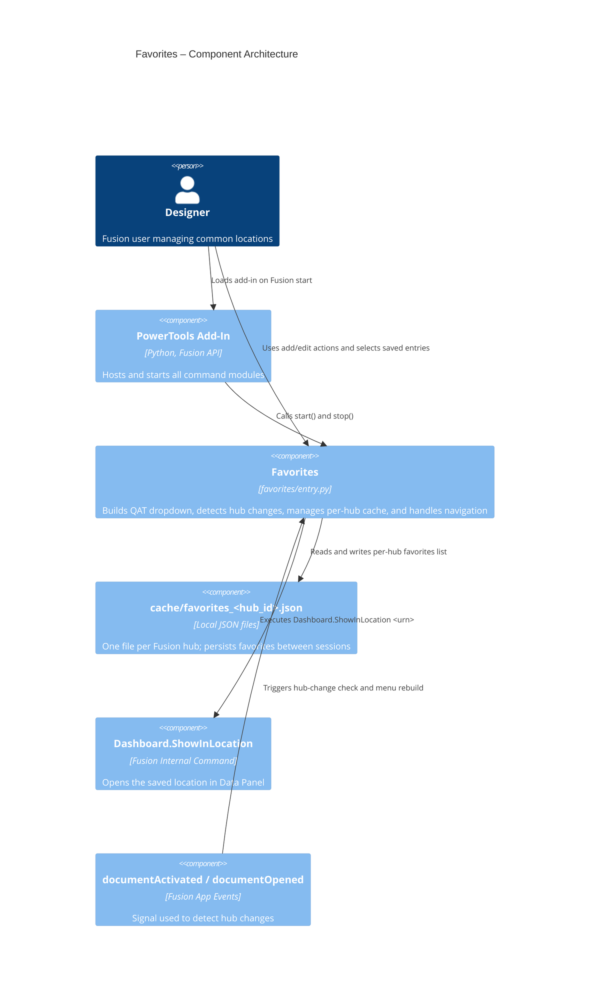

# Favorites — Architecture

[← Favorites guide](../Favorites.md)

## Data model

Each hub's favorites are saved in a separate file: `cache/favorites_<sanitised_hub_id>.json`.

```json
{
  "hub_id": "b.abc123def456",
  "favorites": [
    {
      "name": "Document Name",
      "display": "Project > Folder > Subfolder",
      "urn": "urn:adsk.wipprod:dm.lineage:..."
    }
  ]
}
```

- `hub_id`: the Fusion hub ID this file belongs to (informational).
- `name`: document name shown in edit UI.
- `display`: folder lineage shown in the dropdown and edit table.
- `urn`: the `dataFile.id` URN used for reliable navigation.

## Architecture

The Favorites module creates one static dropdown control and a set of dynamic command definitions. The first two static actions are **Favorite This Location** and **Edit Favorites**. Below those actions, each favorite entry is added as a generated command that executes `Dashboard.ShowInLocation` for its saved URN.

### Command IDs

- Dropdown: `PTAT-favorites-dropdown`
- Add action: `PTAT-favorites-add`
- Edit action: `PTAT-favorites-edit`
- Dynamic favorite entries: `PTAT-fav-<index>`

### Execution flow

1. Add-in startup removes any legacy `cache/favorites.json`, resolves the active hub ID, and creates the Favorites dropdown on the QAT.
2. Startup registers static commands for add/edit and loads saved favorites from the active hub's cache file.
3. The menu is rebuilt with dynamic commands for each saved favorite.
4. Application-level `documentActivated` and `documentOpened` handlers monitor for hub changes. When the hub changes, the menu is rebuilt with the new hub's favorites.
5. **Favorite This Location** validates the active document is saved and writes a new favorite record to the active hub's cache file if it is not a duplicate.
6. **Edit Favorites** stages changes in a dialog table and commits deletes only when the user confirms.
7. Selecting any saved favorite executes `Dashboard.ShowInLocation <urn>`.

### Component diagram


