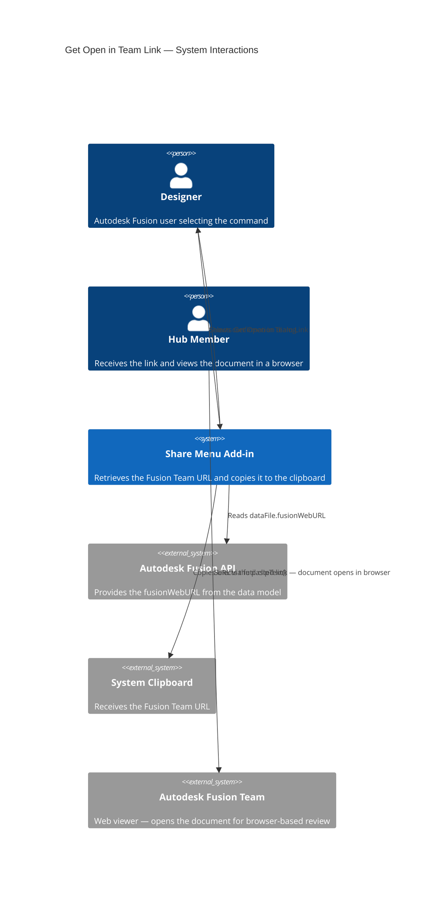
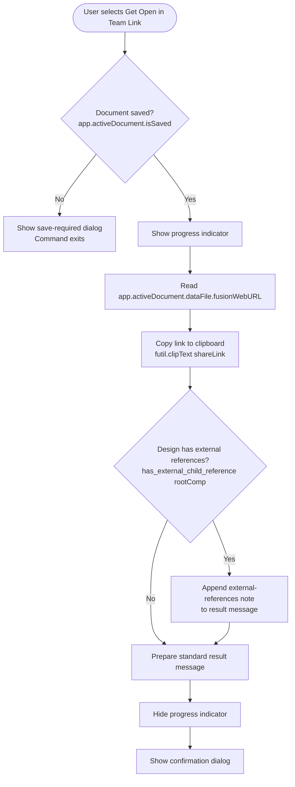

# Get Open in Team Link — Architecture

[← Get Open in Team Link guide](../Get%20Open%20in%20Team%20Link.md)

## Architecture — command flow

The following diagram shows what the add-in does when you select **Get Open in Team Link**.

### Detailed command flow

---

## Key API surface

| API element | Purpose |
|---|---|
| `futil.isSaved()` | Guards against operating on unsaved documents (checks `app.activeDocument.isSaved`; shows a "Please Save" prompt if not) |
| `app.activeDocument.dataFile.fusionWebURL` | The Fusion Team URL for the active document |
| `futil.clipText(text)` | Copies the link to the system clipboard |
| `has_external_child_reference(component)` | Recursive function that checks the component tree for linked external files |
