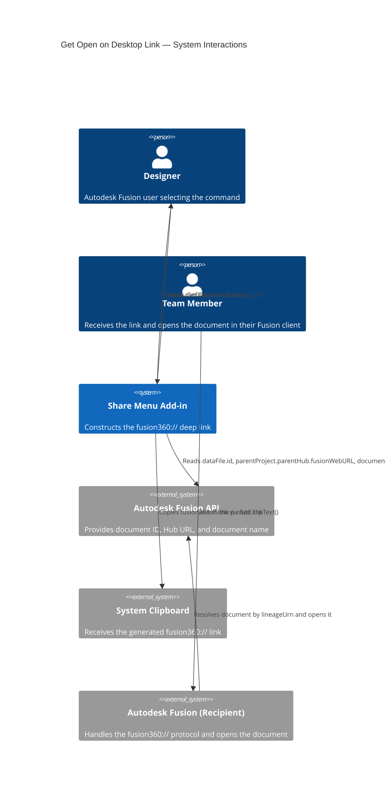
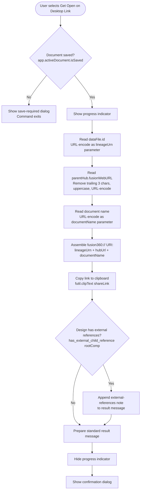

# Get Open on Desktop Link — Architecture

[← Get Open on Desktop Link guide](../Get%20Open%20on%20Desktop%20Link.md)

## Architecture — command flow

The following diagram shows what the add-in does when you select **Get Open on Desktop Link**.

### Detailed command flow

---

## Key API surface

| API element | Purpose |
|---|---|
| `futil.isSaved()` | Guards against operating on unsaved documents (checks `app.activeDocument.isSaved`; shows a "Please Save" prompt if not) |
| `app.activeDocument.dataFile.id` | The document's lineage URN, used as the primary deep-link identifier |
| `app.activeDocument.dataFile.parentProject.parentHub.fusionWebURL` | The Hub URL encoded into the link so the recipient's client connects to the correct Hub |
| `app.activeDocument.name` | The document name encoded into the link for display purposes |
| `urllib.parse.quote(string)` | URL-encodes each link parameter |
| `futil.clipText(text)` | Copies the assembled link to the system clipboard |
| `has_external_child_reference(component)` | Recursive function that checks the component tree for linked external files |
