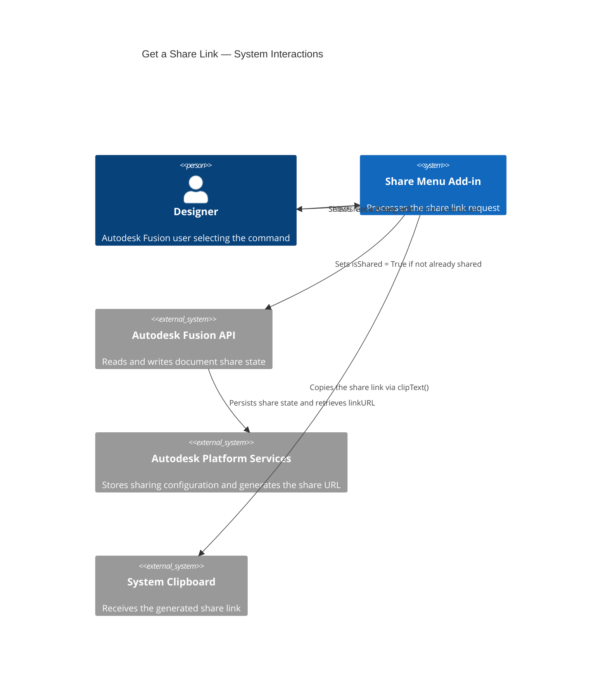
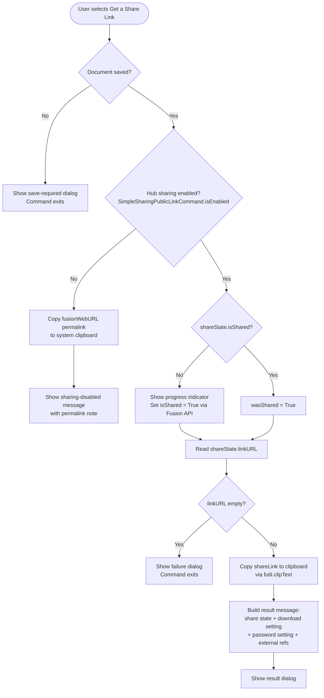

# Get a Share Link — Architecture

[← Get a Share Link guide](../Get%20a%20Share%20Link.md)

## Architecture — command flow

The following diagram shows what the add-in does when you select **Get a Share Link**.

### Detailed command flow

---

## Key API surface

| API element | Purpose |
|---|---|
| `ui.commandDefinitions.itemById("SimpleSharingPublicLinkCommand")` | Checks whether sharing is enabled for this Hub |
| `futil.isSaved()` | Guards against operating on unsaved documents (checks `app.activeDocument.isSaved`; shows a "Please Save" prompt if not) |
| `app.activeDocument.dataFile.sharedLink` | Returns the `SharedLink` object for reading and setting share state |
| `sharedLink.isShared` | Reads or sets the sharing enabled state |
| `sharedLink.linkURL` | The public share URL |
| `sharedLink.isDownloadAllowed` | Whether recipients can download the document |
| `sharedLink.isPasswordRequired` | Whether the share link is password protected |
| `app.activeDocument.designDataFile.fusionWebURL` | Private permalink used when Hub sharing is disabled |
| `futil.clipText(text)` | Copies the link to the system clipboard |
