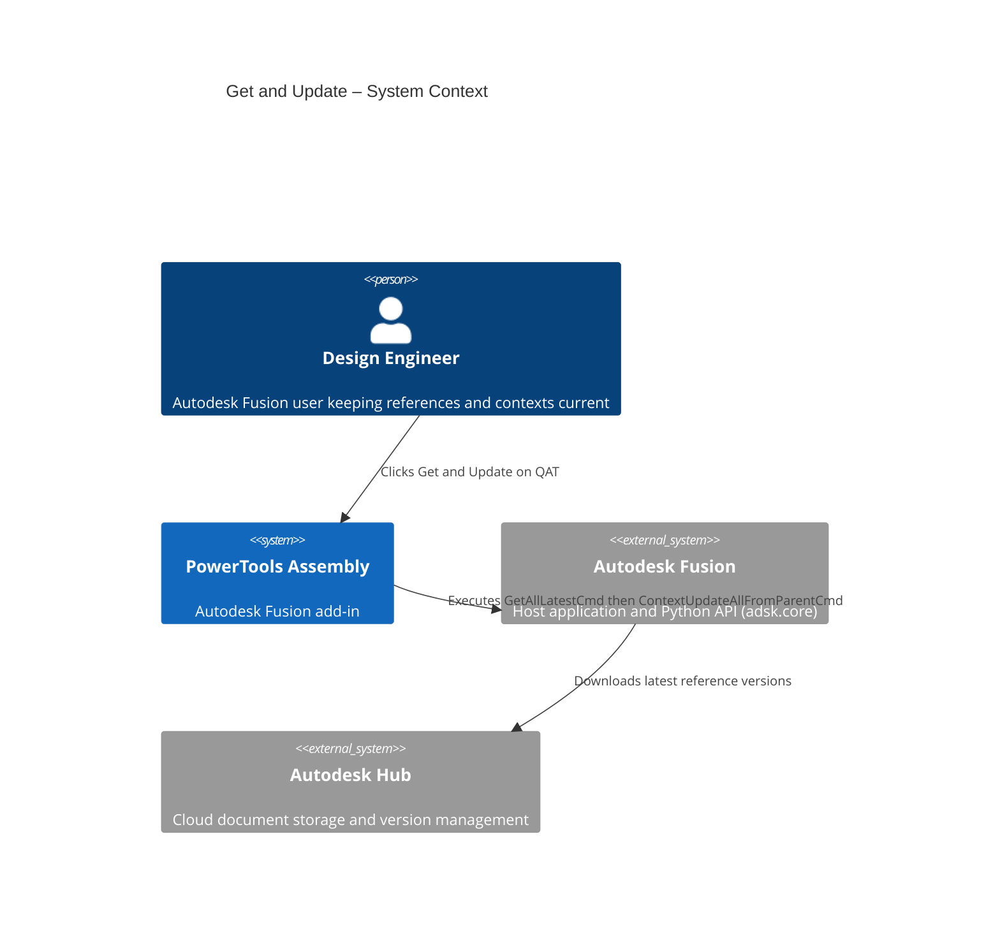
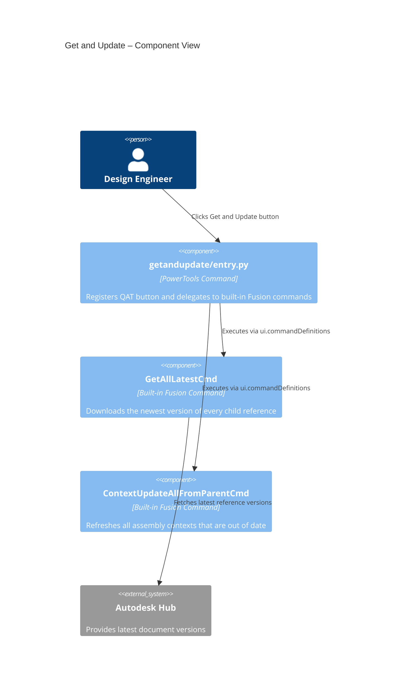
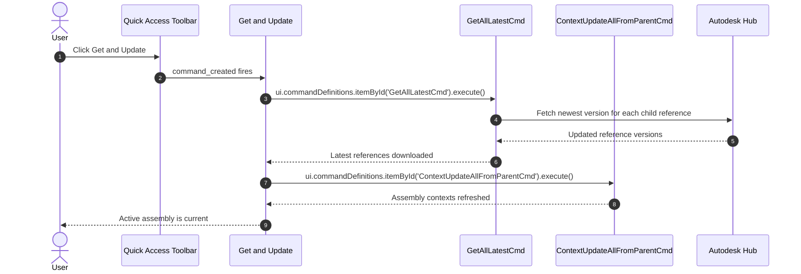

# Get and Update — Architecture
[← Get and Update guide](../Get%20and%20Update.md)

## Architecture

The following diagram shows how the Get and Update command interacts with Autodesk Fusion.

### User flow

