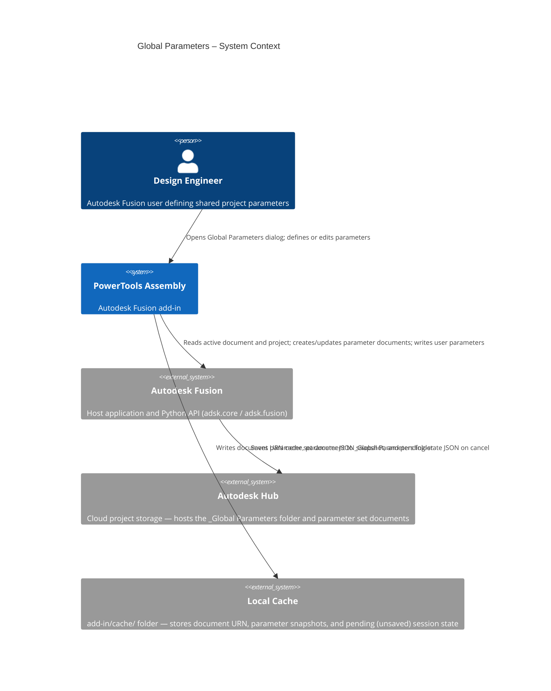
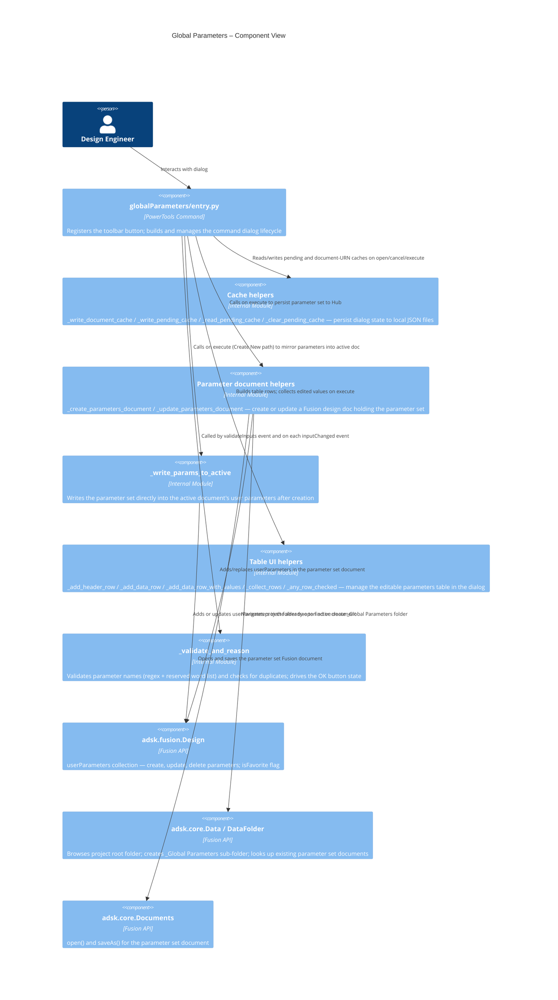
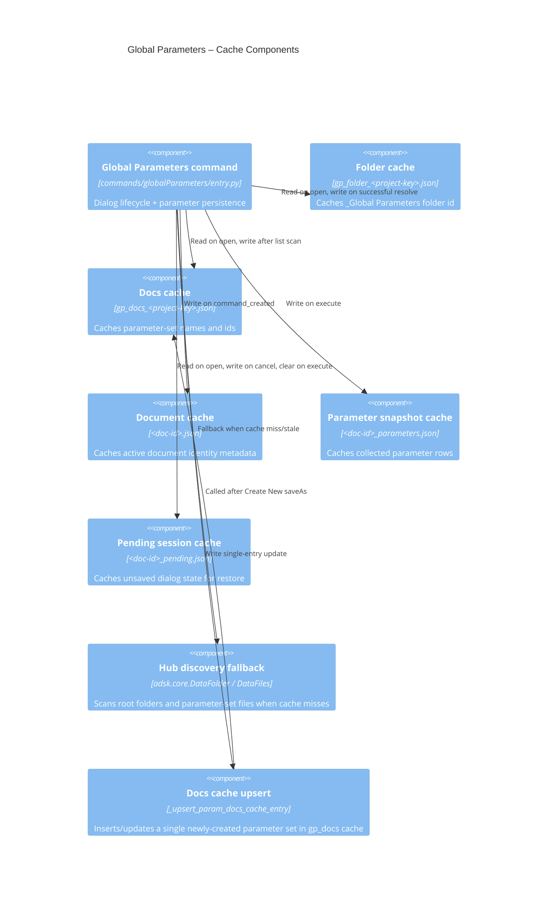
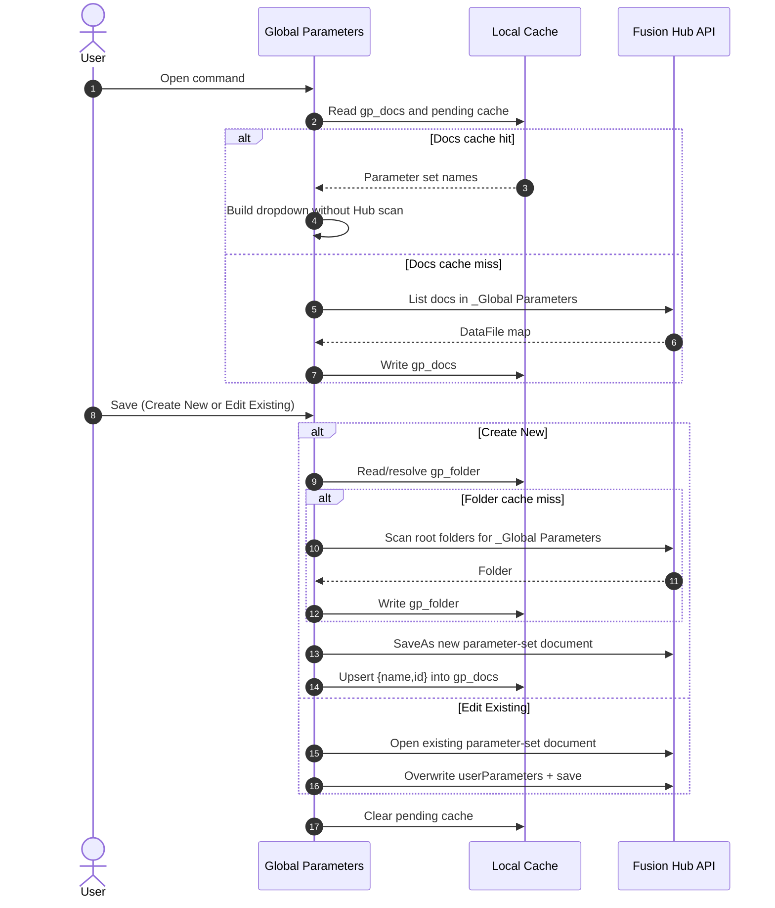
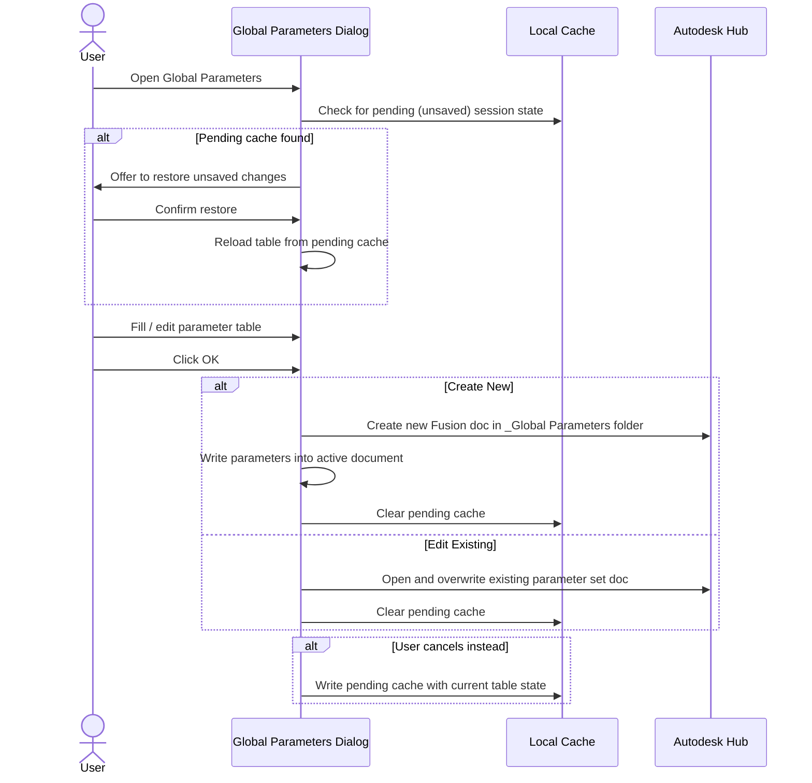

# Global Parameters — Architecture
[← Global Parameters guide](../Global%20Parameters.md)

## Architecture

The following diagrams show how the Global Parameters command interacts with Autodesk Fusion and the project data model.

## Caching and Discovery Logic

Global Parameters uses layered cache reads before any Hub scan:

1. `gp_folder_<project-key>.json`: project-scoped folder id cache for `_Global Parameters`.
2. `gp_docs_<project-key>.json`: project-scoped parameter set list used to pre-populate the Parameter Set dropdown.
3. `<active-doc-id>_pending.json`: cancel-time unsaved session restore payload.
4. `<active-doc-id>_parameters.json`: last collected table rows snapshot.

When cache-based resolution fails, the command falls back to Hub scans and then refreshes cache files. On **Create New**, the command also upserts the new parameter-set `{name,id}` into `gp_docs_<project-key>.json` immediately so Link Global Parameters can discover it without waiting for a full rescan.

