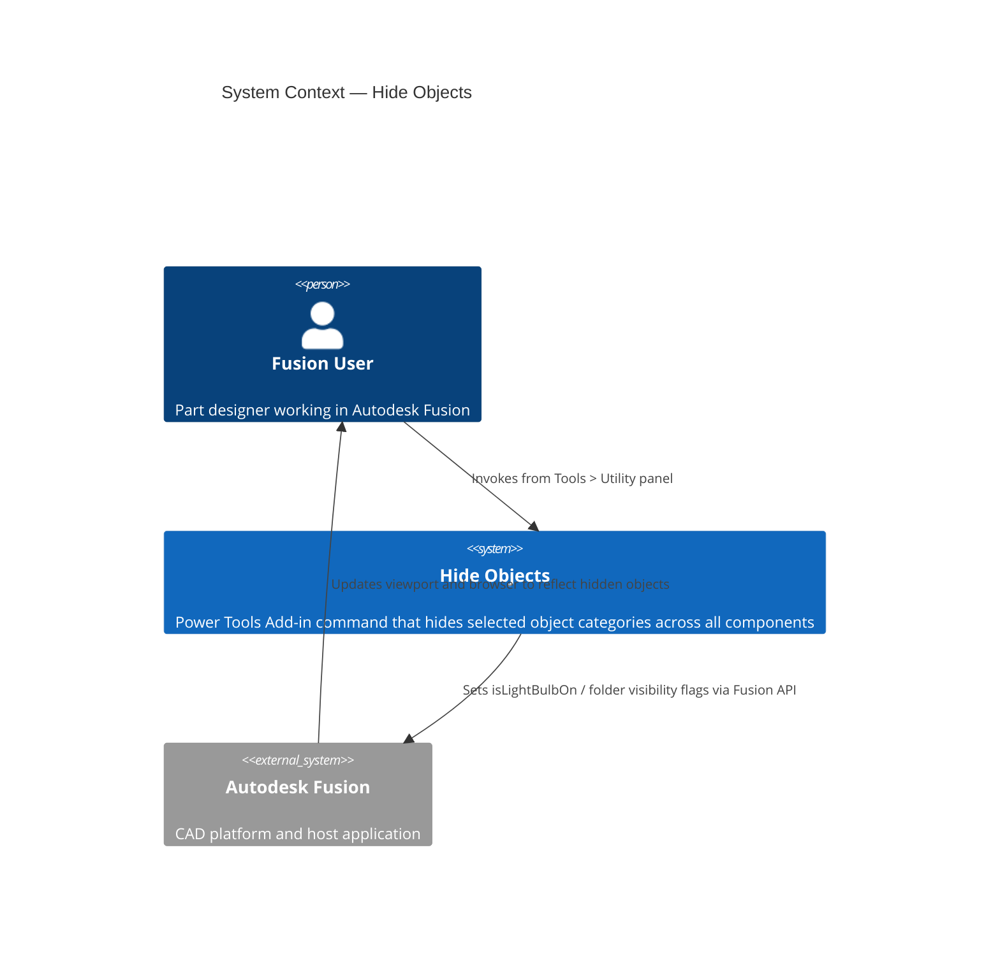
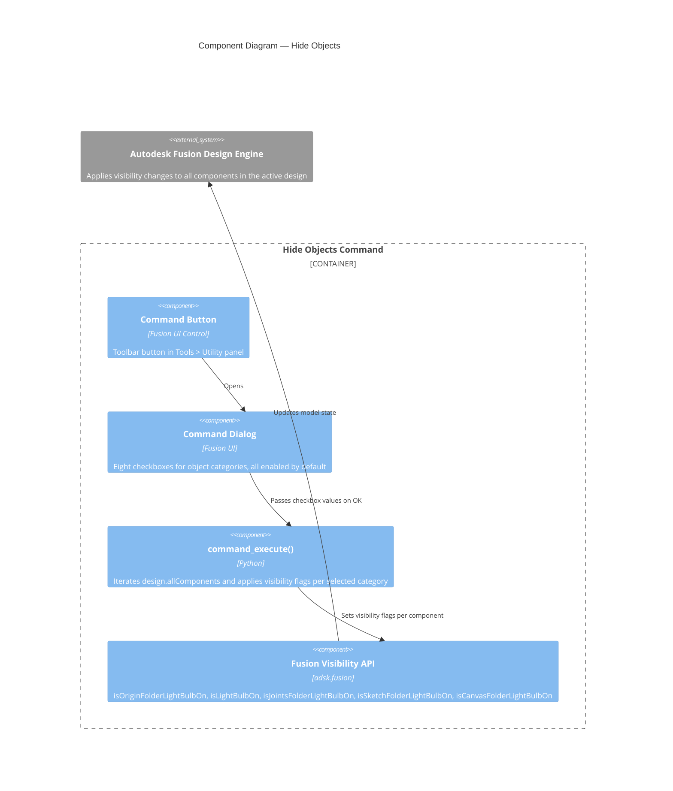

# Hide Objects — Architecture

[← Hide Objects guide](../HideObjects.md)

## Architecture

### System context

The following diagram shows the relationship between the user, the Hide Objects command, and Autodesk Fusion.

### Component diagram

The following diagram shows how the internal components of the command interact during execution.

