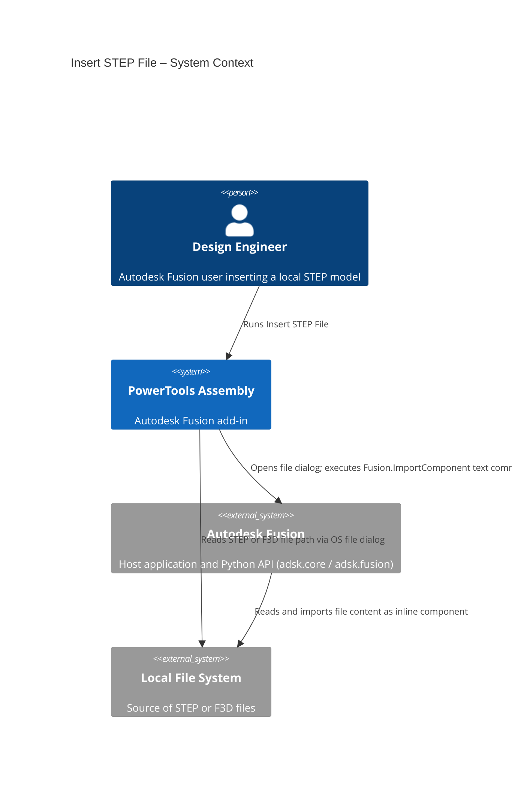
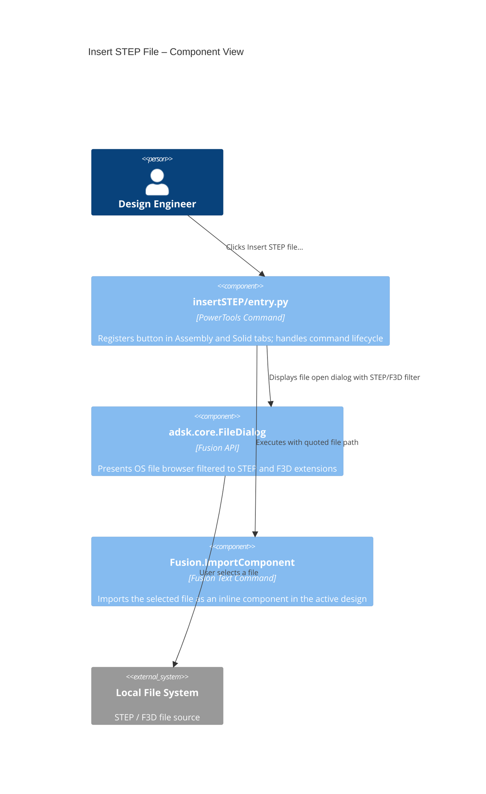
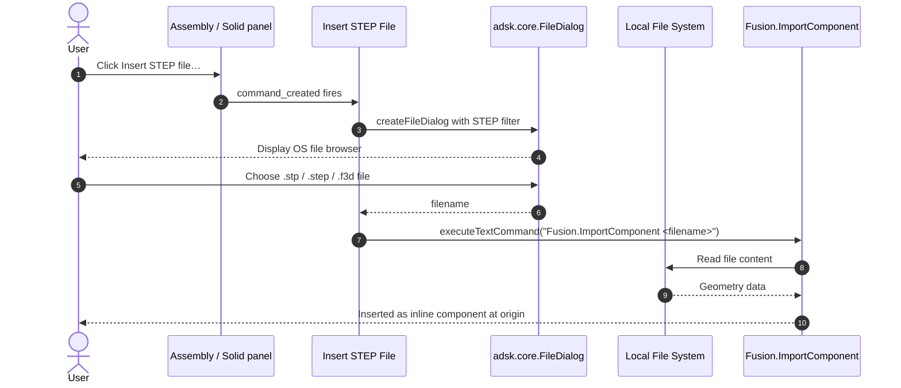

# Insert STEP File — Architecture
[← Insert STEP File guide](../Insert%20Step.md)

## Architecture

The following diagram shows how the Insert STEP File command interacts with Autodesk Fusion.

### User flow

