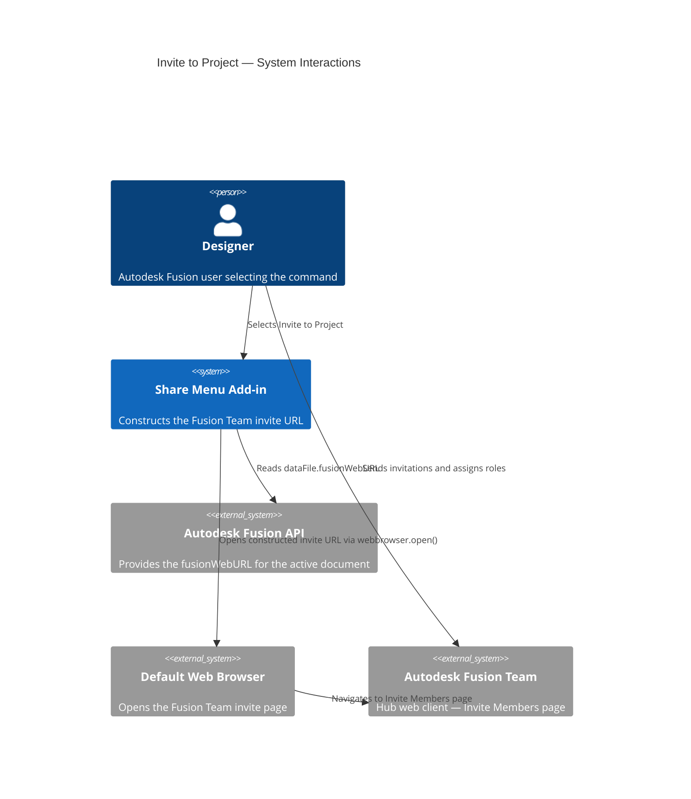
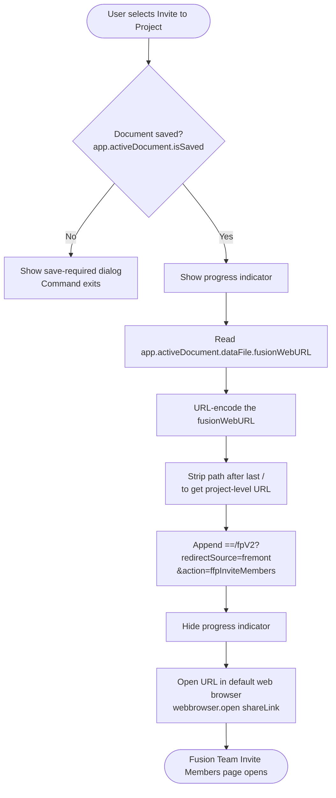

# Invite to Project — Architecture

[← Invite to Project guide](../Invite%20to%20Project.md)

## Architecture — command flow

The following diagram shows what the add-in does when you select **Invite to Project**.

### Detailed command flow

---

## URL construction

The add-in derives the invite URL from `dataFile.fusionWebURL`, which points to the active document's page on Fusion Team. The construction process:

1. Reads the document's `fusionWebURL` (for example, `https://autodesk.com/team/hubs/.../projects/.../data/.../files/...`).
2. Trims the path to the project level by removing everything after the last `/`.
3. Appends the query string `==/fpV2?redirectSource=fremont&action=ffpInviteMembers` to redirect to the Invite Members page.

---

## Key API surface

| API element | Purpose |
|---|---|
| `futil.isSaved()` | Guards against operating on unsaved documents (checks `app.activeDocument.isSaved`; shows a "Please Save" prompt if not) |
| `app.activeDocument.dataFile.fusionWebURL` | Base URL used to construct the invite page URL |
| `urllib.parse.quote` / `urllib.parse.unquote` | URL encoding and decoding during path manipulation |
| `webbrowser.open(url)` | Opens the constructed URL in the system default browser |
