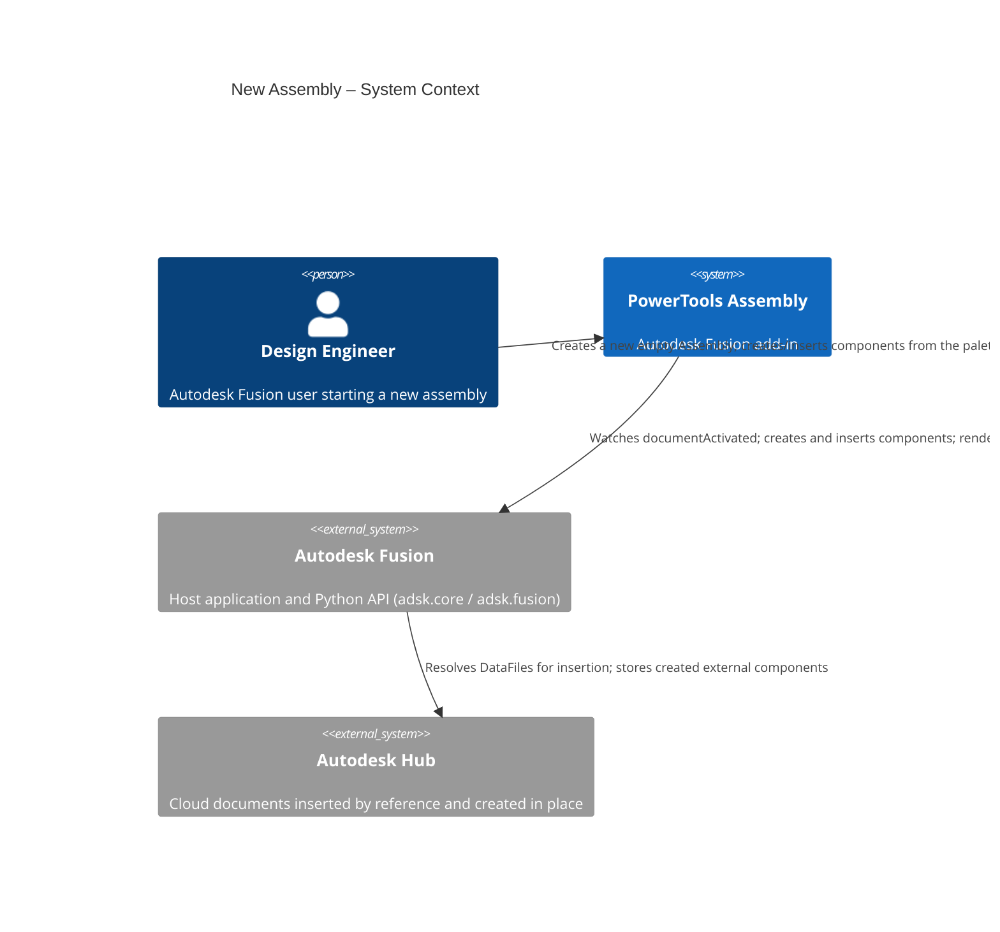
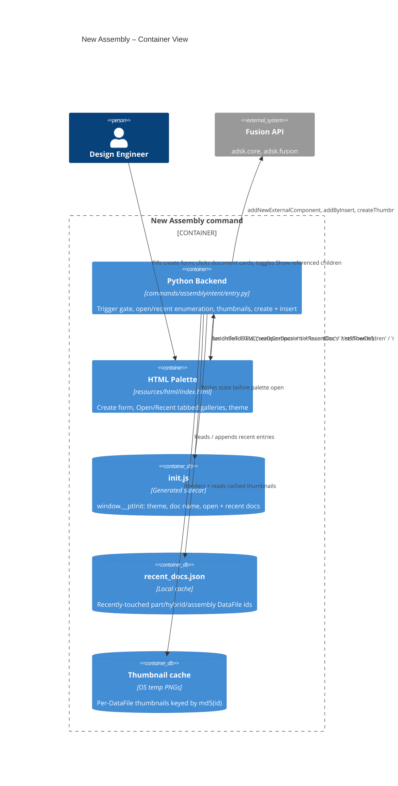
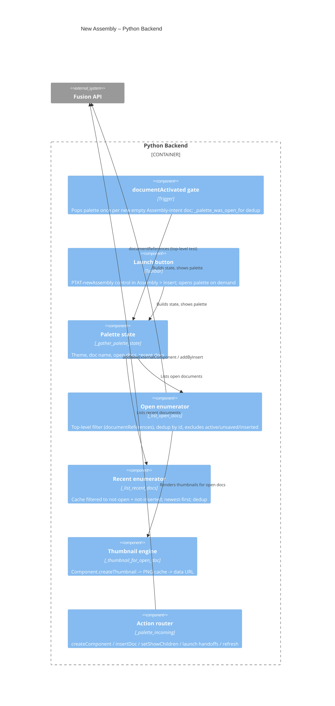
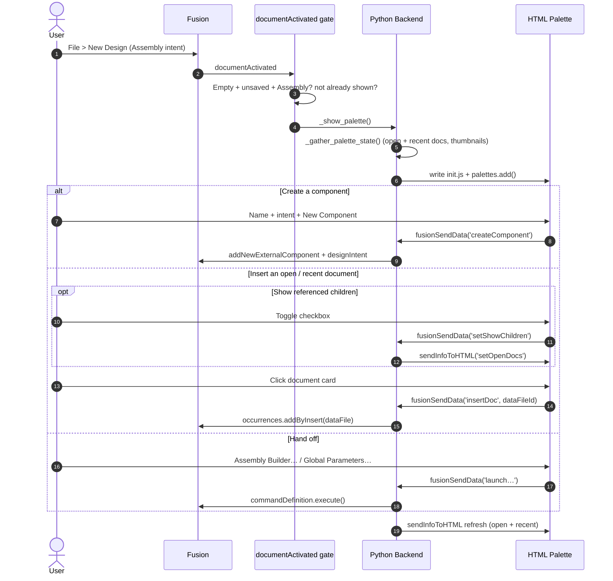

# New Assembly — Architecture
[← New Assembly guide](../New%20Assembly.md)

## Architecture

New Assembly bridges an HTML/JS palette (running in Fusion's QT WebEngine) and the Fusion Python API. The palette hosts the three quick-start sections; the Python backend watches for new empty Assembly documents, enumerates open and recent documents, renders thumbnails, and performs component creation and insertion.

### User flow

## Design decisions

### Why `documentActivated` instead of `documentOpened`?
`documentOpened` is not reliably emitted for **File > New** across Fusion builds (notably on macOS), while `documentActivated` fires consistently. It also fires on every tab switch, so a `_palette_was_open_for` gate (compared by Python object identity, not `id()`) suppresses re-popping the palette for a document it already handled. `documentOpened` is attached as a harmless backup when the running build exposes it.

### How are top-level documents told apart from referenced children?
Fusion answers this directly and instantly: `Document.documentReferences` raises *"Cannot get documentReferences of a non-top-level document"* for a reference-loaded child and returns the reference collection for a top-level document. The Open tab uses that in-memory check (no cloud round-trip) to show only the documents you opened directly. **Show referenced children** simply skips the filter.

### Why a generated `init.js` instead of a message handshake?
As with Assembly Builder, the palette loads asynchronously and `palettes.add()` rejects a query string on the URL. Writing `resources/html/init.js` (theme, document name, open docs, recent docs) **before** creating the palette lets the page read `window.__ptInit` synchronously and apply the correct theme before the first paint. A reopened palette is refreshed via `sendInfoToHTML` instead.

### Why render thumbnails with `Component.createThumbnail`?
The DataFile-backed cloud thumbnail did not resolve reliably in the target build. Rendering the live root component is dependable while a document is open, so thumbnails are generated for open documents and cached on disk (keyed by `md5(dataFileId)` in the OS temp folder). The Recent gallery — whose documents are closed and cannot be rendered — reuses whatever PNG was cached while the document was last open, falling back to a placeholder.

### Why a per-session "inserted" filter?
A document inserted from the palette is not "open in a tab," so the next refresh would re-list it under Recent and a second click would silently add a duplicate occurrence. Inserted DataFile ids are tracked for the current palette session and hidden from both galleries; the set is cleared each time the palette is opened so deliberate re-insertion is still possible in a fresh session.
