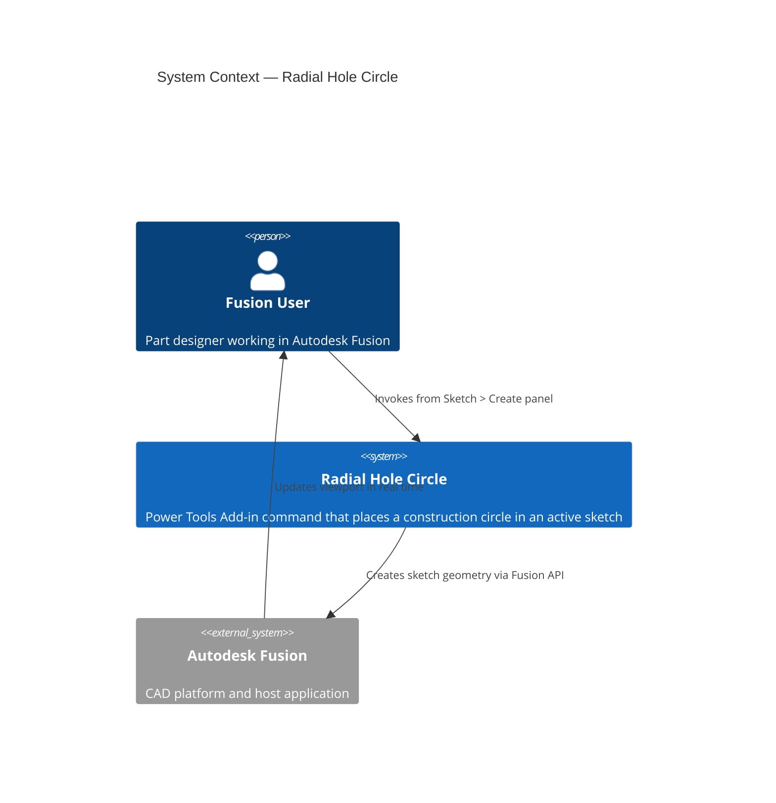
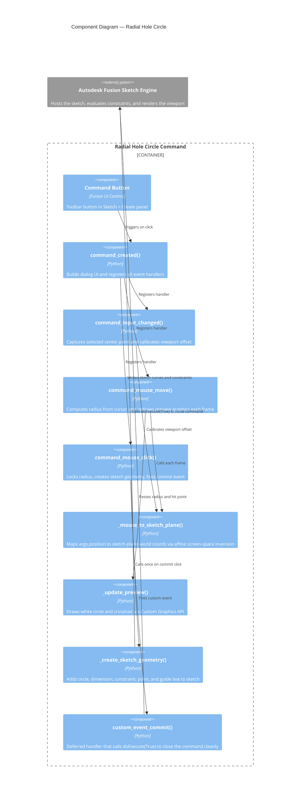

# Radial Hole Circle — Architecture

[← Radial Hole Circle guide](../RadialHoleCircle.md)

## Architecture

### System context

### Component diagram

### Coordinate space note

Fusion's `MouseEventArgs.position` reports cursor coordinates in **application-window space**, while `Viewport.modelToViewSpace()` returns coordinates in **viewport-local space**. The two share the same pixel scale but differ by a constant offset equal to the viewport's top-left corner within the application window.

The command calibrates this offset once at the moment the center point is selected (when both the click position and the projected center screen position are known simultaneously), then applies the correction on every `mouseMove` event so that the affine screen-space inversion produces accurate sketch-plane coordinates.
