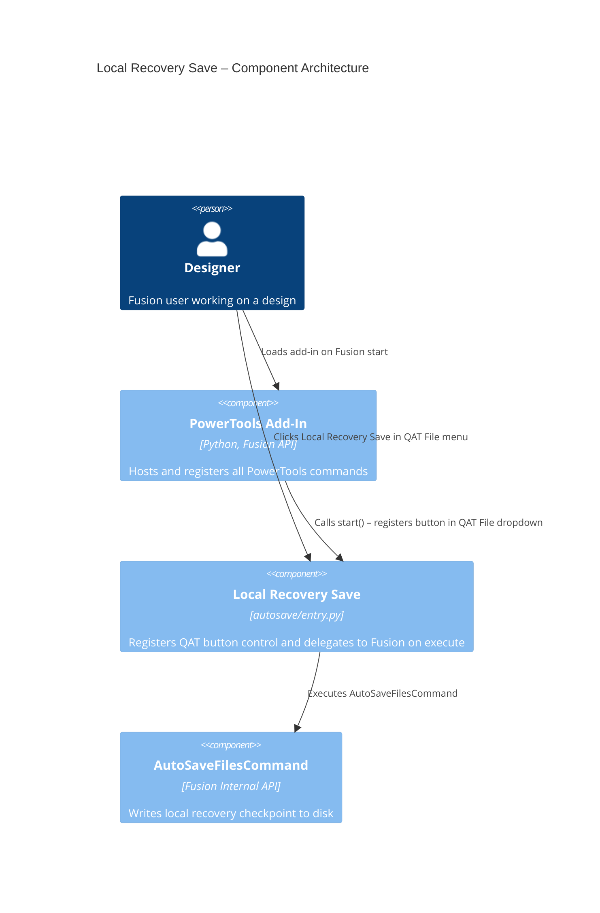

# Local Recovery Save — Architecture

[← Local Recovery Save guide](../Recovery%20Save.md)

## Architecture

The Local Recovery Save command is a thin wrapper around Fusion's built-in `AutoSaveFilesCommand`. It registers a button control in the QAT File dropdown during add-in startup and delegates execution directly to the internal Fusion command on click.

### Command ID

`PTND-autoSave`

### Execution flow

1. The add-in registers the command definition and inserts a button after the **Save as Latest** control in the QAT File dropdown.
2. The user selects **Local Recovery Save**.
3. The `command_execute` handler retrieves the internal `AutoSaveFilesCommand` command definition from the Fusion UI.
4. `AutoSaveFilesCommand` is executed, writing the local recovery checkpoint.

### Component diagram

