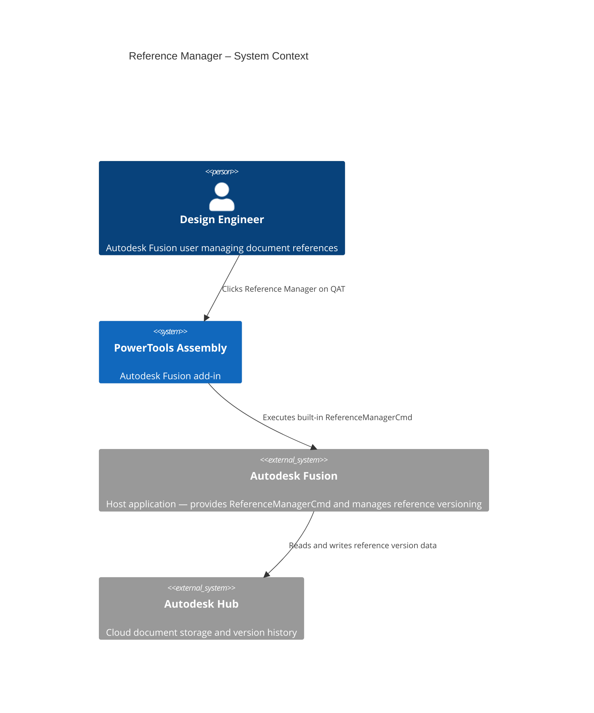
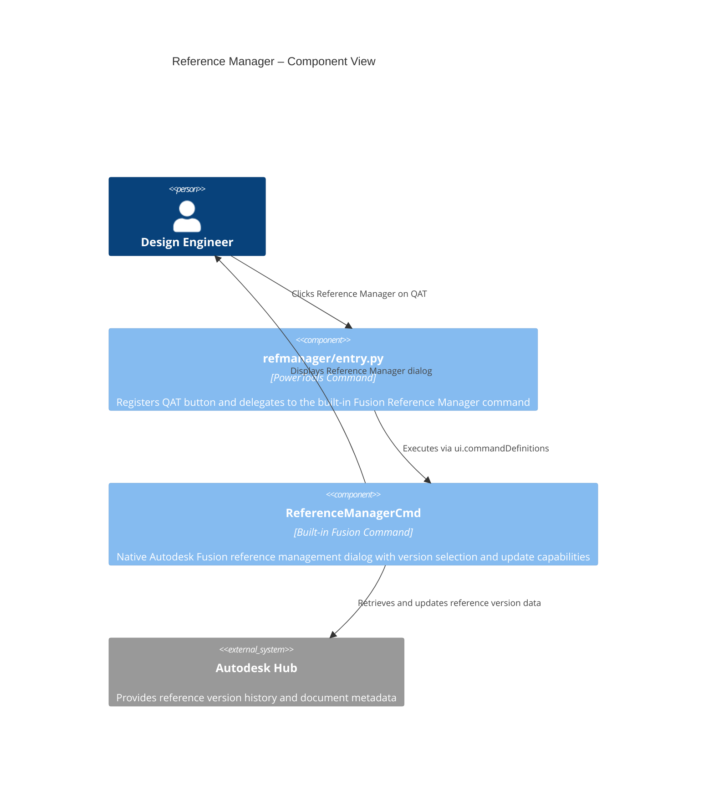
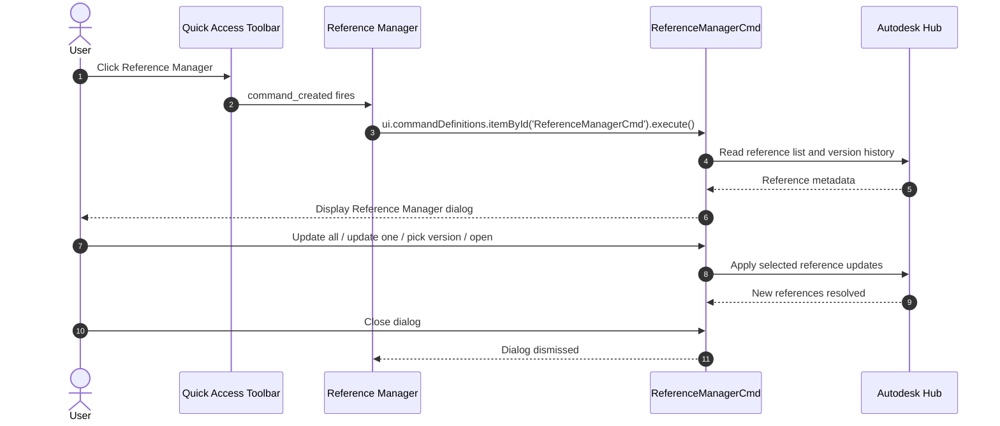

# Reference Manager — Architecture
[← Reference Manager guide](../Reference%20Manager.md)

## Architecture

The following diagram shows how the Reference Manager command interacts with Autodesk Fusion.

### User flow

