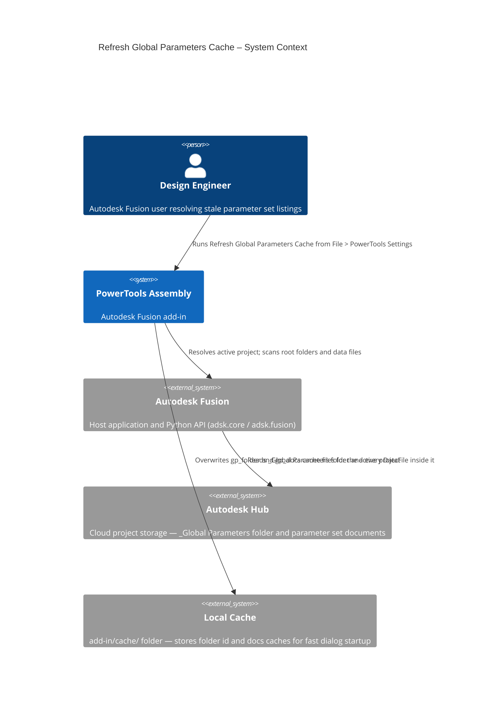
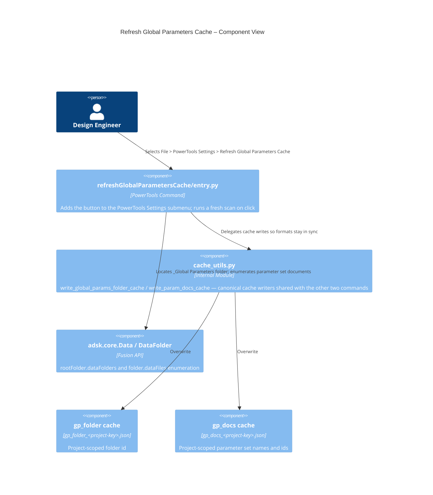
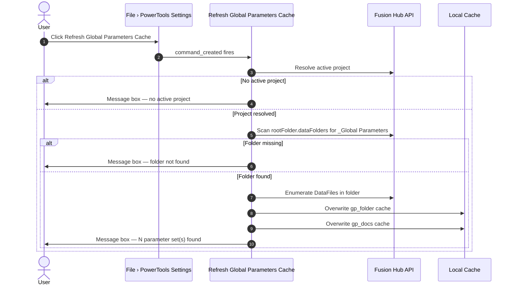

# Refresh Global Parameters Cache — Architecture
[← Refresh Global Parameters Cache guide](../Refresh%20Global%20Parameters%20Cache.md)

## Architecture

```mermaid
C4Context
  title Refresh Global Parameters Cache – System Context

  Person(user, "Design Engineer", "Autodesk Fusion user resolving stale parameter set listings")
  System(addin, "PowerTools Assembly", "Autodesk Fusion add-in")
  System_Ext(fusion, "Autodesk Fusion", "Host application and Python API (adsk.core / adsk.fusion)")
  System_Ext(hub, "Autodesk Hub", "Cloud project storage — _Global Parameters folder and parameter set documents")
  System_Ext(cache, "Local Cache", "add-in/cache/ folder — stores folder id and docs caches for fast dialog startup")

  Rel(user, addin, "Runs Refresh Global Parameters Cache from File > PowerTools Settings")
  Rel(addin, fusion, "Resolves active project; scans root folders and data files")
  Rel(fusion, hub, "Reads _Global Parameters folder and every DataFile inside it")
  Rel(addin, cache, "Overwrites gp_folder and gp_docs cache files for the active project")
```

```mermaid
C4Component
  title Refresh Global Parameters Cache – Component View

  Person(user, "Design Engineer")
  Component(cmd, "refreshGlobalParametersCache/entry.py", "PowerTools Command", "Adds the button to the PowerTools Settings submenu; runs a fresh scan on click")
  Component(cache_utils, "cache_utils.py", "Internal Module", "write_global_params_folder_cache / write_param_docs_cache — canonical cache writers shared with the other two commands")
  Component(api_data, "adsk.core.Data / DataFolder", "Fusion API", "rootFolder.dataFolders and folder.dataFiles enumeration")
  Component(folder_cache, "gp_folder cache", "gp_folder_<project-key>.json", "Project-scoped folder id")
  Component(docs_cache, "gp_docs cache", "gp_docs_<project-key>.json", "Project-scoped parameter set names and ids")

  Rel(user, cmd, "Selects File > PowerTools Settings > Refresh Global Parameters Cache")
  Rel(cmd, api_data, "Locates _Global Parameters folder; enumerates parameter set documents")
  Rel(cmd, cache_utils, "Delegates cache writes so formats stay in sync")
  Rel(cache_utils, folder_cache, "Overwrite")
  Rel(cache_utils, docs_cache, "Overwrite")
```

```mermaid
sequenceDiagram
  autonumber
  actor User
  participant QAT as File › PowerTools Settings
  participant Cmd as Refresh Global Parameters Cache
  participant Hub as Fusion Hub API
  participant Cache as Local Cache

  User->>QAT: Click Refresh Global Parameters Cache
  QAT->>Cmd: command_created fires
  Cmd->>Hub: Resolve active project
  alt No active project
    Cmd->>User: Message box — no active project
  else Project resolved
    Cmd->>Hub: Scan rootFolder.dataFolders for _Global Parameters
    alt Folder missing
      Cmd->>User: Message box — folder not found
    else Folder found
      Cmd->>Hub: Enumerate DataFiles in folder
      Cmd->>Cache: Overwrite gp_folder cache
      Cmd->>Cache: Overwrite gp_docs cache
      Cmd->>User: Message box — N parameter set(s) found
    end
  end
```
