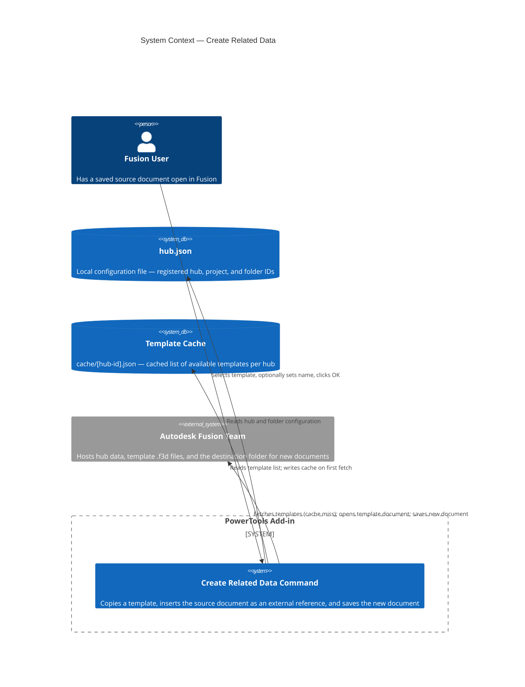
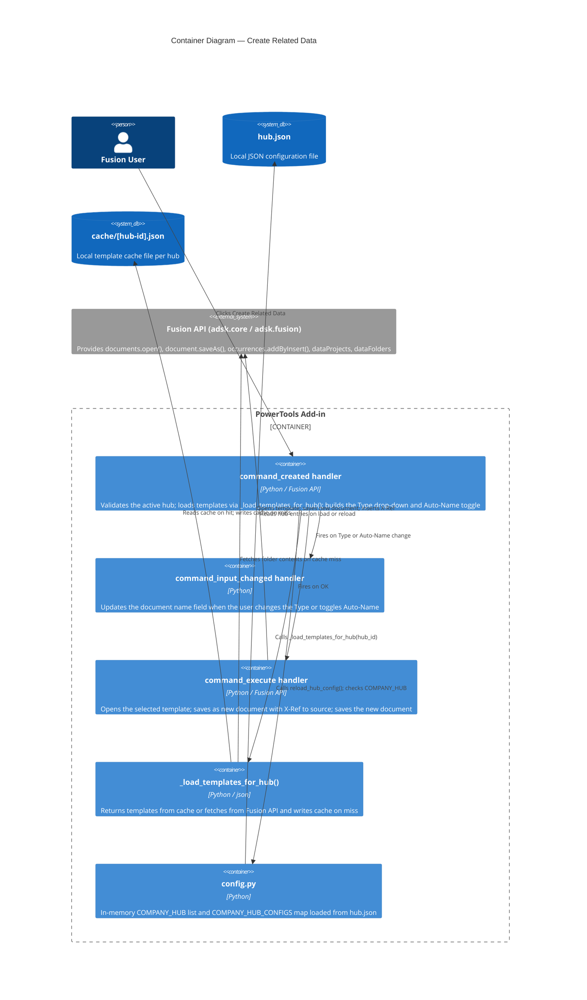

# Create Related Data — Architecture

[← Create Related Data guide](../Related%20Data.md)

## Architecture

### How the command works

When you run **Create Related Data**, the add-in follows this sequence:

1. Reloads the in-memory hub configuration from `hub.json` to pick up any recently added hubs.
2. Checks whether the active hub ID is in the configured hub list. If it is not, an error message is displayed.
3. Calls `_load_templates_for_hub()`, which checks for a local cache file at `cache/[hub-id].json`. On a cache hit, templates are loaded from disk. On a cache miss, templates are fetched from the Fusion API, then written to the cache for future use.
4. Verifies that the source document is saved.
5. Presents the command dialog with a **Type** drop-down listing all available templates and an **Auto-Name** toggle.
6. When the user selects a template, the document name field updates automatically to `<source name> ‹+› <template name>`.
7. On confirmation (OK):
   - Opens the selected template document from the hub.
   - Saves it as a new document with the specified name, into the same folder as the source document.
   - Inserts the source document into the new document's root component as an external reference (X-Ref).
   - Saves the new document.

### System context

### Container detail

