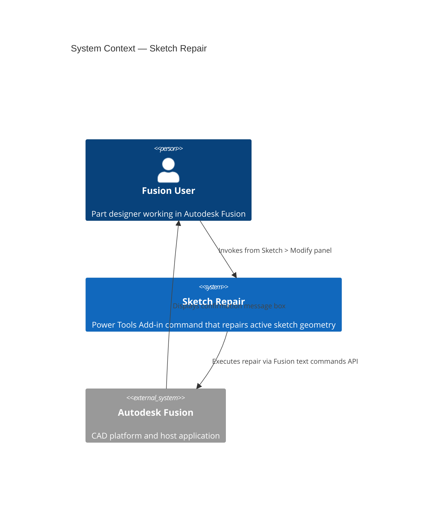
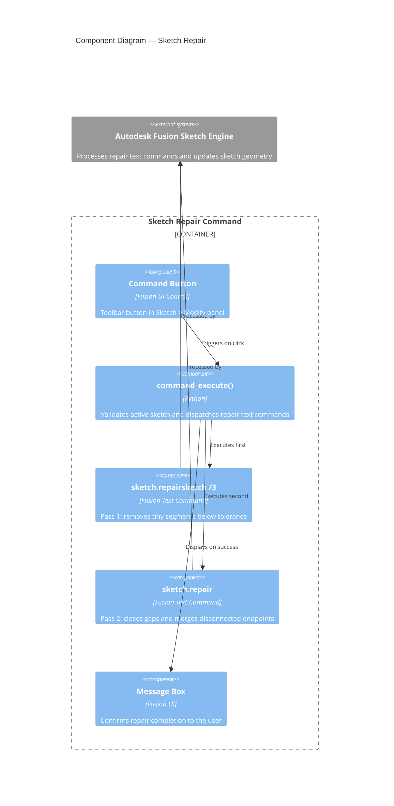

# Sketch Repair — Architecture

[← Sketch Repair guide](../SketchFix.md)

## Architecture

### System context

The following diagram shows the relationship between the user, the Sketch Repair command, and Autodesk Fusion.

### Component diagram

The following diagram shows how the internal components of the command interact during execution.

