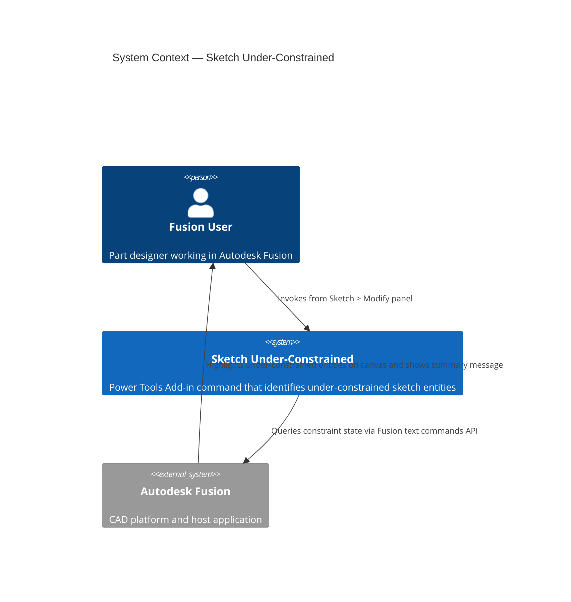
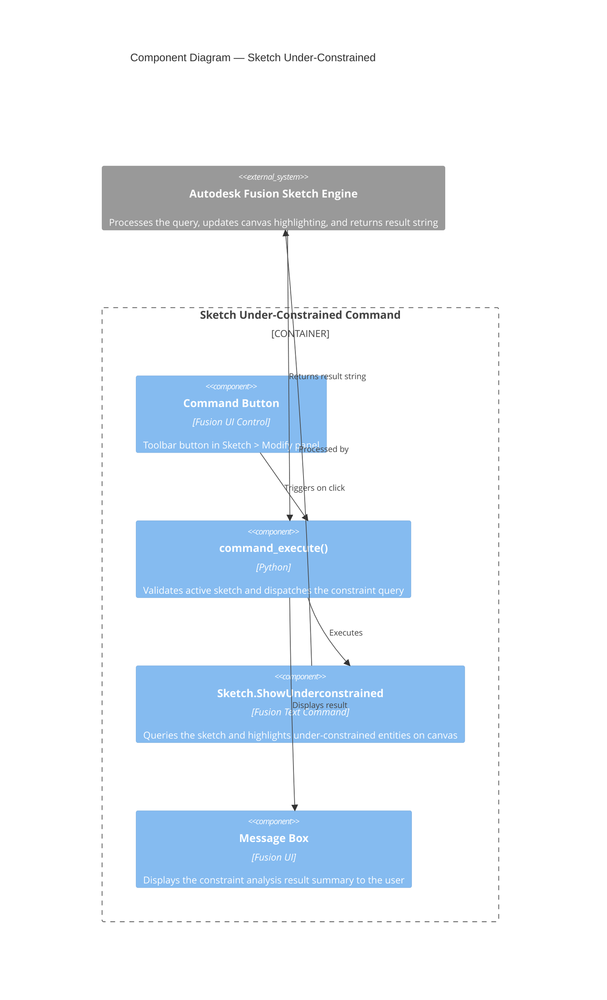

# Sketch Under-Constrained — Architecture

[← Sketch Under-Constrained guide](../SketchUnder.md)

## Architecture

### System context

The following diagram shows the relationship between the user, the Sketch Under-Constrained command, and Autodesk Fusion.

### Component diagram

The following diagram shows how the internal components of the command interact during execution.

