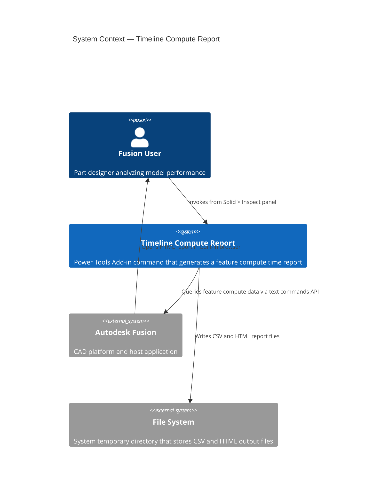
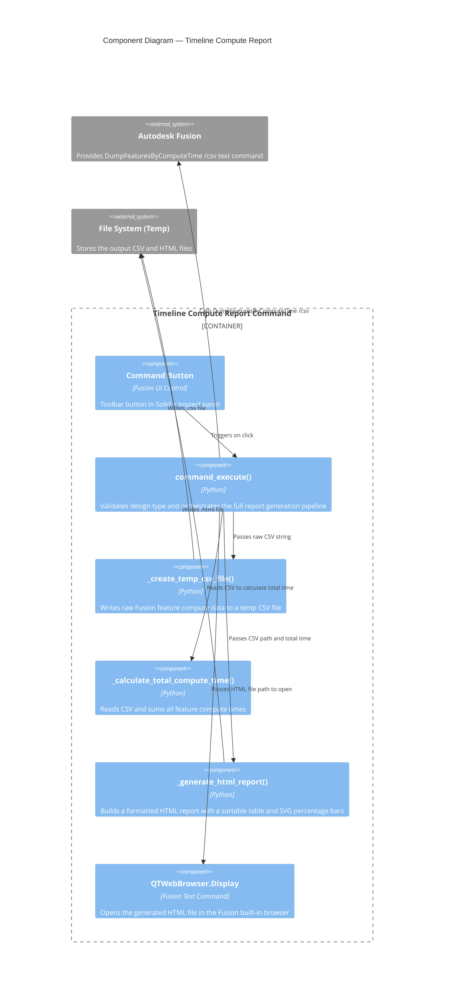

# Timeline Compute Report — Architecture

[← Timeline Compute Report guide](../Timeline%20Compute%20Times.md)

## Architecture

### System context

The following diagram shows the relationship between the user, the Timeline Compute Report command, Autodesk Fusion, and the file system.

### Component diagram

The following diagram shows how the internal components of the command interact during execution.

