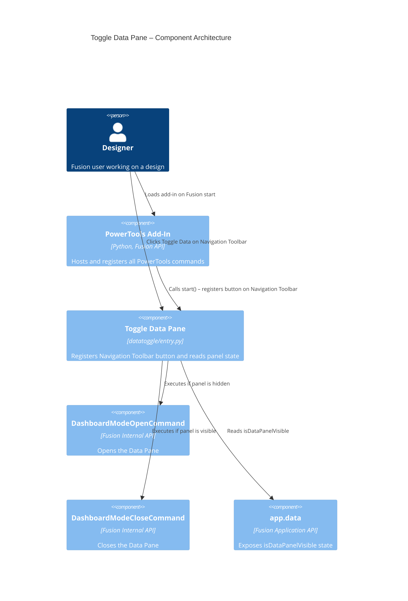

# Toggle Data Pane — Architecture

[← Toggle Data Pane guide](../Toggle%20Data%20Pane.md)

## Architecture

The Toggle Data Pane command registers a button control on the Fusion Navigation Toolbar. On execution, it reads the current state of the Data Pane from the Fusion Application object and dispatches to either the built-in `DashboardModeOpenCommand` or `DashboardModeCloseCommand` accordingly.

### Command ID

`NavBarBtn`

### Execution flow

1. The add-in registers the command definition with a custom icon and inserts a button control on the Navigation Toolbar.
2. The user clicks the **Toggle Data** button.
3. The `command_created` handler checks `app.data.isDataPanelVisible`.
4. If `True`, the handler executes `DashboardModeCloseCommand` to hide the Data Pane.
5. If `False`, the handler executes `DashboardModeOpenCommand` to show the Data Pane.

### Component diagram

