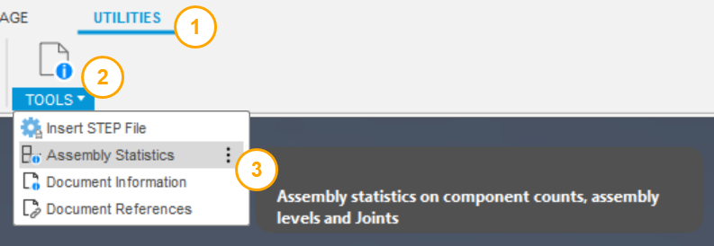
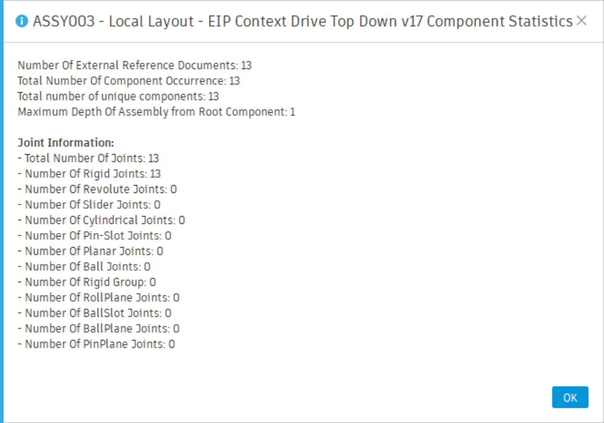

# Assembly Statistics

[Back to README](../README.md)

## Overview

Assembly Statistics reports component counts, nesting depth and joint counts for the active design in one dialog.

SolidWorks' Performance Evaluation for assemblies opens with the numbers that describe how heavy an assembly is: how many components, how many unique, how deep. Fusion has no such summary; you count in the browser. Assembly Statistics gives the same figures in a message box, so a large or slow assembly can be sized up before you decide what to do about it.

## Prerequisites

- A design document saved to a hub. Otherwise the command asks you to save first.

## Where to find it

**Utilities** tab › **Power Tools** panel › **Assembly Statistics**, in the Design workspace.

## How to use

1. Select **Assembly Statistics**.
2. Read the dialog, titled with the root component's name, and select **OK**.

## What it reports

| Figure | Meaning |
|---|---|
| Total component instances | Occurrences across every level of the assembly |
| Unique components | Distinct component definitions, excluding the root |
| Out-of-date components | References in the document with a newer version available |
| Maximum assembly depth | Nesting levels from the root to the deepest component |
| Document contexts | Assembly-context entries in the timeline |
| Constraints, tangent relationships, rigid groups | Counts on the root component |
| Joints, total and by type | Rigid, Revolute, Slider, Cylindrical, Pin-Slot, Planar, Ball |

## Limitations

- The figures are read from the design as it is in memory; update references first if the counts should reflect the latest versions.

> **Developers:** see the [architecture notes](./arch/Assembly%20Statistics.md).

---

[Back to README](../README.md)

*Copyright © 2026 IMA LLC. All rights reserved.*
