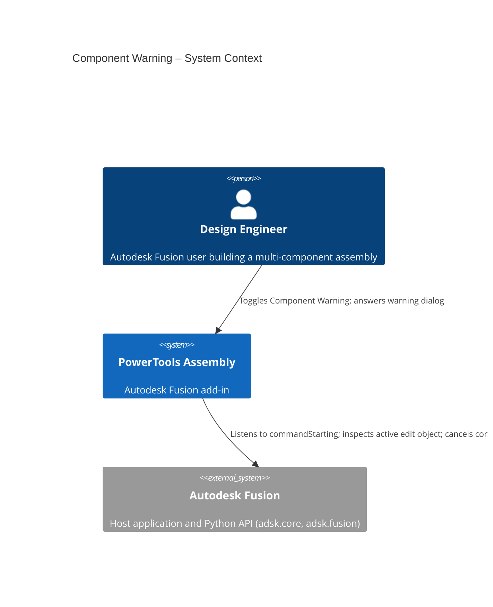
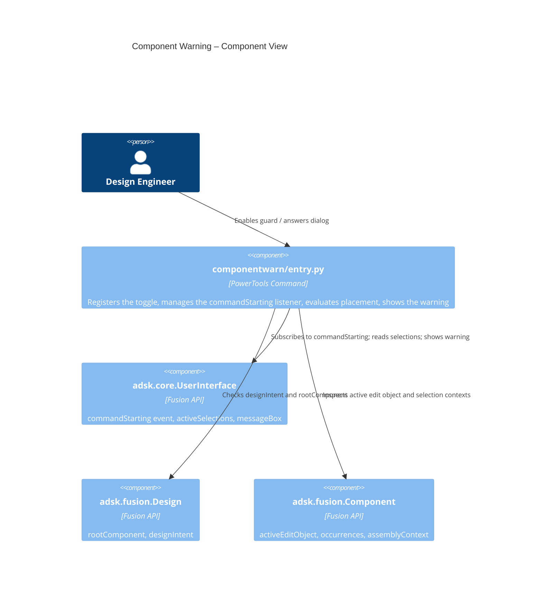

# Component Warning

[Back to PowerTools Assembly](../README.md)

The Component Warning command is a passive guard that warns you before a new feature is created in the wrong place in an assembly. When enabled, it watches for feature-creation commands (sketches, solids, work geometry, patterns, and surfaces) and prompts you when the feature would be created directly in the root component, in a non-leaf component, or while a selection references a different component than the one you are editing. This helps keep assembly designs organized by ensuring features are authored inside the component they belong to.

The command is a toggle: turn it on to monitor placement, turn it off to work without prompts.

## What you can do

- Catch features that would be created directly in the root component, outside of any component.
- Catch features that reference a component other than the one currently being edited.
- Optionally catch features created in a non-leaf component (a component that still has child occurrences).
- Choose, per warning, to create the feature anyway, cancel the command, or silence the warning for the active document.
- Enable or disable the guard from **PowerTools Settings** in the QAT File menu.

## Prerequisites

- An Autodesk Fusion 3D Design must be active.
- The guard is active only in the **Design** (Solid) workspace; it automatically detaches in other workspaces.
- The active design must use **Assembly** or **Hybrid** design intent. Designs with **Part** intent are skipped, because features there are meant to be built directly in the root component.

## How to use Component Warning

1. Open the **QAT File menu** (the file icon at the top-left of Fusion) and expand **PowerTools Settings**.
2. Click **Enable Component Warning**. The menu item changes to **Disable Component Warning** while the guard is active.
3. Continue modeling as usual. If you start a feature-creation command while editing the root component (or referencing another component), a warning dialog appears.
4. In the warning dialog, choose one of the following:
   - **Yes** — create the feature anyway. To avoid a duplicate prompt, the guard pauses briefly after this choice.
   - **No** — stop warning for the active document for the rest of the session.
   - **Cancel** — cancel the command so no feature is created.
5. To turn the guard off entirely, open **PowerTools Settings** again and click **Disable Component Warning**.

> **Note:** Documents silenced with **No** are remembered only for the current Fusion session. Reopening the document restores warnings.

## How it works

While enabled and while the Solid workspace is active, the command listens to the Fusion `commandStarting` event. When a watched feature-creation command begins, the guard inspects the active edit target:

- If the active edit target is the **root component**, the feature would be created outside of any component.
- If **only-leaf checking** is enabled and the target component still has child occurrences, the feature would be created in a **non-leaf component**.
- If any current selection belongs to a **different component** than the one being edited, the feature would reference another component.

When any of these is true, the warning dialog is shown before the command runs. Choosing **Cancel** sets the starting command to canceled so it never executes.

The set of watched commands and the only-leaf option are defined at the top of `commands/componentwarn/entry.py`.

## Access

**Component Warning** is accessed from the **QAT File menu › PowerTools Settings**. The menu item label reflects the current state: **Enable Component Warning** when the guard is off, **Disable Component Warning** when it is on. The PowerTools Settings submenu is shared with other PowerTools add-ins and is created automatically on first use.

## Architecture

The following diagrams show how the Component Warning command interacts with Autodesk Fusion.





### User flow

```mermaid
sequenceDiagram
  autonumber
  actor User
  participant Menu as QAT › PowerTools Settings
  participant Cmd as Component Warning
  participant API as Fusion API

  User->>Menu: Click "Enable Component Warning"
  Menu->>Cmd: command_execute fires
  Cmd->>Cmd: _enabled = True; label → "Disable Component Warning"
  Cmd->>API: Attach commandStarting listener
  User->>API: Start a feature command (e.g. Extrude)
  API->>Cmd: command_starting fires
  Cmd->>API: Read designIntent, activeEditObject, selections
  alt Feature lands in wrong place
    Cmd->>User: Show warning (Yes / No / Cancel)
    User-->>Cmd: Choice
    alt Cancel
      Cmd->>API: args.isCanceled = true
    else No
      Cmd->>Cmd: Silence active document
    else Yes
      Cmd->>Cmd: Start hold-off timer
    end
  else Placement is fine
    Cmd-->>API: Do nothing (command proceeds)
  end
```

---

[Back to PowerTools Assembly](../README.md)

---

*Copyright © 2026 IMA LLC. All rights reserved.*
