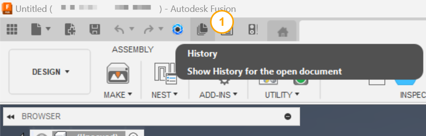

# Document History

[Back to README](../README.md)

## Overview

The **Document History** command adds a **History** button to the Autodesk Fusion Quick Access Toolbar (QAT) and opens a palette that shows the active document's version history as a stack of day rows, newest at the top.

Each row is one calendar day. Inside a day, every person who saved gets their own track, and each save is a dot placed at the time of day it happened, on a clock that runs from midnight on the left to midnight on the right. Between two rows, a label says how much time passed &mdash; "Next day", "3 days later", "1 year, 2 months and 3 days later".

That layout answers questions a single version list cannot: who was working on this design, how a working day was shaped, whether two people were saving over each other, and how long the design sat untouched between bursts of work.

Reaching Fusion's own history panel otherwise means right-clicking the root component in the browser panel &mdash; a non-obvious interaction that is easy to overlook.

## Prerequisites

- A document must be open in Autodesk Fusion.
- The document must be saved to an Autodesk Hub. Version history is cloud data, so an unsaved document has none.

## Access

Select **History** from the **Quick Access Toolbar (QAT)**, immediately to the left of **Save**.

## Reading the view

### Day rows

Rows run newest first. Each row's heading gives the date &mdash; **Today** and **Yesterday** are named rather than dated &mdash; and the number of saves that day. Rows alternate between a plain and a shaded band so a long history stays countable.

The column of circles down the left is the author gutter: one identity disc per track, coloured from the person's Autodesk user id so the same person is the same colour in every row. The gutter is frozen against the left edge, so it still says who no matter how far the view is scrolled.

Where a day has more than six people, the remaining tracks merge into a single track marked **+N**. Nothing is dropped &mdash; every save still has its own dot and its own hover card.

### The clock axis

By default a row is a 00:00 to 24:00 clock fitted to the palette width, so noon sits in the same column in every row and one day's shape can be compared with the day above it.

Saves closer together than the dots are wide are nudged apart so a burst does not collapse into a blob. When a dot has been moved, a faint hairline marks the time it actually happened, and the hover card always carries the exact timestamp.

### The markers

| Marker | Meaning |
|---|---|
| Plain grey dot | An ordinary save. |
| Small open ring | An edit that made no new version &mdash; only shown with **Show other changes** on. |
| Grey dot with a blue ring | A milestone. |
| Blue dot with a blue ring | A release &mdash; a milestone you gave a revision name, such as "A" or "Rev B". Milestones Fusion names for itself ("Milestone V7", "Item Update") are shown as milestones, not releases. |
| Outer ring | The version a public share link points at. |

The legend below the view lists only the markers that occur in this document's history.

### The elapsed-time labels

Between two day rows, a rule and a phrase say how long the design was untouched. The weight of the rule scales with the gap &mdash; a hairline for the next day, a dashed rule for a week or more &mdash; so a long silence is felt before it is read.

### The hover card

Rest the pointer on an open ring to see what the change was &mdash; "Property change", the property and its new value, when, and who. There is no thumbnail or version number, because no version was made.

Rest the pointer on a dot to see that version's thumbnail, version number, milestone and release markers, the description typed at save time, the exact local timestamp, and who saved it.

The thumbnail is fetched from the cloud only for the version you actually rest on, and cached for the rest of the session, so scanning across a busy day costs nothing.

## Layout options

| Option | What it does |
|---|---|
| **Show other changes** | Adds the edits that did not produce a version &mdash; property changes, milestones, part numbers &mdash; each as a small open ring on its author's track. This can add people: someone who edited a property but never saved does not appear at all with this off. Hidden entirely for a document whose history could not be read from the cloud, since those edits are not visible there. |
| **Show thread across days** | Switches the horizontal axis from the clock to the version's position in the history: every save is one column apart, and a line threads them in order across the day rows. Empty time then costs no width, so a long history scrolls sideways inside the box, with a dashed seam wherever the axis crosses from one day into the next. |
| **Show all N days** | Appears when a history runs past 60 days. The view renders the most recent 60 by default; this draws the rest. |

The clock view is the default because it is the one that never scrolls sideways and keeps every row on the same scale. Turn the thread on when the question is "what order did these happen in", rather than "when in the day".

## Notes

- The palette takes a moment to open while it reads the history from Fusion's cloud; Fusion shows a busy indicator in the status bar meanwhile.
- The palette shows a snapshot taken when it was opened. Select **History** again to re-read the history after saving.
- Authorship comes from Fusion's cloud data. If the design is not in a hub, or you are offline, the palette still draws the history but every save is attributed to the document's creator, because that is all the desktop API can tell it.
- The history is read from the cloud, so a document with hundreds of versions takes a moment to open. Fusion shows a busy indicator while it reads.
- Fusion exposes a public share link on the document rather than on a specific version, so the public-share ring marks the current version.
- Where Fusion could not resolve who saved a version, the track is drawn as an unknown author rather than dropped, and a version with no usable date collects in a trailing **Date unknown** row.

> **Developers:** see the [architecture notes](./arch/Document%20History.md).

[Back to README](../README.md)

*Copyright © 2026 IMA LLC. All rights reserved.*
