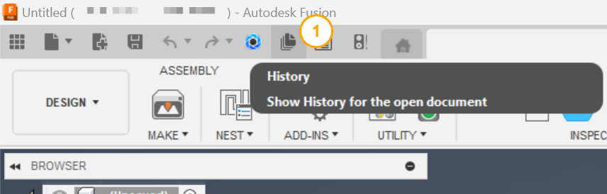

# History

[Back to README](../README.md)

## Overview

History shows the active document's version history as a stack of day rows in a palette: one row per day, a track per author, saves placed on a clock axis, and the elapsed time called out between days.

Every CAD data manager lists versions as a table: number, date, user, comment. Onshape's history and SolidWorks PDM's History tab are good examples, and Fusion's own version panel, reached by right-clicking the root component in the browser, is another. A table answers "what is version 12?". It does not answer who was working on this design, how a working day was shaped, whether two people were saving over each other, or how long the design sat untouched between bursts of work. History draws the versions on time so those questions are answered at a glance.

## Prerequisites

- A document must be open and saved to a hub. Version history is cloud data; an unsaved document has none, and the command asks you to save first.

## Where to find it

**History** on the Quick Access Toolbar, immediately to the left of **Save**.



The palette, titled **Document History**, docks on the right. Fusion shows a busy indicator while the history is read from the cloud; a document with hundreds of versions takes a moment.

## Reading the view

### Day rows

Rows run newest first. Each row's heading gives the date, with **Today** and **Yesterday** named rather than dated, and the number of saves that day. Rows alternate between a plain and a shaded band so a long history stays countable.

The column of circles down the left is the author gutter: one identity disc per track, colored from the person's Autodesk user ID so the same person is the same color in every row. The gutter stays against the left edge however far the view is scrolled.

A day holds at most six tracks. Where more than six people saved on one day, five keep their own track and the rest merge into a single track marked **+N**. Nothing is dropped; every save still has its own dot and its own hover card.

### The clock axis

By default a row is a 00:00 to 24:00 clock fitted to the palette width, so noon sits in the same column in every row and one day's shape can be compared with the day above it.

Saves closer together than the dots are wide are nudged apart so a burst does not collapse into a blob. When a dot has been moved, a faint hairline marks the time it actually happened, and the hover card always carries the exact timestamp.

Where a day is too crowded for that nudging to keep the dots on the right side of the hour markers, the row drops its hour markers and shows the order the day's events came in rather than the time they happened. Narrowing the palette makes this more likely.

### The markers

| Marker | Meaning |
|---|---|
| Plain grey dot | An ordinary save. |
| Small open ring | An edit that made no new version: a property change, a part number, a component update. Shown only with **Show other changes** on. Creating a milestone or a release is not shown this way; it marks the save it was made against. |
| Grey dot with a blue ring | A milestone. |
| Blue dot with a blue ring | A release: a milestone you gave a revision name, such as "A" or "Rev B". Milestones Fusion names for itself ("Milestone V7", "Item Update") are shown as milestones. |
| Outer ring | The version a public share link points at. |

The legend below the view always lists saves, and adds the other markers only when they occur in this document's history.

### The index

Every dot can carry a small three-part number above it, counted from the oldest event forward:

| Event | What it counts up |
|---|---|
| A release | The first figure. The second and third restart at zero. |
| A save or a milestone | The second figure. The third restarts at zero. |
| Any other change | The third figure. |

Counting starts at `0.0.0`, so a document's first save reads `0.1.0` and the first release someone names reads `1.0.0`:

```
save        0.1.0
save        0.2.0
property    0.2.1
property    0.2.2
release A   1.0.0
save        1.1.0
milestone   1.2.0
```

Because a save restarts the third figure, turning **Show other changes** on and off never renumbers a save.

There are two ways to see the numbers. Rest the pointer on a track and that person's numbers appear for as long as the pointer is in their row. Or turn on **Index** to show all of them: the day rows open up so every number sits inside its own author's track, and close again when it is off. A release's number is drawn in the accent its dot is filled with, so releases stand out when scanning a long history. On a day with more saves than the row can separate, some numbers are left off the plot; the hover card still carries them.

### The elapsed-time labels

Between two day rows, a rule and a phrase say how long the design was untouched: "Next day", "3 days later", "1 year, 2 months and 3 days later". The rule is a hairline for the next day and becomes dashed for a week or more, so a long silence is felt before it is read.

### The hover card

Rest the pointer on a dot to see that version's thumbnail, version number, milestone and release markers, the description typed at save time, the exact local timestamp, who saved it, and its index number. Rest it on an open ring to see what the change was, the property and its new value, when, and who; there is no thumbnail or version number because no version was made.

Thumbnails are fetched from the cloud only for the version you rest on and cached on disk, so scanning across a busy day costs nothing.

## Options

| Option | Default | Effect |
|---|---|---|
| **Show other changes** | Off | Adds the edits that produced no version, each as a small open ring on its author's track. This can add people: someone who edited a property but never saved does not appear otherwise. The toggle is hidden when the history holds no such changes. |
| **Show thread across days** | Off | Switches the horizontal axis from the clock to the version's position in the history: every save is one column apart and a line threads them in order across the day rows. Empty time costs no width, so a long history scrolls sideways, with a dashed seam wherever the axis crosses from one day to the next. |
| **Index** | Off | Numbers every event and opens the day rows up to fit the numbers. |
| **Show all N days** | — | Appears when the history has more than 60 days with activity. The view draws the most recent 60 by default; this draws the rest. |

The clock view is the default because it never scrolls sideways and keeps every row on the same scale. Turn the thread on when the question is "what order did these happen in" rather than "when in the day".

## Limitations

- The palette shows a snapshot taken when it was opened. Select **History** again to re-read after saving; this also resets the toggles.
- The palette closes when the active document changes, since a history left on screen under a different document's name would read as that document's own. Select **History** again for the one you have moved to.
- Authorship comes from Fusion's cloud data. Offline, or for a document that is not in a hub, every save is attributed to the document's creator, because that is all the desktop API can report.
- Fusion exposes a public share link on the document rather than on a specific version, so the public-share ring marks the current version.
- Where the person who saved a version cannot be resolved, the track is drawn as an unknown author rather than dropped, and a version with no usable date collects in a trailing **Date unknown** row.

> **Developers:** see the [architecture notes](./arch/Document%20History.md).

---

[Back to README](../README.md)

*Copyright © 2026 IMA LLC. All rights reserved.*
