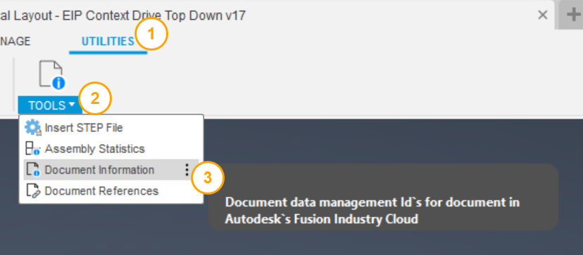
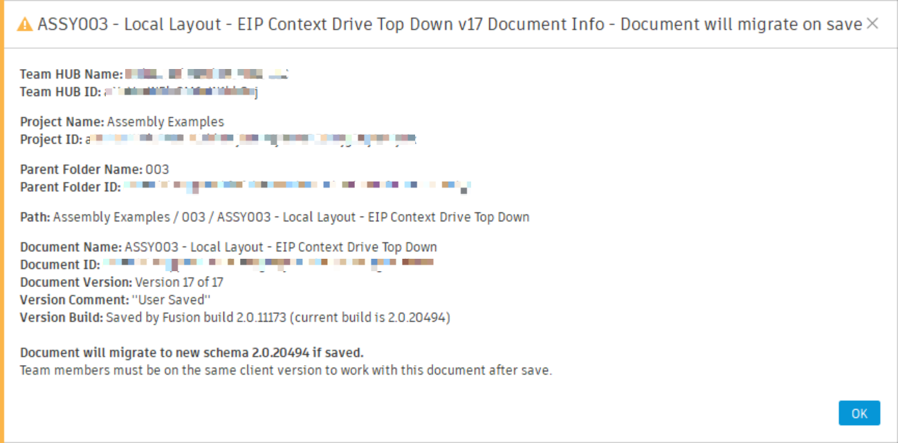

# Document Information

[Back to README](../README.md)

## Overview

Document Information shows the hub, project, folder, version and MFGDM identifiers of the active design or drawing, and warns when saving it would migrate it to the running Fusion build.

When a reference will not resolve, a teammate cannot see a file, or support asks "which document exactly?", the answer is an identifier the Fusion UI never shows. This command puts them all in one dialog: hub, project, folder and document IDs, the full folder path, the version you have open and the latest version on the hub. It checks whether Fusion's cloud manufacturing data model (MFGDM) holds a record for the document, where Fusion keeps cloud properties such as part numbers. It also compares the Fusion build that last saved the document with the one you are running, so you know before you save that the file will move to a new schema and that collaborators on an older client will no longer be able to open it.

## Prerequisites

- A design or drawing must be open and saved to a hub. An unsaved document has no identifiers, and the command asks you to save first.

## Where to find it

- Design workspace: **Utilities** tab › **Power Tools** panel › **Document Information**.
- Drawing workspace: **Power Tools** panel › **Document Information**, next to Assign Drawing Number.

## How to use

1. Select **Document Information**.
2. Read the dialog. Select **OK** to close it.

## What it shows

| Field | Meaning |
|---|---|
| Hub name and ID | The hub that holds the document |
| Project name and ID | The project that holds the document |
| Folder name and ID | The document's parent folder, or the project root |
| Path | Folder path from the project root to the document |
| Document name and ID | The document's cloud identifier |
| Version | `Version X of Y`: the version you have open and the latest on the hub |
| Version comment | The comment typed at the last save |
| Fusion build | The build that saved this version |

### MFGDM

For a **design**:

| Field | Meaning |
|---|---|
| MFGDM Data | **Available**, **Not available yet** (Fusion has no MFGDM id for the design), **Not found** (MFGDM has no record), or **Query failed** with the reason |
| Model ID | The design's timeless MFGDM model id |
| Component ID | The root component at its current version |
| MFGDM Hub ID | The hub id MFGDM uses (`urn:adsk.ace:...`), not the Data Panel's hub id |
| Part Number, Item Number | The cloud values, or *(none)* |

For a **drawing**, the same verdict for the drawing itself, then its drawing id, item number, lifecycle state and revision, and the design MFGDM records it as documenting (**MFGDM Source Design**). Below that comes the design the drawing references in Fusion (**Source Design**), with the design fields above when that design is open. The command never opens it for you; when it is not open, the dialog says so.

The two should name the same design. If MFGDM links the drawing to a different design from the one it references in Fusion, the dialog says so and shows the warning icon. That disagreement is a Fusion defect, not something you caused; report it to Autodesk with the document names the dialog shows.

If that build differs from the one you are running, the dialog title changes to say the document will migrate on save, the icon becomes a warning, and a line at the end explains it. The icon also becomes a warning when MFGDM data is missing or the drawing's links disagree.

## Limitations

- MFGDM ids arrive a short while after a design is first saved. Until then the check reports **Not available yet**; retry after a moment.
- A drawing's source design is checked only when it is already open in Fusion.
- If MFGDM cannot be reached, the check reports **Query failed**; the rest of the dialog is unaffected.

> **Developers:** see the [architecture notes](./arch/Document%20Information.md).

---

[Back to README](../README.md)

*Copyright © 2026 IMA LLC. All rights reserved.*
