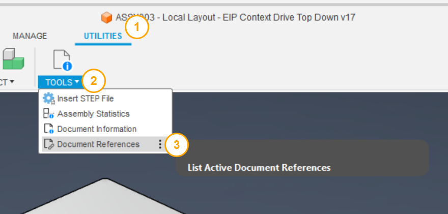
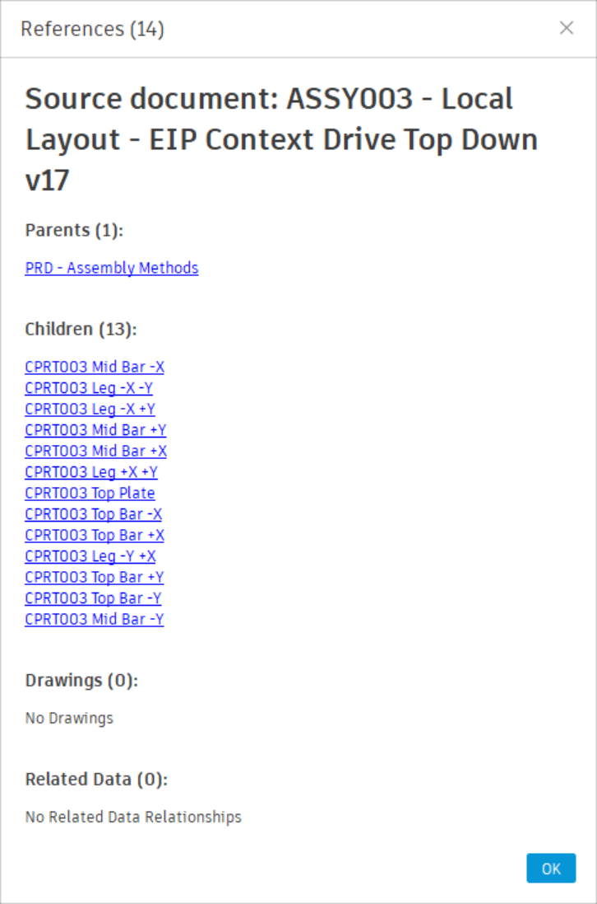

# Document References

[Back to README](../README.md)

## Overview

Document References lists every document related to the active design, grouped by relationship: the top-level assemblies that ultimately contain it, the assemblies that use it directly, the documents it uses, its drawings, its fasteners, and its related-data documents. For a drawing, it lists the designs the drawing documents; for an electronics document or a drawing of one, the rest of the electronics design it belongs to.

"Where is this part used?" is a PDM question. SolidWorks PDM answers it on a Where Used tab and Vault on a Uses/Where Used view; Fusion's desktop client shows only the references *inside* the open document. Document References walks the parent chain the other way, all the way to the root assemblies, and puts parents, children, drawings and related documents in one dialog you can open documents from.

## Prerequisites

- A design, drawing or electronics document saved to a hub.
- An internet connection. Offline, the command says so and stops.

## Where to find it

- Design workspace: **Utilities** tab › **Power Tools** panel › **Document References**.
- Drawing workspace: **Power Tools** panel › **Document References**.
- Electronics: a **Power Tools** panel in the electronics project, on the **Utilities** tab of the Schematic and PCB editors, and on the **3D PCB** tab.

## How to use

1. Select **Document References**.
2. Read the groups. Each heading shows its count; an empty group is collapsed.

   | Group | Contents |
   |---|---|
   | **Roots** | Top-level assemblies with no parents of their own, found by walking the full parent chain. Drawings and related-data documents are not followed, and the active document is never listed here |
   | **Used In (Parents)** | Documents that reference the active document directly |
   | **Uses (Children)** | Documents the active document references; a configuration is marked `(configuration)` |
   | **Drawings** | Drawings of the active document |
   | **Fasteners** | Components from Fusion's **Standard Components** library |
   | **Related Data** | Documents created with [Create Related Data](./Related%20Data.md), recognised by the `‹+›` in their name |

   From a drawing, the dialog has one group, **Uses**: the designs the drawing documents. The other groups do not apply to a drawing and are not shown.

   From an electronics document, the dialog lists the rest of the electronics design it belongs to in groups: **Electronics Project**, **Schematic**, **2D PCB**, **3D PCB** and **Drawings** (drawings of the 3D PCB). The electronics files usually share one name, so the group says which is which. The document you have open is not listed, and its group is left out. From the project, schematic or 2D PCB only these groups are shown. A drawing of the 3D PCB shows the same groups. From the 3D PCB they come first, followed by the design groups; the 2D PCB is not repeated as a parent, the drawings are not repeated, and the walk for Roots does not climb into the electronics files.

3. Hover a row for its project and folder path and a thumbnail; a reference in another project is flagged **Cross Project Reference**.
4. Select a row's folder button to open the document in Fusion (this closes the dialog), or its web button to open it in Fusion Team.
5. Select **Close**.

## Limitations

- Thumbnails are downloaded while the dialog is open and discarded when it closes.

> **Developers:** see the [architecture notes](./arch/Document%20References.md).

---

[Back to README](../README.md)

*Copyright © 2026 IMA LLC. All rights reserved.*
