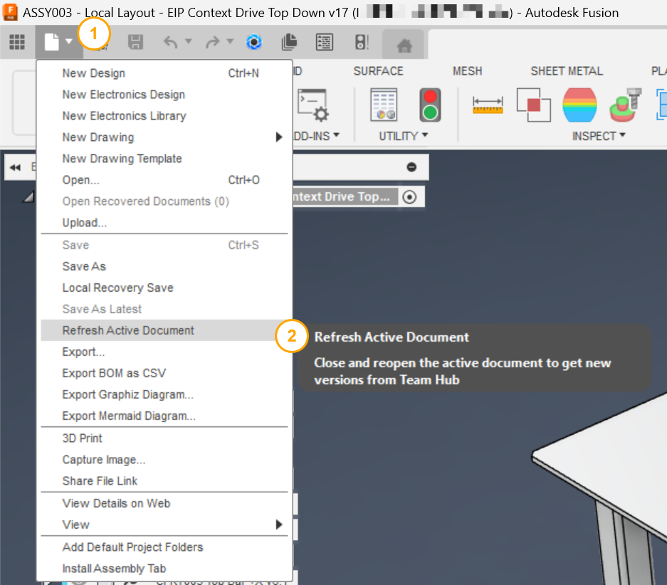

# Document Refresh

[Back to PowerTools Assembly](../README.md)

The Document Refresh command checks the Autodesk Hub for a newer version of the active document and, when there is one, closes and reopens the document to load it — all in a single step. Use this command when collaborating with a team and you need to load changes that other team members have published, without manually closing and re-opening the document through the File menu.

## What you can do

- Check whether anyone has published a newer version of the active document, and see which version you have open.
- Reload the active document to its latest cloud version in one click.
- Avoid the multi-step process of closing the document, selecting **Get Latest**, and reopening manually.
- Run the command at any time rather than waiting for Fusion to prompt you with the yellow triangle indicator on the Quick Access Toolbar.

## Prerequisites

- An Autodesk Fusion 3D Design must be active.
- The document must be saved to an Autodesk Hub (cloud project). Local documents that are not associated with a Hub cannot be refreshed.
- Unsaved local changes are discarded by the reload. The command always asks before discarding them, but saving pending work first is the safer habit.

## How to use Document Refresh

1. On the Quick Access Toolbar, select **File**, then select **Refresh Active Document**.
2. The command compares the version you have open against the latest version on the Autodesk Hub, then does one of three things:
   - **A newer version exists** — Autodesk Fusion closes the active document, retrieves the newer version from the Hub, and reopens it automatically. If the document has unsaved changes, the command first reports both version numbers and asks whether to discard those changes.
   - **You already have the latest version** — the command reports the version you are on and leaves the document open and untouched. Nothing is closed and no work is lost.
   - **You already have the latest version, but with unsaved changes** — the command offers to reload from the Hub anyway, which discards those changes. Answer **Yes** to revert the document to the Hub version, or **No** to keep working.

> **Note:** The close and reopen sequence is instantaneous. Autodesk Fusion displays the document in the same state as when it was last saved to the Hub by any team member.

> **Note:** The version check is also written to the PowerTools debug log, which records the version you had open and the latest version the Hub reported.

## Access

The **Refresh Active Document** command is located in the **File** dropdown menu on the Autodesk Fusion Quick Access Toolbar.

> **Developers:** see the [architecture notes](./arch/Document%20Refresh.md).

---

[Back to PowerTools Assembly](../README.md)

---

*Copyright © 2026 IMA LLC. All rights reserved.*
