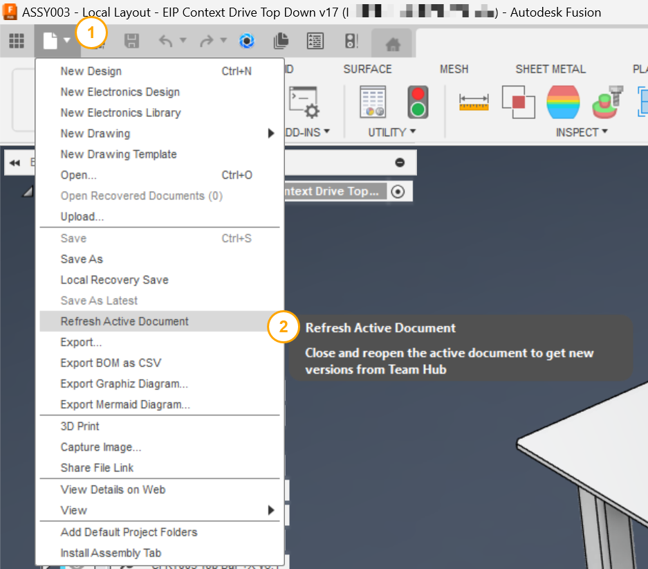

# Refresh Active Document

[Back to README](../README.md)

## Overview

Refresh Active Document checks the hub for a newer version of the active document and, when there is one, closes and reopens the document to load it.

Fusion's yellow triangle tells you when a *referenced* document is out of date, and **Get Latest** fixes that. It says nothing when the document you have open is itself out of date because a teammate saved a new version; you find out when your save creates a conflict. Vault users know the fix as **Refresh from Vault**. This command does the check and the reload in one step, from the File menu, at any time.

## Prerequisites

- The active document must be saved to a hub.

## Where to find it

**File › Refresh Active Document** on the Quick Access Toolbar, after **Export**.

## How to use

1. Select **File › Refresh Active Document**. The version you have open is compared with the latest on the hub.
2. One of three things happens:
   - **A newer version exists.** The document is closed, the newer version fetched, and reopened. If you have unsaved changes, a dialog first shows both version numbers and asks whether to discard them.
   - **You already have the latest version.** The command reports the version and leaves the document untouched.
   - **You have the latest version, with unsaved changes.** The command offers to reload from the hub anyway, which discards those changes. **Yes** reverts to the hub version; **No** keeps working.

## Limitations

- The reload is a full close and re-download; a large document takes as long as opening it does.
- If either version number cannot be read, the prompt says a newer version *may* be available and the reload goes ahead after your confirmation.
- Any saved document type can be refreshed, drawings included.

> **Developers:** see the [architecture notes](./arch/Document%20Refresh.md).

---

[Back to README](../README.md)

*Copyright © 2026 IMA LLC. All rights reserved.*
