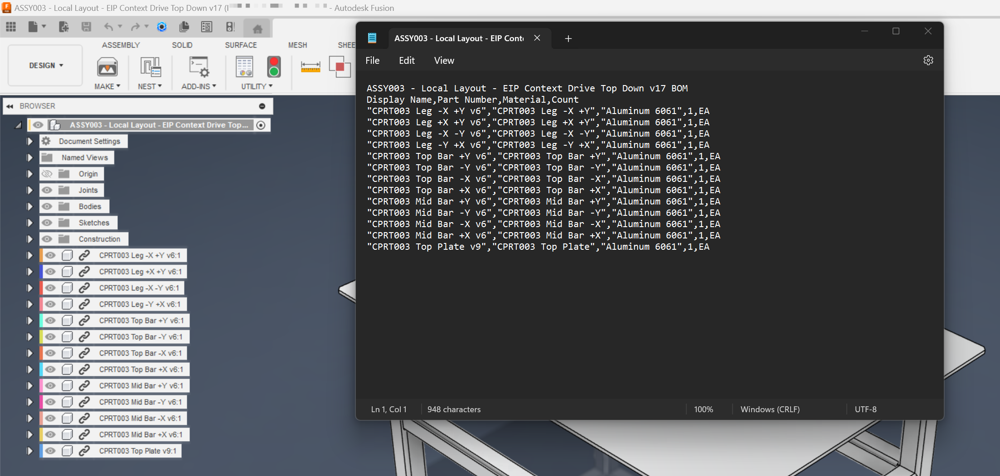
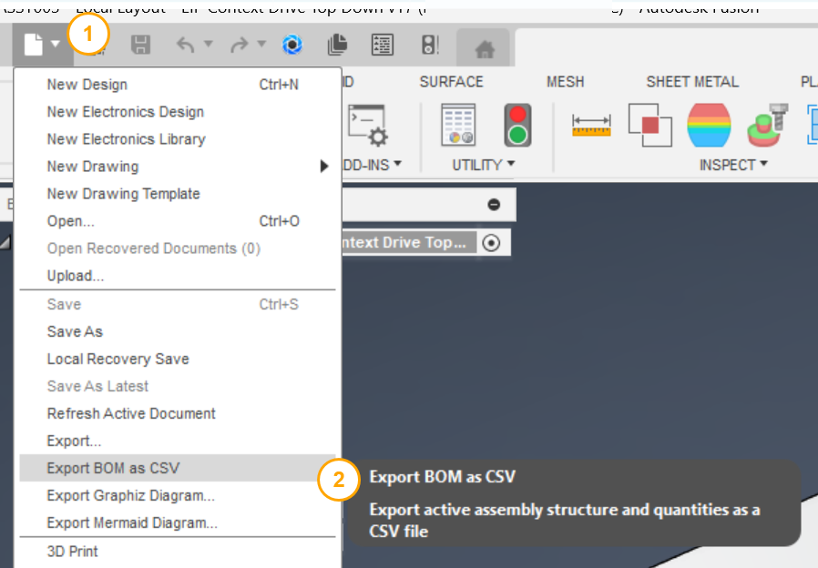

# Export BOM as CSV

[Back to README](../README.md)

## Overview

The **Export BOM as CSV** command exports the bill of materials (BOM) for the active Autodesk Fusion assembly to a comma-separated values (CSV) file. Use this command to share component data with procurement, manufacturing, or project management tools that accept CSV input.

## Prerequisites

- An Autodesk Fusion design document must be active and open.
- The design must contain at least one component.

## How to use this command

1. Open an assembly design in Autodesk Fusion.
2. From the **File** drop-down menu in the Quick Access Toolbar, select **Export BOM as CSV**.
3. In the folder browser dialog, navigate to the destination folder for the output file.
4. Click **OK**. Power Tools traverses the assembly and writes the file.
5. A confirmation dialog displays the full path of the exported file.

## Output

Power Tools creates a CSV file named `{DocumentName}.csv` in the folder you selected. The file uses the following columns:

| Column | Description |
|---|---|
| **Display Name** | The component display name as shown in the Fusion browser. For external reference (xref) components, the Fusion version suffix is removed so the name stays consistent across design revisions. |
| **Part Number** | The part number property defined on the component. |
| **Material** | The material assigned to the first solid body of the component. If the component has no solid bodies, this field is empty. |
| **Count** | The total number of instances of this component in the assembly. |
| **Unit** | Always `EA` (each). |

### Flat BOM behavior

By default, the BOM includes only **leaf components** — components that contain geometry but have no child sub-assemblies. Sub-assembly nodes are excluded from the output rows, but their child leaf components are included and counted. This behavior produces a flat BOM that is suitable for procurement and manufacturing.

### Version handling

For components that are external references, Power Tools automatically removes the Fusion version suffix from the display name. For example, `Bracket v3` is written as `Bracket`. This keeps the exported names stable across design revisions without requiring manual edits to the CSV.

## Example output

```
Display Name,Part Number,Material,Count
"Bracket","BRK-001","Steel",4,EA
"Cap Screw M6","HDW-010","Stainless Steel",16,EA
"Base Plate","PLT-002","Aluminum",1,EA
```



## Access

From the design document's **File** drop-down menu in the Quick Access Toolbar, select **Export BOM as CSV**.



> **Developers:** see the [architecture notes](./Arch/Export%20BOM.md).

---

[Back to README](../README.md)

*Copyright © 2026 IMA LLC. All rights reserved.*
