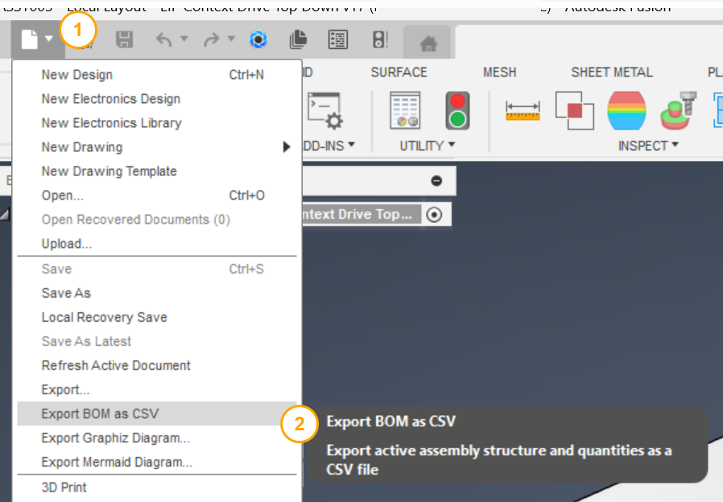
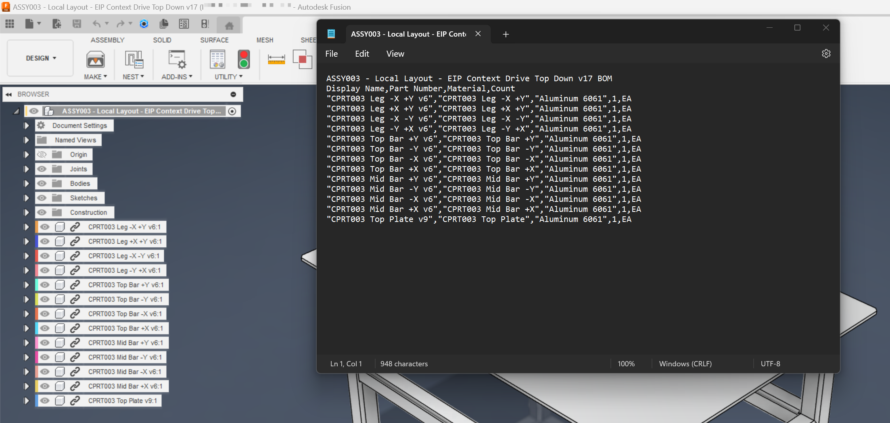

# Export BOM as CSV

[Back to README](../README.md)

## Overview

Export BOM as CSV writes the flat bill of materials of the active assembly to a CSV file.

SolidWorks and Inventor export a bill of materials straight from the assembly. In Fusion the built-in route is to make a drawing, place a parts list, and export that table. This command skips the drawing: one click from the File menu, one file, ready for procurement, a spreadsheet, or an ERP import.

## Prerequisites

- A design document must be active.

## Where to find it

**File › Export BOM as CSV** on the Quick Access Toolbar, directly before **Export**.



## How to use

1. Open the assembly.
2. Select **File › Export BOM as CSV**. The assembly is traversed and a folder dialog opens.
3. Choose the destination folder and select **OK**.
4. A dialog reports `BOM saved at: <path>`.

## What it produces

A UTF-8 file named `<document name>.csv` in the chosen folder. Characters that are not valid in a file name are replaced with `_`. The first line is `<document name> BOM`, followed by the header row and one row per unique leaf component:

```
Bracket v7 BOM
Display Name,Part Number,Material,Count
"Bracket","BRK-001","Steel",4,EA
"Cap Screw M6","HDW-010","Stainless Steel",16,EA
"Base Plate","PLT-002","Aluminum",1,EA
```

| Field | Content |
|---|---|
| **Display Name** | The component name as shown in the browser, including any version suffix on external references |
| **Part Number** | The component's part number property |
| **Material** | The material of the component's solid bodies; empty when it has none |
| **Count** | Total number of occurrences of that component across the whole assembly |
| (fifth field) | Always `EA` (each); this field has no column header |

The BOM is flat: only leaf components, those with no child components, are listed. Sub-assemblies are not rows, but their leaf components are counted.



## Limitations

- Cells beginning with `=`, `+`, `-` or `@` are prefixed with `'` so a spreadsheet does not evaluate them as formulas.
- A component with several solid bodies of different materials has their names written run together.
- There are no options; the flat form and the columns are fixed.

> **Developers:** see the [architecture notes](./arch/Export%20BOM.md).

---

[Back to README](../README.md)

*Copyright © 2026 IMA LLC. All rights reserved.*
