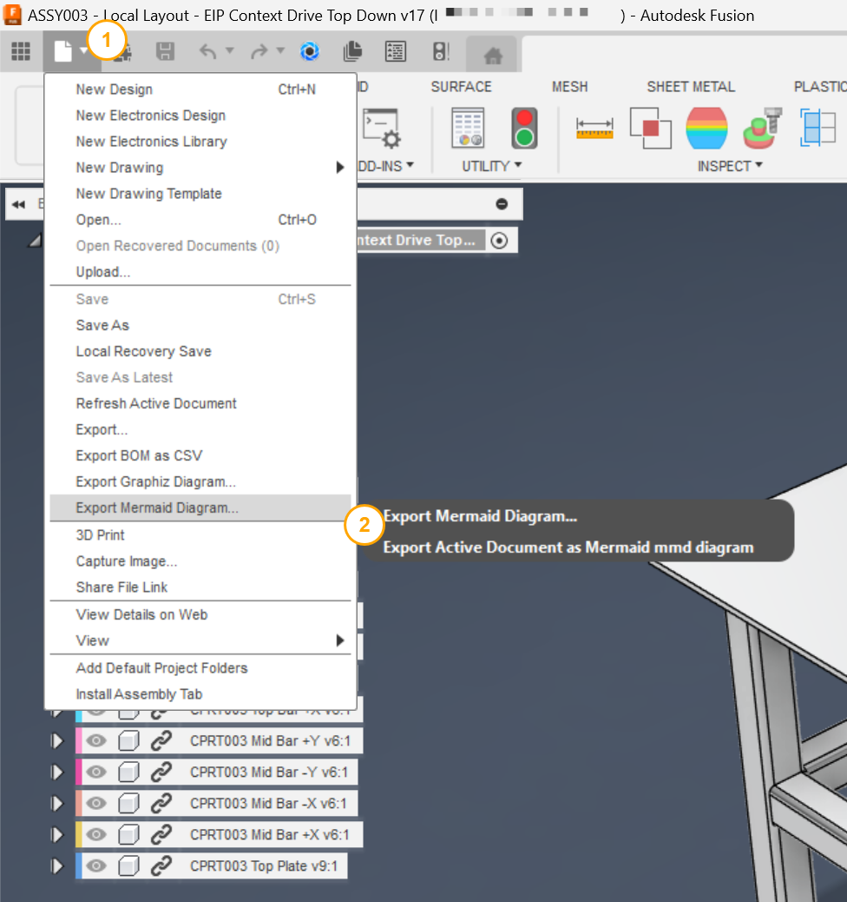
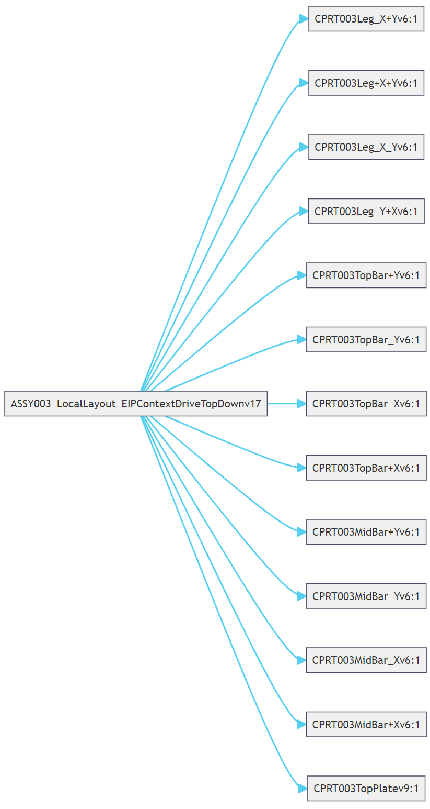

# Export Mermaid Diagram...

[Back to README](../README.md)

## Overview

Export Mermaid Diagram writes the component hierarchy of the active assembly as a [Mermaid](https://mermaid.js.org/) flowchart file and opens it in the Mermaid Live viewer.

A browser tree is hard to paste into a wiki, a review document or a chat. A Mermaid diagram is plain text that GitHub, GitLab, Notion, VS Code and the Mermaid Live Editor render as a diagram, so the structure of an assembly can be shared and versioned like any other text.

## Prerequisites

- A design document must be active. The menu item is available on the start screen too; with no design open it shows a message asking you to open or create one.

## Where to find it

**File › Export Mermaid Diagram...** on the Quick Access Toolbar, directly before **Export**.



## How to use

1. Open the assembly.
2. Select **File › Export Mermaid Diagram...**.
3. Choose the destination folder and select **OK**.
4. A dialog reports `Graph saved at: <path>`, and the diagram opens in your web browser at [mermaid.live](https://mermaid.live/).

## What it produces

A UTF-8 file named `<document name>.mmd` in the chosen folder. Characters that are not valid in a file name are replaced with `_`. The file is a `graph LR` (left-to-right) flowchart with a theme block at the top:

| Variable | Value |
|---|---|
| `theme` | `base` |
| `primaryColor` | `#f0f0f0` (node fill) |
| `primaryBorderColor` | `#454F61` (node border) |
| `lineColor` | `#59cff0` (connectors) |
| `tertiaryColor` | `#e1ecf5` |
| `fontSize` | `14px` |
| `look` | `classic` |
| `layout` | `elk` |

Each parent-child relationship is one line, `Parent-->Child`, written for every occurrence, so a component used in several places gets an arrow for each use. The root node is the document name.

Mermaid does not accept every character in a node name, so occurrence names are cleaned before writing:

| Character | Replacement |
|---|---|
| `-` | `_` |
| `<` or `>` | `_` |
| `"`, `=`, `(`, `)` | removed |
| space | removed |



## Rendering the file elsewhere

- **GitHub, GitLab, Notion:** paste the file contents inside a ` ```mermaid ` fenced block in any Markdown file.
- **Visual Studio Code:** install a Mermaid preview extension and open the `.mmd` file, or paste it into a Markdown file as above.

## Limitations

- Node names are occurrence names, so they carry Fusion's `:1`, `:2` instance suffixes.
- An empty design produces a file with only the theme block.

> **Developers:** see the [architecture notes](./arch/Export%20Mermaid.md).

---

[Back to README](../README.md)

*Copyright © 2026 IMA LLC. All rights reserved.*
