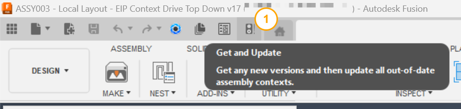

# Get and Update

[Back to README](../README.md)

## Overview

Get and Update gets any new versions of the referenced documents and then updates all out-of-date assembly contexts, in one click.

When a teammate saves a component you reference, Fusion shows a yellow triangle and offers **Get Latest**. That brings in the new versions but leaves any assembly contexts, the geometry a component was edited against, out of date; **Update All Contexts From Parent** is a second command in a second place. Get and Update runs both from one button on the Quick Access Toolbar, which is what you want every time the triangle appears.

> **Off by default.** Enable it under **File › PowerTools Preferences › Assembly › Get and Update** and restart Fusion.

## Prerequisites

- A design document with external references, saved to a hub. The command runs Fusion's own two commands, which decide what to do otherwise.

## Where to find it

**Get and Update** on the Quick Access Toolbar, directly before **Save**.

## How to use

1. Select **Get and Update**.
2. Fusion's **Get All Latest** runs, then **Update All Contexts From Parent**.
3. Check the browser: the yellow triangle should be gone and the contexts current.

## Limitations

- The two Fusion commands are started one after the other; their behavior and messages are Fusion's.

> **Developers:** see the [architecture notes](./arch/Get%20and%20Update.md).

---

[Back to README](../README.md)

*Copyright © 2026 IMA LLC. All rights reserved.*
