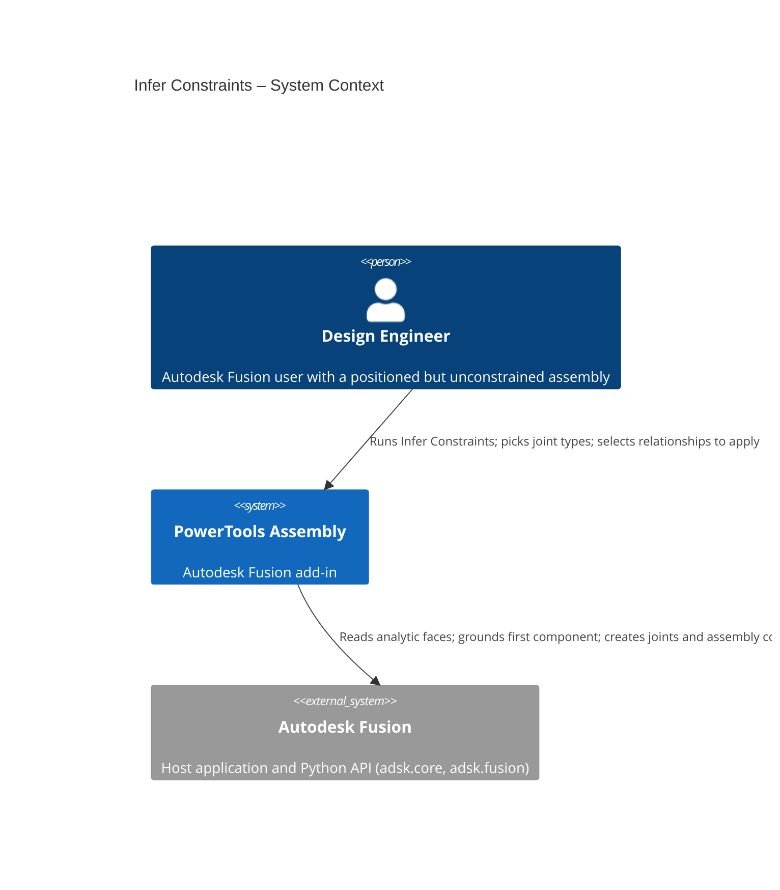
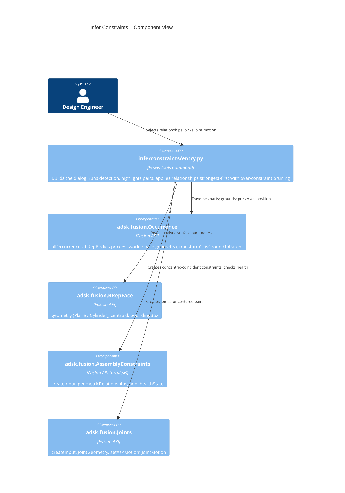

# Infer Constraints

[Back to PowerTools Assembly](../README.md)

The Infer Constraints command looks at an assembly whose components are already in their final spatial position — most often a STEP import — but which has no relationships between them, and proposes relationships based on the geometry that is already mating. It detects coaxial cylindrical faces (shaft-in-hole) and flush planar faces, grounds the first component, and lists what it finds with a confidence score so you can choose which relationships to apply. Everything it applies is **position-preserving** — components do not move when a relationship is created — and it automatically skips redundant relationships so the assembly is not over-constrained.

## What you can do

- **Ground the first component:** the first entry is always a *Ground to Parent* relationship on the first component in the browser, giving the assembly a fixed reference.
- Detect **concentric** relationships between coaxial cylindrical faces (including shaft-in-hole pairs with clearance).
- Detect **coincident** relationships between planar faces that lie flush against one another.
- Recognize **centered** coincident faces (whose centroids also coincide) and connect them with a **Joint** at the shared face center. For these rows you pick the joint motion type from a dropdown — **Rigid** (default), Revolute, Slider, Cylindrical, Pin-Slot, Planar, or Ball.
- Review every inferred relationship in a preview table with the participating components and a confidence score, and click a row's **Components** button to highlight that pair in the graphics.
- Adjust the linear and angular tolerances and re-scan to widen or tighten detection.
- Select exactly which relationships to apply; high-confidence rows are pre-selected.
- Apply everything in one step without moving the components, and let the command **drop redundant relationships** that would over-constrain the assembly.

## Prerequisites

- An Autodesk Fusion 3D Design must be active.
- The assembly should already be **positioned** — the command infers relationships from geometry that is mating in the current pose; it does not move components into place.
- The design needs **component occurrences** (or solid bodies in the root) that expose analytic **planar** or **cylindrical** faces — typical of imported solids.
- **Preview API:** creating assembly constraints relies on Fusion's Assembly Constraints API, which Autodesk currently ships as a **preview** capability. On builds where it is unavailable, detection and the preview table still work, but applying a constraint reports an error. Joints (used for centered pairs and grounding) use the released API. See [How it works](#how-it-works).

## How to use Infer Constraints

1. Open the assembly you want to constrain (for example, after inserting a STEP file).
2. On the **Utilities** tab, open the **Power Tools** panel and click **Infer Constraints**.
3. The command scans the assembly and fills the **Inferred relationships** table. Each row shows the relationship type, the two components, and a confidence score. The first row is always a **Ground to Parent** relationship on the first component in the browser.
4. Click a row's **Components** button to **highlight that relationship's pair in the graphics window** (for a Ground row, the single grounded component is highlighted), so you can see exactly what each relationship connects.
5. (Optional) Adjust **Linear tolerance** or **Angular tolerance** and click **Re-scan** to refine the results. Looser tolerances find more (and weaker) candidates; tighter tolerances keep only near-exact matches.
6. For any centered (Joint) row, choose the motion type from its dropdown (Rigid by default).
7. Check the relationships you want to apply. Rows with a confidence of 0.60 or higher are checked for you.
8. Click **OK** to apply. The command captures the current position first, then applies the selected relationships — grounding first, then strongest relationships first — and reports how many were created, how many redundant ones were skipped, and whether anything moved.

> **Note:** Inferring relationships is inherently ambiguous — research on this problem puts the realistic single-best-answer accuracy near 73%. Treat the list as ranked suggestions and review the low-confidence rows before applying.

## How it works

When the command opens, it traverses every leaf occurrence (and any root-level solid bodies) and collects analytic faces using occurrence **body proxies**, whose geometry is reported in the root component's (world) coordinate system. Each planar and cylindrical face is recorded with its world-space parameters.

Detection runs in two phases:

- **Broad phase** — face pairs from different parts are pre-filtered by bounding-box proximity (inflated by the linear tolerance) so only nearby faces are tested in detail.
- **Narrow phase** — the analytic surface parameters are compared:
  - *Concentric:* both cylinder axes are parallel (within the angular tolerance) and collinear (axis-to-axis distance within the linear tolerance). Differing radii are allowed and reported as shaft-in-hole. Applied as a **coincident assembly constraint** between the cylindrical faces.
  - *Coincident:* both plane normals are parallel and the signed gap along the normal is within the linear tolerance. Applied as a **coincident assembly constraint** (which leaves the in-plane sliding free).
  - *Centered (Joint):* a coincident pair whose face centroids also coincide is applied as a **Joint** with both inputs on the face centers, using the motion type chosen in the row's dropdown (Rigid by default). For a planar-face joint the motion axis is the face normal.

Each candidate gets a confidence score from its angular and positional residuals, and only the strongest candidate is kept per pair of parts and relationship type.

**Applying without moving parts.** Before anything is created, the command captures the current pose (the API equivalent of *Capture Position*). The first selected relationship grounds the first browser component to its parent (`Occurrence.isGroundToParent`), fixing a reference for everything that follows. The "first browser component" is taken from the timeline (parametric designs) because `root.occurrences` is not in browser order. For each relationship the command tries the small set of offset/flip (and joint isFlipped) options, measures how far the affected components move — translation **and** rotation — and keeps the option that preserves position. On typical positioned assemblies this is zero movement.

**Avoiding over-constraint.** Relationships are applied **strongest-first** (rigid joints, then concentric, then coincident), and after each one Fusion's own solver is asked whether it is healthy. A relationship that closes a cycle already covered by stronger ones adds no independent constraint, so Fusion marks it over-constrained ("sick") and the command removes it. Using the solver as the rank oracle keeps the largest non-redundant set — a spanning structure plus the independent extra relationships that further locate parts — which mirrors the spanning-tree / degree-of-freedom approach from the underlying research. Order matters: applying the strongest relationships first keeps them healthy and lets the redundant weaker ones drop, rather than the reverse.

> **Parametric vs. direct designs:** the over-constraint check reads each relationship's health state, which Fusion only reports in **parametric** designs. In a **direct** design there is no timeline, so relationships report an *Unknown* health state and the redundancy check cannot prune them — everything selected is applied. Grounding and position preservation work in both.

The Assembly Constraints creation API is a Fusion preview capability. To keep the dependency contained, all relationship creation lives in `_apply_candidate` (and its joint/constraint helpers) in `commands/inferconstraints/entry.py`; detection and the preview UI do not depend on it.

## Access

**Infer Constraints** is on the **Design** workspace **Utilities** tab, in the **Power Tools** panel.

## Architecture

The following diagrams show how the Infer Constraints command interacts with Autodesk Fusion.





### User flow

```mermaid
sequenceDiagram
  autonumber
  actor User
  participant Panel as Utilities › Power Tools
  participant Cmd as Infer Constraints
  participant API as Fusion API

  User->>Panel: Click "Infer Constraints"
  Panel->>Cmd: command_created fires
  Cmd->>API: Traverse parts, read analytic faces
  Cmd->>Cmd: Broad phase + narrow phase + scoring + Ground row
  Cmd-->>User: Show preview table (ranked candidates)
  opt Inspect / adjust
    User->>Cmd: Click a Components button
    Cmd->>API: Highlight that pair in the graphics
    User->>Cmd: Change tolerance / Re-scan, pick joint types
    Cmd->>API: Re-run detection
    Cmd-->>User: Refresh table
  end
  User->>Cmd: Check rows, click OK
  Cmd->>API: Capture position; ground first component
  loop Each selected relationship (strongest first)
    Cmd->>API: Create joint or assembly constraint (position-preserving)
    API-->>Cmd: healthState
    Cmd->>API: Delete it if over-constrained (sick)
  end
  Cmd-->>User: Report created / skipped-redundant / moved
```

---

[Back to PowerTools Assembly](../README.md)

---

*Copyright © 2026 IMA LLC. All rights reserved.*
