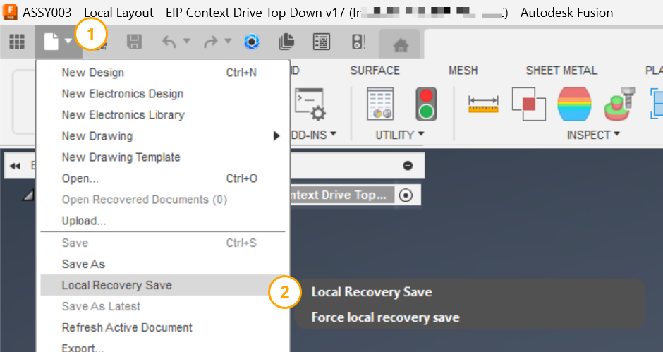

# Local Recovery Save

[Back to README](../README.md)

## Overview

The **Local Recovery Save** command adds a **Local Recovery Save** entry to the Fusion File dropdown on the Quick Access Toolbar (QAT). When you select it, Fusion writes a local recovery checkpoint for the active document to disk without creating a new cloud version. This protects work in progress between formal saves.

In team environments, each cloud save can trigger out-of-date notifications for collaborators. Local Recovery Save lets you checkpoint local work frequently without generating that version noise.

## Capabilities

| Capability | Details |
|---|---|
| Create a local recovery checkpoint | Writes a recovery file to disk for the active document |
| Avoid version increment | Does not create a new cloud version or notify collaborators |
| Quick access from the QAT | Available from the File dropdown on the Quick Access Toolbar |

## Prerequisites

- A Fusion design document must be open and active.

## Notes

- This command delegates directly to Fusion's internal `AutoSaveFilesCommand`.
- It creates a local recovery checkpoint without creating a new cloud version.

## Access

Select **Local Recovery Save** from the **File** dropdown on the **Quick Access Toolbar (QAT)**.

> **Developers:** see the [architecture notes](./arch/Recovery%20Save.md).

[Back to README](../README.md)

*Copyright © 2026 IMA LLC. All rights reserved.*
