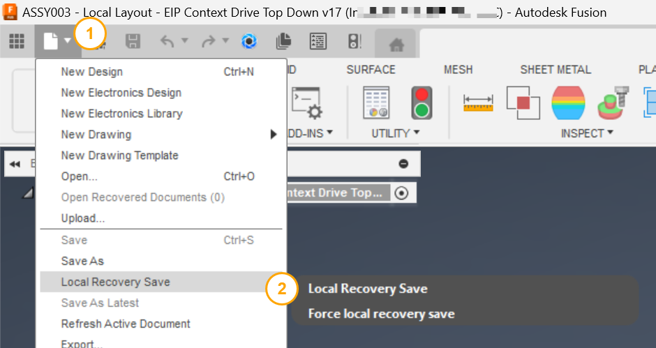

# Local Recovery Save

[Back to README](../README.md)

## Overview

Local Recovery Save writes a local recovery checkpoint for the active document without creating a new cloud version.

Every cloud save in Fusion makes a new version, and on a shared assembly every new version raises an out-of-date flag for everyone else who references the document. That discourages saving often. Local Recovery Save runs Fusion's own recovery save on demand: your work in progress is checkpointed on disk, recoverable from **File › Recover Documents** after a crash, and nobody else sees a thing. Desktop CAD systems autosave on a timer; this puts the same protection under your finger, for the moment just before a risky operation.

## Prerequisites

- A document must be open.

## Where to find it

**File › Local Recovery Save** on the Quick Access Toolbar.

## How to use

1. Open the **File** menu on the Quick Access Toolbar.
2. Select **Local Recovery Save**.

There is no dialog. Fusion writes the checkpoint and returns you to the design.

## What it produces

- A local recovery checkpoint, the same kind Fusion writes on its own autosave interval.
- No new cloud version, no version comment, no notification to collaborators.

## Limitations

- The command delegates to Fusion's recovery save; what it covers (the active document or every open document) is Fusion's behavior, not PowerTools'.
- A recovery checkpoint is not a substitute for a cloud save. Only a save creates a version you and your team can open later.

> **Developers:** see the [architecture notes](./arch/Recovery%20Save.md).

---

[Back to README](../README.md)

*Copyright © 2026 IMA LLC. All rights reserved.*
