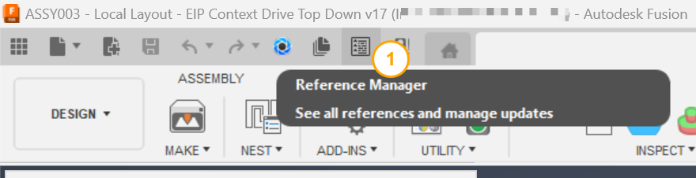
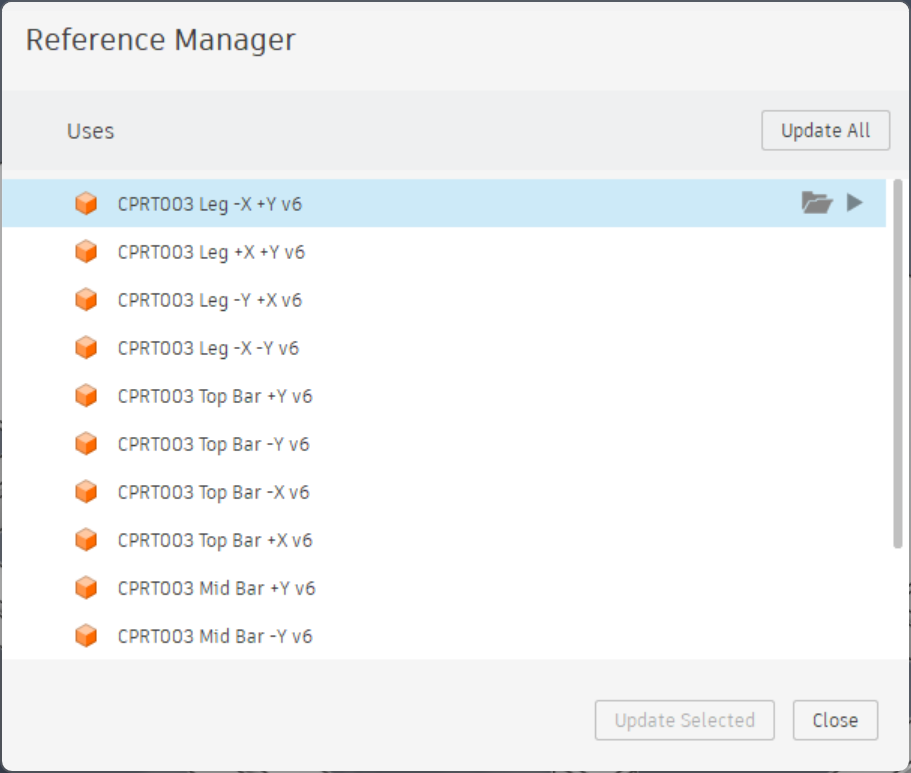

# Reference Manager

[Back to README](../README.md)

## Overview

Reference Manager opens Fusion's Reference Manager dialog from the Quick Access Toolbar.

Every external reference in the active document in one list, update them all or one at a time, pin a specific version, or open one: that is Fusion's own Reference Manager, and it is worth having one click away instead of behind nested menus. SolidWorks puts the equivalent under **File › Find References**; here it is a toolbar button.

> **Off by default.** Enable it under **File › PowerTools Preferences › Assembly › Reference Manager** and restart Fusion.

## Prerequisites

- A design document must be open. The dialog is Fusion's; it decides what it shows for a document with no references.

## Where to find it

**Reference Manager** on the Quick Access Toolbar, directly before **Get and Update** when that command is enabled.

## How to use

1. Select **Reference Manager**. Fusion's Reference Manager dialog opens with every reference in the active document.
2. Use the dialog to update all references, update or change the version of one, or open one in a new tab.

## Limitations

- Everything inside the dialog is Fusion's behavior.

> **Developers:** see the [architecture notes](./arch/Reference%20Manager.md).

---

[Back to README](../README.md)

*Copyright © 2026 IMA LLC. All rights reserved.*
