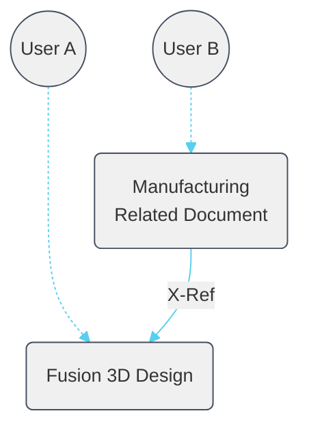
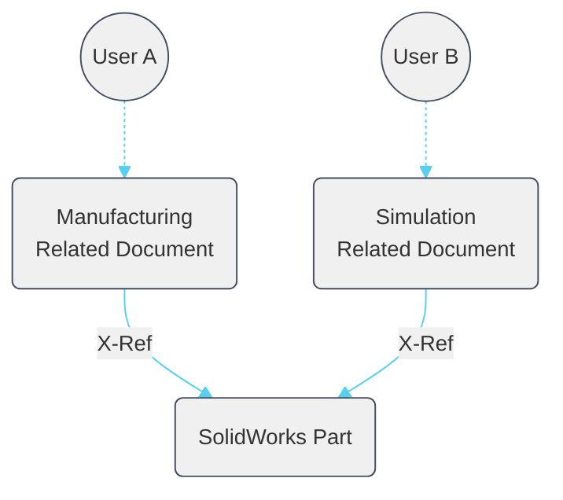
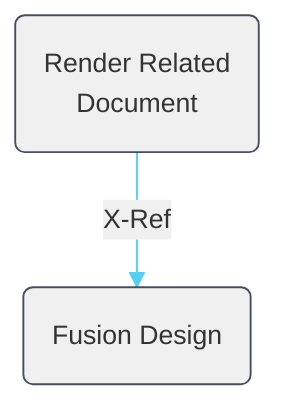
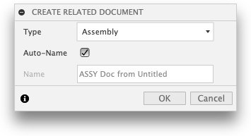

# Create Related Data

[Back to README](../README.md)

## Overview

**Create Related Data** is a Fusion add-in command in the **Design Workspace → Create Panel** that copies a pre-configured template document from your Team Hub and inserts the active source document as an external reference inside it.

The result is a *related document* — a separate file that references your source design without locking or modifying it. Multiple team members can work in their own related documents simultaneously. Each document's lifecycle, permissions, and workspace can be managed independently.

When creating the new related document, select from a configurable list of templates stored in your hub. The add-in auto-names the new document using the pattern `<source name> ‹+› <template name>`, making the relationship clear at a glance. You can disable auto-naming to provide a custom name.

> **Requirement:** The source document must be saved before you can use this command.

---

## Use cases

### Manufacture a native Fusion 3D design

Create a Manufacturing related document so a CNC programmer can work in parallel without locking or modifying the original design. When you share your design file, manufacturing setups and toolpaths stay private in their own separate document.

### AnyCAD — reference an uploaded non-native file

Upload a SolidWorks (or other CAD) file through Fusion Team, then use this add-in to create Manufacturing or Simulation related documents that reference it. When the source file is updated and saved, the related document can update to the new version.

Two related documents — one for Manufacturing, one for Simulation — each with a dedicated user working in parallel. This allows different disciplines to work concurrently without permission conflicts.

> **Note:** AnyCAD workflows require a Team Hub and a Commercial, Education, or Start-Up entitlement. Personal (free/hobby) entitlements do not include AnyCAD.

### Render designs with a consistent look

Store lighting rigs, exposure settings, HDRI environments, and camera presets inside a Render template document. Every new render document created from that template starts with a consistent, pre-configured look.

---

## Template documents

Template documents are `.f3d` files stored in a dedicated folder inside a Team Hub project. The add-in lists every `.f3d` file in that folder as a selectable **Type** when you run the command.

### What to include in a template

- **Active workspace** — Fusion preserves the active workspace when saving, so the new document opens directly in the correct workspace (Design, Manufacture, Simulation, Render, and so on).
- **Machine definitions, posts, and fixtures** for Manufacturing templates.
- **Material and appearance libraries** for assembly templates.
- **Lighting rigs, render settings, and camera presets** for Render templates.
- **Document units preference.**

### Example template set

| Template name | Purpose |
|---|---|
| `MFG - Haas.f3d` | Manufacture workspace with Haas machine, post, and fixture pre-loaded |
| `MFG - Plasma.f3d` | Manufacture workspace with plasma cutter setup and toolpaths |
| `ASSY - in.f3d` | Empty assembly in inches |
| `ASSY - mm.f3d` | Empty assembly in millimetres |
| `VIZ.f3d` | Render studio with custom lighting and floor stage elements |

> **Tip:** Always include a generic empty assembly template so users can create a plain related document when no specialist template is needed.

---

## Setup

### Step 1 — Create the Templates project and folder in Fusion Team

> This step is best performed by a Fusion Team administrator.

1. Sign in to [Fusion Team](https://www.autodesk.com/fusion-team).
2. Create a new project — recommended name: **Templates**.
3. Set project permissions so all team members can access it — use the _All Users_ group or equivalent folder-level permissions.
4. Inside the project, create a folder — recommended name: **Related Data** or **Start Parts**.
5. Create or upload `.f3d` documents into that folder — one file per workflow.

### Step 2 — Select the related data folder (once per machine and hub)

The **Select Related Data Folder** command opens Fusion's cloud folder picker, lets you browse to the folder where your start parts and templates must be located, and resolves the owning hub and project automatically. No manual JSON editing is required.

See the [Select Related Data Folder](./Select%20Related%20Data%20Folder.md) documentation for the full walkthrough.

In brief:

1. Run **Select Related Data Folder** from the **Quick Access Toolbar → File menu → PowerTools Settings** flyout.
2. Click **OK** on the prompt to launch the cloud folder picker.
3. Browse to the folder that contains your template `.f3d` files and confirm the selection.

The hub configuration is written to `hub.json` at the add-in root. Multiple hubs can be configured, and the folder must be selected once for each hub. Re-running on an already-configured hub lets you re-point it to a new folder.

### Step 3 — Use the command

1. Open the source document you want to reference. The document must be saved.
2. Run **Create Related Data** from the **Design Workspace → Create Panel**.
3. Select a template from the **Type** drop-down.
4. By default, the new document is auto-named as `<source name> ‹+› <template name>`. Clear **Auto-Name** to enter a custom name.
5. Click **OK**. The add-in creates the new related document, saves it in the same folder as the source document, and inserts the source document as an external reference.

---

## Template cache

After the first successful run, the add-in saves a local cache file at `cache/[hub-id].json` that lists all templates found in the configured folder. Subsequent runs load from the cache instead of querying the API, which makes the dialog open faster.

**To refresh the cache** — for example, after adding or renaming templates:

Delete the relevant `.json` file from the `cache/` folder at the add-in root. The next run re-queries the templates folder and rebuilds the cache automatically.

---

## Access

**Create Related Data** is in the **Design Workspace → Create Panel** (Assembly tab and Solid tab) and is promoted to the main toolbar by default.

You can also pin it to the **Shortcuts** (S-key menu) for faster access.

---

> **Developers:** see the [architecture notes](./Arch/Related%20Data.md).

---

Thanks to contributions from:

- [TheEppicJR](https://github.com/TheEppicJR)

[Back to README](../README.md)

*Copyright © 2026 IMA LLC. All rights reserved.*
