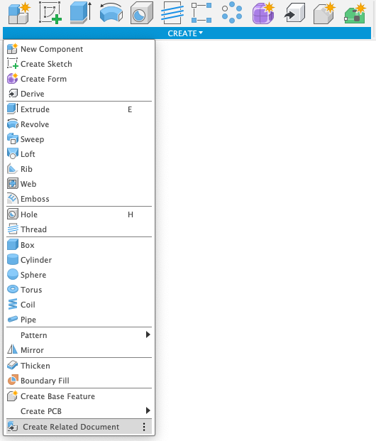
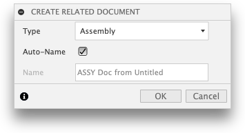
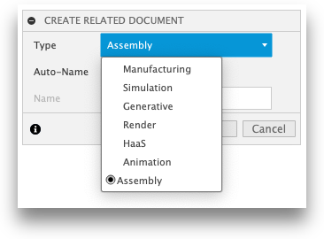
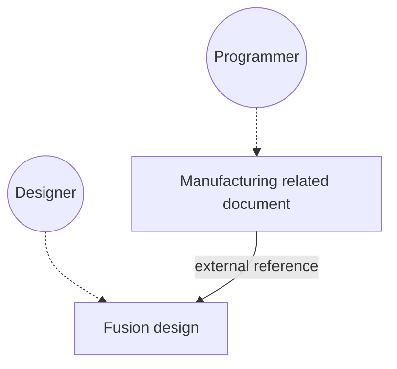
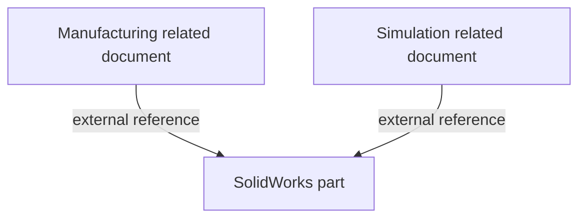

# Create Related Data

[Back to README](../README.md)

## Overview

Create Related Data creates a new document from a template kept in your hub and inserts the active document into it as an external reference.

The result is a *related document*: a separate file that references your source design without locking or modifying it. A CNC programmer works in a Manufacture document while you keep modelling; a render artist works in a Render document with the lighting rig already set up; each has its own lifecycle, permissions and workspace. In SolidWorks and Inventor, CAM and render setups live inside the part file itself; a related document keeps them out of it, so sharing the design shares nothing else. Templates are ordinary `.f3d` files in one hub folder, so the team's start points are the same for everyone.

The new document is named `<source name> ‹+› <template name>`, which makes the relationship obvious in the Data Panel and lets [Document References](./Document%20References.md) list related documents separately from assembly references.

## Prerequisites

- The related-data folder must be configured for the active hub with [Select Related Data Folder](./Select%20Related%20Data%20Folder.md).
- The active document must be saved, with no unsaved changes; the new document is saved in the same folder.

## Where to find it

**Solid** tab › **Create** panel › **Create Related Data**, in the Design workspace. It is promoted to the panel by default.

## How to use

1. Open the source document.
2. Select **Create Related Data**.
3. Choose a template from **Type**.
4. Keep the auto-generated name, or untick **Auto-Name** and edit **Name**.
5. Select **OK**. The template is copied into the source's folder under the new name and the source is inserted into it as an external reference.

## Options

| Option | Default | Effect |
|---|---|---|
| **Type** | The last template in alphabetical order | Which `.f3d` in the templates folder to copy |
| **Auto-Name** | On | Fills **Name** with `<source name> ‹+› <template name>`; untick to edit the name |
| **Name** | Auto-generated | The new document's name. Changing **Type** refills it |

## Use cases

**Manufacture a native design.** A Manufacture related document lets a programmer work in parallel; when you share the design, the setups and toolpaths stay in their own document.

```mermaid
flowchart TD
    B["Fusion design"]
    A["Manufacturing related document"]
    UA(("Designer"))
    UB(("Programmer"))
    UA -.-> B
    UB -.-> A
    A -- "external reference" --> B
```

**Reference an uploaded non-native file.** Upload a SolidWorks or other CAD file to the hub, then create Manufacture and Simulation related documents that reference it. When the source file is updated, the related documents can update to the new version. This needs a hub and a Commercial, Education or Start-Up entitlement; personal entitlements do not include AnyCAD.

```mermaid
flowchart TD
    A["SolidWorks part"]
    B["Manufacturing related document"]
    C["Simulation related document"]
    B -- "external reference" --> A
    C -- "external reference" --> A
```

**Render with a consistent look.** Keep lighting, exposure, HDRI environment and camera presets in a Render template; every render document created from it starts the same way.

## Setting up templates

Best done once by a Fusion Team administrator:

1. In Fusion Team, create a project (recommended name **Templates**) that all team members can read.
2. Inside it, create a folder directly under the project root (recommended name **Related Data** or **Start Parts**).
3. Upload one `.f3d` per workflow into that folder. Every `.f3d` there becomes a **Type**. Save each template in the workspace it should open in; Fusion keeps the active workspace with the document. A Manufacture template can carry machines, posts and fixtures; a Render template lighting and cameras; an assembly template units and libraries.
4. On each machine, run [Select Related Data Folder](./Select%20Related%20Data%20Folder.md) once per hub.

| Example template | Purpose |
|---|---|
| `MFG - Haas.f3d` | Manufacture workspace with a Haas machine, post and fixture loaded |
| `MFG - Plasma.f3d` | Manufacture workspace with a plasma cutter setup |
| `ASSY - in.f3d` | Empty assembly in inches |
| `ASSY - mm.f3d` | Empty assembly in millimetres |
| `VIZ.f3d` | Render studio with lighting and floor stage |

> **Tip:** Include a plain empty-assembly template for the cases where no specialist template applies.

## What it produces

- A new document in the source's folder, saved twice: once as the copied template and once with the source inserted.
- A template list cached per hub in `cache/<hub id>.json` in the add-in folder, written the first time the dialog opens. After adding, removing or renaming templates, delete that file so the next run rebuilds it.

## Troubleshooting

| Message | Cause | What to do |
|---|---|---|
| **Hub Not Configured** / **Incorrect Hub** | The active hub has no entry | Run Select Related Data Folder on this hub |
| **Project Not Found** / **Folder Not Found** | The configured project or folder no longer exists, or the folder is not directly under the project root | Re-run Select Related Data Folder |
| *The active document must be saved before you can continue.* | Unsaved changes | Save the document |

> **Developers:** see the [architecture notes](./arch/Related%20Data.md).

Thanks to contributions from [TheEppicJR](https://github.com/TheEppicJR).

---

[Back to README](../README.md)

*Copyright © 2026 IMA LLC. All rights reserved.*
