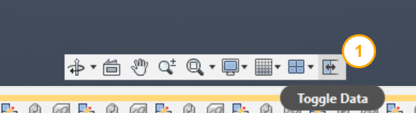

# Toggle Data Pane

[Back to README](../README.md)

## Overview

The **Toggle Data Pane** command adds a button to the Fusion Navigation Toolbar that opens or closes the Data Pane with a single click. By default, toggling the Data Pane requires navigating a nested menu or using a keyboard shortcut that many users are unaware of. This command surfaces that action directly on the Navigation Toolbar for fast, discoverable access.

## Capabilities

| Capability | Details |
|---|---|
| Open the Data Pane | Shows the Data Pane if it is currently hidden |
| Close the Data Pane | Hides the Data Pane if it is currently visible |
| Single-click toggle | Automatically detects the current state and takes the correct action |
| Persistent toolbar button | Button is always visible in the Navigation Toolbar while the add-in is active |

## Prerequisites

- A Fusion document must be open.
- The PowerTools add-in must be active.

## Notes

- The command uses the current `app.data.isDataPanelVisible` state to decide whether to open or close the Data Pane.
- The toolbar button is available while the add-in is running.

## Access

Select **Toggle Data** on the **Navigation Toolbar** at the bottom of the Fusion canvas.

> **Developers:** see the [architecture notes](./Arch/Toggle%20Data%20Pane.md).

[Back to README](../README.md)

*Copyright © 2026 IMA LLC. All rights reserved.*