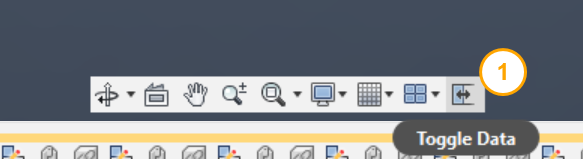

# Toggle Data

[Back to README](../README.md)

## Overview

Toggle Data opens or closes the Data Panel with a single click from the Navigation Toolbar.

Fusion shows and hides the Data Panel from the grid button at the far left of the Quick Access Toolbar, or with a keyboard shortcut most people never find. Toggle Data puts the same action on the Navigation Toolbar at the bottom of the canvas, next to the view controls, where your hand already is. The button reads the Data Panel's current state and does the opposite, so one button serves both directions.

## Prerequisites

- None. The button works with or without a document open.

## Where to find it

**Toggle Data** is the last button on the **Navigation Toolbar** at the bottom of the Fusion canvas.

## How to use

1. Select **Toggle Data** on the Navigation Toolbar.
2. If the Data Panel was hidden it opens; if it was visible it closes.

## Limitations

- The button is present only while PowerTools is running.

> **Developers:** see the [architecture notes](./arch/Toggle%20Data%20Pane.md).

---

[Back to README](../README.md)

*Copyright © 2026 IMA LLC. All rights reserved.*
