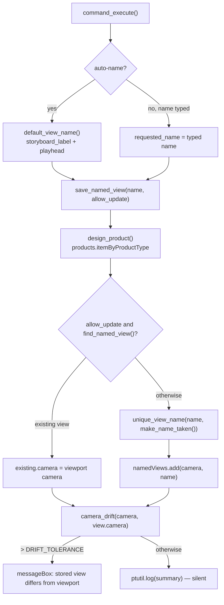

# Animation Named View — Architecture

[← Animation Named View guide](../Animation%20Named%20View.md)

| | |
|---|---|
| **Command ID** | `PTAN_animationnamedview` (command name **Save Named View**) |
| **Registry** | group `animation` (`Animation`); enabled by default |
| **UI location** | Panel `PT_AnimationPowerTools` (`config.animation_panel_id`, named "Power Tools") on Fusion's own **Animation** tab, inserted directly after the built-in View panel (`PublisherViewPanel`, `isBefore = False`) in the workspace returned by `config.resolve_animation_workspace_id()`; `isPromoted = True`. No UI at all when that resolver returns `None` |
| **Files** | `commands/animationnamedview/entry.py`, `commands/animationnamedview/logic.py` (`adsk`-free); `resources/` (button icons) |
| **Shared helpers** | [`config.resolve_animation_workspace_id`, `get_or_create_animation_panel`, `animation_panel_id`](architecture.md#config); [`ptutil.remove_from_panel`](architecture.md#ui_utils); [`ptutil.add_handler`](architecture.md#event_utils); [`ptutil.log`, `handle_error`](architecture.md#general_utils) |
| **Tests** | `tests/test_animationnamedview_logic.py`, `tests/test_config_workspaces.py`, `tests/test_command_contract.py` |

## Purpose

Saves the current Animation viewport camera as a Named View on the design, named from the active storyboard and playhead (`Storyboard2 @ 3.50s`), so a framing found while animating is available in the Design workspace and in drawings without switching workspaces. Two API facts shape it: inside the Animation environment `app.activeProduct` is not the design, so the design is fetched from the document's product list; and `Storyboard` exposes no readable name, so the name is recovered by probing the storyboards collection.

## How it is wired

- `start()`: `config.resolve_animation_workspace_id()` — the pinned candidates (`Publisher3DEnvironment` first; the Animation environment is internally the Publisher environment) then a display-name scan that logs every workspace. `None` → log `no Animation workspace found; UI skipped` and return, so the rest of the add-in starts. Otherwise `addButtonDefinition` with the `resources/` icon folder, attaches `command_created`, then `config.get_or_create_animation_panel(_workspace_id)` returns `(panel, tab_id)` — the existing `PT_AnimationPowerTools` panel or a new one added after `PublisherViewPanel` (falling back to a panel named "View", then to appending) — and the control is added, promoted. `_workspace_id` and `_tab_id` are kept for teardown.
- `stop()`: `ptutil.remove_from_panel(_workspace_id, PANEL_ID, _tab_id, CMD_ID)` removes the control and deletes the panel once empty; the tab-deletion branch inside it is only reached for an empty tab, which Fusion's Animation tab never is ([rule 10](../dev/lessons.md)). Then the definition is deleted.
- `command_created(args)`: `okButtonText = "Save View"`; `PTAN_autoName` (`BoolValueInput`, checked) and `PTAN_name` (`StringValueInput`, seeded with `default_view_name()`, disabled). Attaches `command_execute`, `command_input_changed`, `command_destroy`.
- `command_input_changed(args)`: only reacts to `PTAN_autoName` — enables the name field when unticked, and when re-ticked disables it and re-seeds it from `default_view_name()` so a stale hand edit is never reused.
- `command_execute(args)`: reads both inputs; an unticked box with a non-blank name is a user name, anything else falls back to `default_view_name()` with `auto_name = True`. Calls `save_named_view(requested_name, allow_update=auto_name)`, logs the returned summary and shows the returned warning in a message box only if there is one — a clean save is silent. Exceptions go to [`ptutil.handle_error`](architecture.md#general_utils) with a message box.
- `command_destroy(args)`: clears `local_handlers`.
- `design_product()`: `app.activeDocument.products.itemByProductType("DesignProductType")` cast to `Design`; `Design.cast(app.activeProduct)` returns `None` in the Animation environment.
- `default_view_name()`: `design.animationManager.storyboards` → `logic.find_active_storyboard_index` → `logic.storyboard_label`; `activeStoryboard.playheadPosition` → `logic.derive_view_name(label, playhead)`. Any failure logs and returns `FALLBACK_VIEW_NAME` (`Animation View`).
- `save_named_view(requested_name, allow_update)`: raises `RuntimeError` without a design or `design.namedViews`. Takes `app.activeViewport.camera`. With `allow_update`, `logic.find_named_view(named_views, requested_name)` returning a view means `existing.camera = camera` (an auto-generated name encodes storyboard and playhead, so a collision is the same view being re-saved). Otherwise `logic.unique_view_name(requested_name, logic.make_name_taken(named_views))` picks a free name (`-2`, `-3`, …) and `named_views.add(camera, name)` creates it — a user-typed name is never overwritten. In both cases `logic.camera_drift(camera, view.camera)` reads the stored camera back; a drift above `DRIFT_TOLERANCE` (0.001) becomes the warning that the view was stored but will not restore the framing, with the suggestion to switch to an orthographic view.

## Data and state

- Module globals: `_workspace_id`, `_tab_id` (resolved in `start()`, used by `stop()`), `local_handlers`.
- No files, settings keys, custom events or temp files. Named views are stored on the design and persist only when the document is saved.

## Naming (`logic.py`)

- `find_active_storyboard_index(storyboards)` scans `count` / `item(i)` for the storyboard whose `isActive` is true; the active storyboard object carries neither a name nor an index.
- `recover_storyboard_name(storyboards, index)` asks `itemByName("Storyboard<index+1>")` — Fusion's default name for that slot — and accepts it only if the returned storyboard is the active one. A renamed storyboard yields `None`.
- `storyboard_label` returns the recovered name (`Storyboard2`), else the positional `Storyboard 2` (with a space), else `Animation` when there is no active storyboard.
- `format_playhead` renders `3.50s`; a negative position is Fusion's scratch zone and is labelled `scratch`. `derive_view_name` joins them as `<label> @ <playhead>`.
- `make_name_taken(named_views)` rejects `TOP`, `FRONT`, `RIGHT`, `HOME` by comparison (Fusion hides the four standard views from `itemByName`, so `add()` would otherwise be handed a name that looks free) and otherwise defers to `find_named_view`, which treats an unverifiable lookup as *free*: `view_matches_name` requires a valid view carrying exactly the requested name. `unique_view_name` tries suffixes up to `-999` and then leaves the duplicate for Fusion's `add()` to reject.
- `camera_drift(source, saved)` is the largest of the eye, target and up-vector distances (`point_distance`), or `None` when a camera cannot be read.

## Diagram

Name resolution and the read-back check inside `save_named_view`.

## Tests

- `tests/test_animationnamedview_logic.py` — with `FakeStoryboards` / `FakeNamedViews` / `FakeCamera` stand-ins: active-index lookup (found, none active, unreadable collection); default-name recovery (found, renamed → `None`, inactive match rejected); label preference and fallbacks; playhead formatting including scratch and garbage; `derive_view_name`; `unique_view_name` pass-through and suffixing; `make_name_taken` rejecting the four built-ins but not names merely containing them, and treating a raising, mismatched or invalid lookup as free; `find_named_view` match/absent/raising/mismatch; a regression that a bad lookup never reaches the `-999` ceiling; `camera_drift` zero, largest discrepancy, unreadable.
- `tests/test_config_workspaces.py` — `resolve_animation_workspace_id` by pinned ID and by display name, `None` without a workspace; `_find_animation_tab` by ID, by name, and by the tab carrying the View panel; `_anchor_panel_id` pinned, by name, empty.
- `tests/test_command_contract.py` — `PTAN_autoName` and `PTAN_name` are allow-listed as command-input ids; registry/description/ID contract.

`entry.py` is Fusion-bound and is not exercised by the suite; nothing here is verified in Fusion on this branch except by the AST guards in `tests/test_command_contract.py` and `tests/test_command_abort.py`, which import it under the `adsk` stub. The panel placement, `itemByProductType`, `animationManager`, `namedViews.add` and the camera read-back are unverified here. The icon set is not pinned in `tests/test_command_icons.py`.

## Learnings

- **An unusable `itemByName` answer is not a hit.** Treating a lookup that raised or returned some other object as "name taken" made every candidate look taken, so `unique_view_name` ran its suffix range to exhaustion and produced `View-999`. `find_named_view` now confirms the returned object is a valid view with exactly that name and otherwise reports *free*, leaving `add()` as the arbiter of a real duplicate.
- **The Animation workspace publishes none of its IDs.** Workspace, tab and panel IDs are absent from the API docs and the shipped binaries; the pinned values (`Publisher3DEnvironment`, `Animation`, `PublisherViewPanel`) were read out of the debug log on Fusion 2704.1.36, and every lookup keeps a name-based fallback that logs what it saw ([rule 11](../dev/lessons.md)).
- **Check the stored camera, do not assume it.** Autodesk have an open report that saving a perspective camera can yield a named view whose eye is far from the original; it does not reproduce on every build, so the command reads the view's camera back and compares rather than saving silently.

---

*Copyright © 2026 IMA LLC. All rights reserved.*
